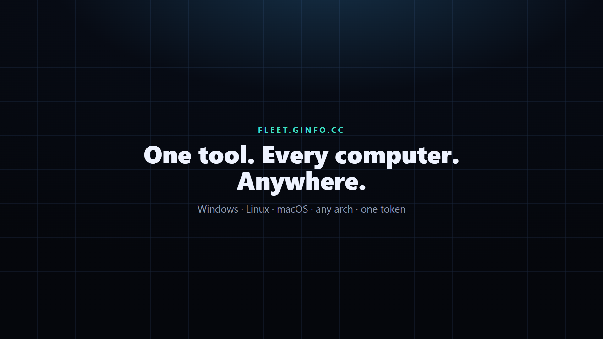

# Fleet

**Docs:** [English](docs/en/README.md) · [中文](docs/zh/README.md)



**One MCP tool. Windows, Linux, and macOS. From anywhere.**

Start on the live hub: **[https://fleet.ginfo.cc](https://fleet.ginfo.cc)**  
Local `npm run dev` is a CLI on 127.0.0.1. The product is the cloud: agents dial out over WebSocket, so a laptop, a colo box, and a Windows PC join the same account.


Four values: **domain URL**, **hub token**, **Agent on each PC**, **import the tool**. Then Cursor / Claude can list and run on every machine you enrolled.

[Try the hub](https://fleet.ginfo.cc) · [Latest release](https://github.com/TITOCHAN2023/fleetForAgent/releases/latest) · [Deploy](docs/en/deploy.md) · [中文文档](docs/zh/README.md)

## How it works


```
Cursor / Claude  --HTTPS + flt_ token-->  fleet.ginfo.cc
                                              │  WSS /v1/device (outbound only)
                    ┌─────────────────────────┼─────────────────────────┐
                    ▼                         ▼                         ▼
              Windows amd64              Linux amd64/arm64        macOS arm64/amd64
```

1. **Tool** — Cursor, Claude, or any MCP client. `FLEET_URL` + `FLEET_TOKEN`.
2. **Server** — the cloud hub ([fleet.ginfo.cc](https://fleet.ginfo.cc)). Login, mint tokens, relay jobs.
3. **Agents** — a small process on each PC. They open an outbound WebSocket. No inbound ports, no public IP on the device.

A command is a round trip: tool → hub → the OS you picked → stdout back.

Silent explainer: [docs/media/architecture.mp4](docs/media/architecture.mp4)

## Try it (cloud)

1. Open **[https://fleet.ginfo.cc](https://fleet.ginfo.cc)** and sign in with Google / X.
2. Settings → generate a Hub token (shown once).
3. Install Agent from [Releases](https://github.com/TITOCHAN2023/fleetForAgent/releases/latest) on each computer. Paste `https://fleet.ginfo.cc` + the token.
4. Import the operator:

```bash
FLEET_URL=https://fleet.ginfo.cc FLEET_TOKEN=flt_... node packages/fleet-tool/index.mjs list
```

Full walkthrough: [English](docs/en/deploy.md) · [中文](docs/zh/deploy.md)

## Local is only a CLI

```bash
npm install
npm run dev
```

http://127.0.0.1:8080 is for hacking. A hub on loopback cannot reach Windows, Linux, and macOS that are not on that box — it never becomes a fleet. At most you get a command-line tool. Deploy the hub in the cloud (this repo’s Worker, or just use **[https://fleet.ginfo.cc](https://fleet.ginfo.cc)**) if you want the product.

## Layout

| Path | What |
|---|---|
| `src/routes/v1/` | Website hub routes (`/v1/*`). Token per account. |
| `packages/fleet-agent/` | Go agent. Config: site origin + Hub token |
| `packages/fleet-tool/` | Operator / MCP. Env: `FLEET_URL` + `FLEET_TOKEN` |
| `packages/fleet-worker/` | Cloudflare Worker backend |
| `packages/fleet-hub/` | Optional standalone Node hub |
| `docs/en/`, `docs/zh/` | Docs by language |
| `docs/media/` | Architecture diagrams, GIF, explainer video |
| `migrations/` | Auth + fleet schema (PGLite locally, Postgres in prod) |
