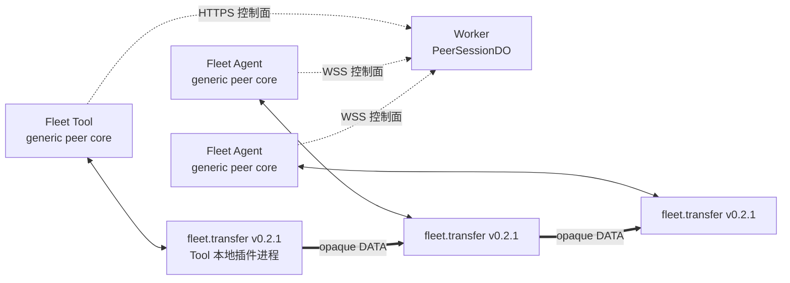
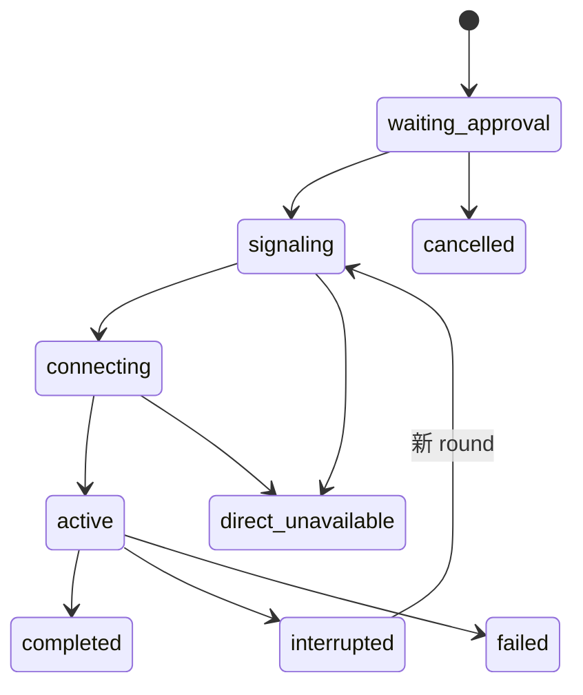
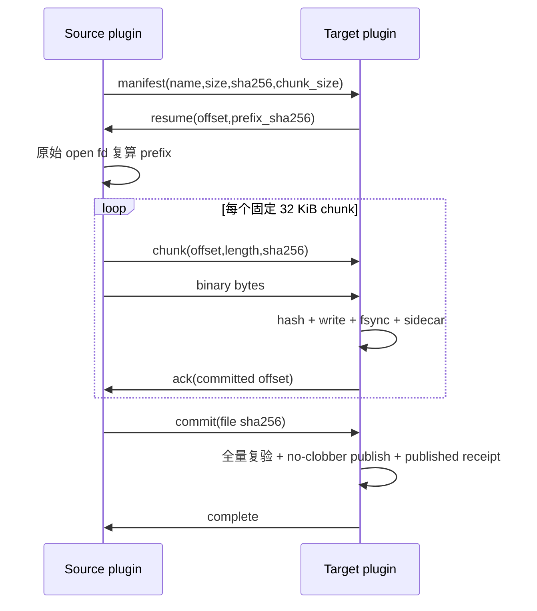
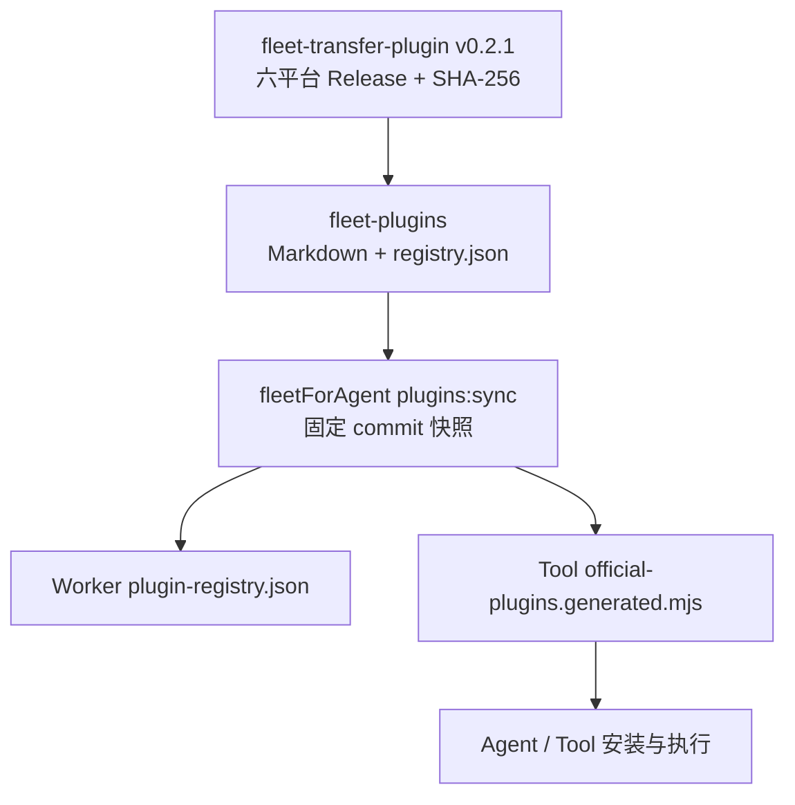

# Fleet 官方文件传输

状态：`fleet.transfer v0.2.1` 实现与验收基线，尚未发布。通用控制面见 [Fleet 通用插件运行时](./PLUGIN_RUNTIME.md)，插件的逐帧协议以公开仓库 `TITOCHAN2023/fleet-transfer-plugin` 的 `PROTOCOL.md` 为准。

## 目标与边界

首版只传输一个普通文件，支持同一 Fleet 账户内：

- 本地 Fleet Tool → 在线 Fleet Agent；
- 在线 Fleet Agent → 本地 Fleet Tool；
- 在线 Fleet Agent → 在线 Fleet Agent。

文件字节只走可靠、有序、直连的 WebRTC DataChannel。Worker 负责账户隔离、目录声明校验、端点在线校验、持久信令 outbox 和短期票据，不读取、解释、缓存或中继文件字节。直连失败固定返回 `direct_unavailable`，不会降级到 WSS、Durable Object、R2、TURN 或第三方中继。

远程 Worker MCP 没有调用者本地磁盘，不能充当 Tool 文件端点；它只能协调设备到设备。Tool 文件端点只存在于本地 stdio/CLI 进程。

首版不支持目录、符号链接、FIFO、设备文件、覆盖已有文件或跨账户传输。没有可达的 host/STUN candidate 时，严格 NAT 环境可能无法直连，这是公开限制。

## 真正的数据边界



| 组件 | 负责 | 禁止负责 |
|---|---|---|
| Worker / `PeerSessionDO` | 账户、端点、固定目录声明、批准状态、round、SDP、票据、持久 outbox | 文件字段、路径、manifest、chunk、进度字节、数据中继 |
| Agent / Tool peer core | 启动固定插件、SHA-256 复验、本机确认、WebRTC、nonce handshake、背压、取消 | 解释 manifest、offset、ACK、resume、commit |
| `fleet.transfer` | 安全文件 I/O、私有 DATA 协议、哈希、续传、no-clobber 提交 | Hub Token、账户、设备目录、SDP、网络回退 |
| Tool 文件 facade | 把 CLI/MCP 参数变成固定插件的 opaque input，展示状态 | 复制实现文件协议或绕过插件 |

主仓可以保留 `send-file`、`receive-file`、`transfer-file` 与对应 MCP 工具作为产品入口；这些只是 `fleet.transfer` 的 facade。通用 Worker、Agent 和 peer transport 中不得出现插件 ID 或文件帧特判。

## 目录声明

`fleet.transfer v0.2.1` 使用固定官方目录声明：

```json
{
  "schema_version": 1,
  "id": "fleet.transfer",
  "version": "0.2.1",
  "runtime": "peer",
  "actions": ["prepare_source", "prepare_target"],
  "approval_actions": ["prepare_source", "prepare_target"],
  "action_specs": {
    "prepare_source": { "runtime": "peer", "role": "source" },
    "prepare_target": { "runtime": "peer", "role": "target" }
  },
  "peer_protocols": [{
    "id": "fleet.transfer.v2",
    "abi": "fleet.plugin.peer.v1",
    "transport": "direct_ordered",
    "approval": "both_once",
    "roles": {
      "source": "prepare_source",
      "target": "prepare_target"
    }
  }]
}
```

Tool 和 Worker 使用固定 registry commit。Agent/Tool 选择本机 OS/arch artifact，要求 URL 属于同一官方仓库的 `v0.2.1` Release，下载有硬上限，并在安装和每次执行前复验固定 SHA-256。客户端不能提交 URL、可执行路径或 SHA。

## 会话与 round

文件传输复用通用 `PeerSessionDO`，没有 `TransferDO`，也没有文件专用 Worker 路由。



每个 session 只进行一次本机批准（`both_once`）。每次重连由 DO 生成新的 `round_id`；两端 Core 生成新的随机 round nonce，重新建 PeerConnection、重新验票，并用原有 opaque action input 重启插件进程。插件通过自己的 manifest/resume 握手恢复，Core 不计算文件 offset。

短期票据绑定：

- 当前账户、kid、operator 和 session/round；
- source/target 的 kind、id、plugin id/version、action/role；
- 固定 protocol/ABI/transport/approval 的 capability digest；
- 两端 Core session/round nonce 的 SHA-256；
- offer/answer DTLS fingerprint；
- `direct_only=true`、签发时间和最多 60 秒过期时间。

票据不包含文件名、路径、大小、文件 SHA、offset、prefix 或 nonce 原文。DataChannel 打开后，两端 Core 先交换 nonce 并按票据哈希复验；通过前禁止把任何 DATA 交给插件。

## 本地 FLPP ABI

Agent/Tool 与插件之间使用通用 `fleet.plugin.peer.v1`：

```text
magic    4 bytes  "FLPP"
version  uint8    1
kind     uint8    1=CONTROL, 2=DATA
flags    uint16   must be 0
length   uint32   big-endian
payload  length bytes
```

- CONTROL 最大 64 KiB；
- DATA 最大 32 KiB；
- 首个 CONTROL 是 `open {v:1,type:"open",action,input}`；
- 插件准备完成返回 `status=ready`；
- Core 只保持 DATA 消息边界并原样转发；
- 显式取消是 CONTROL `cancel`；
- 插件以 `status=complete|canceled|error` 结束；
- Core 的所有队列和 DataChannel buffered amount 都有硬上限。

插件不理解 Fleet session、round、nonce、票据、SDP 或 WSS。网络中断由 Core 终止旧插件进程并重新 `open`；这避免每个插件重复实现 Fleet 传输状态机。

## `fleet.transfer.v2` 私有 DATA 协议

下面的消息全部位于 FLPP DATA 内，Core 不解析。



应用控制消息是带 `v:2` 的紧凑 JSON DATA。一个文件块严格使用两个连续 DATA：先是 chunk 元数据，再是原始二进制。固定块大小为 32 KiB，最后一块可以更短；对端不能协商更大值。零字节文件从 resume 直接进入 commit。

Source：

- 只接受绝对路径；
- 拒绝 symlink 和非普通文件；
- 预哈希和所有读取使用同一个只读 fd；
- 读取前后检查 identity/size/mtime，并对每块和全文件做 SHA-256；
- 同一 fd 复算 target 给出的 prefix，失败不猜测 offset。

Target：

- 发送者只提供本机目录和可选 basename，不能指定任意最终绝对路径；
- facade 在创建会话前生成 UUIDv4 `transfer_id`，并把 `SHA-256("fleet.transfer.source.v1\\0" + transfer_id + "\\0" + canonical({kind,id}))` 作为 `source` 绑定传给目标插件；同一传输跨 round 保持一致，不同传输不可关联，原始 endpoint id 不进入插件状态；
- 最终文件存在时绝不覆盖；只有同一 `transfer_id`、来源绑定和 manifest 的已发布回执完整匹配，且目标内容重新全量验真后，才作为同一次传输的幂等重试；
- 用户后来删除或移动最终文件时，只有 destination 与 partial 都不存在、且 sidecar 是结构完整并精确绑定该目标路径的 `published` 回执，下一次 open 才能按 inode 隔离回收它；回收期间 destination、partial 或 sidecar 被并发替换就安全失败，绝不覆盖或删除新路径；
- 在最终目录创建权限 `0600` 的 partial 与 sidecar；
- 只有 chunk hash 验证、写入、sync 和 checkpoint 持久化后才 ACK；
- resume 重新读取整个已确认前缀并复算 SHA-256；
- commit 时复验大小和全文件 SHA、fsync，并原子 no-clobber 发布；发布回执先进入 `publishing`，目标可见且复验后进入 `published`，用于恢复“已发布但完成帧丢失”；
- 不完整内容永远不能以最终文件名出现。

## 中断与取消

网络中断和显式取消不是一回事：

- **中断**：关闭当前 round 和插件进程，但保留身份匹配的 partial/sidecar；新 round 重启插件后重新走 manifest/resume；
- **取消**：仅在尚未发布时，插件才会在 partial、sidecar、transfer id 和 source binding 全部仍匹配后删除自己的恢复文件；任何路径替换或 symlink 竞争都会安全失败。进入 `published` 后取消是幂等空操作，最终文件和已发布回执都保留；
- **失败**：source changed、partial tamper、hash mismatch、target exists 和 direct unavailable 都是稳定终态，不能静默从零重传或覆盖。

首次版本最多自动重试三个新 round，总协调窗口不超过 30 分钟；若实现没有同时锁住这两个界限，就不得发布。

## 本机授权

- 安装、卸载和两个 peer action 都是设备端敏感动作；
- `permit=allow` 不能跳过首次 source/target 确认；
- Core 显示固定插件、action、对端和 bounded opaque input；不得相信远端提供的伪造“友好说明”；
- source 侧确认可见的是固定 metadata、`prepare_source`、对端和 canonical input（包括本机 source path/chunk size）；target 侧可见的是 `prepare_target`、对端和 canonical input（包括本机 directory/name、transfer id 与不透明 source digest）；
- 文件大小和完整 SHA-256 要到批准后由 source 插件计算，并经私有 manifest 交给 target，批准对话框不得声称用户已经看见或批准这两个字段；
- 插件不是 OS 沙箱，它继承 Agent/Tool 当前用户的文件权限；
- Hub Token 重置、控制 WSS 失效、设备切 Off 或用户取消会关闭所有当前 peer round。

## 发布链路



顺序不能颠倒：先构建并测试插件 artifacts，再把真实 SHA 写入目录；目录提交后，主仓固定该 commit；最后才构建 Tool/Agent、部署 Worker 和发布主仓版本。任一步失败都不能用 `latest`、临时 URL 或跳过 SHA 的方式补洞。

## 验收门禁

发布前必须在本地 VM 中验证：

1. Tool→Client、Client→Tool、Client→Client；
2. 0 字节和至少 32 MiB，最终 SHA-256 一致；
3. 37% 处强制断开，使用新 round 从已验证 offset 恢复；
4. 显式取消清理自己的 partial；普通中断保留可恢复数据；
5. 目标已存在、source 变化、partial 篡改、symlink/FIFO、错误 hash 均安全失败；
6. 交换端点、篡改 capability/nonce/fingerprint、旧 round、过期票据、旧 kid、跨账户均拒绝；
7. 阻断所有可用 ICE path 时固定 `direct_unavailable`；
8. Worker/WSS 日志与测试 sink 中没有 FLPP DATA、manifest、chunk 或文件字节；
9. 内存占用不随文件大小线性增长；
10. 现有 shell RTC、desktop、task plugin、`configure_acp` 和 `delegate_to_acp` 回归通过。
