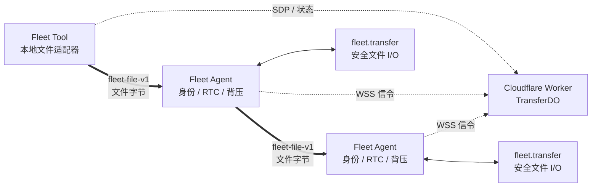
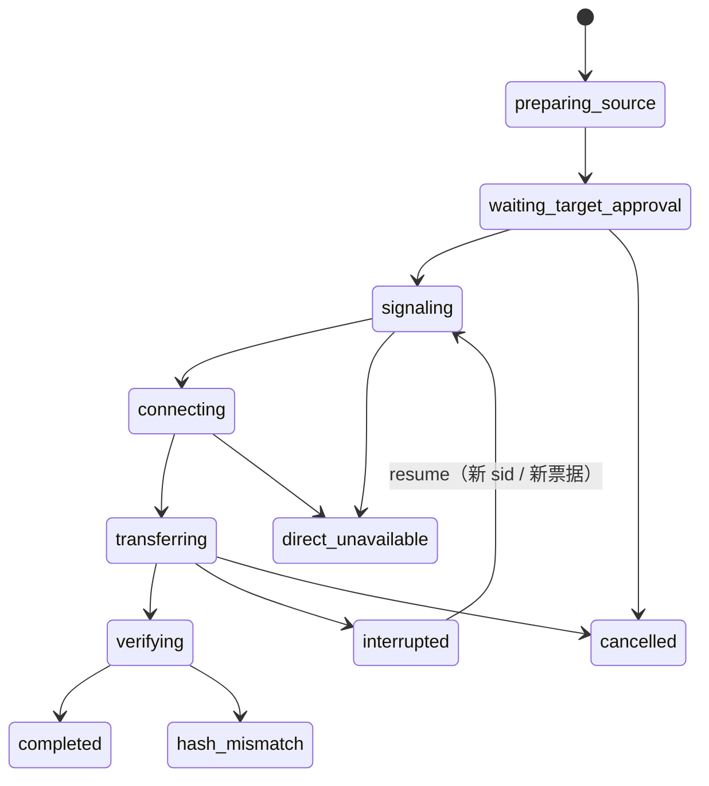
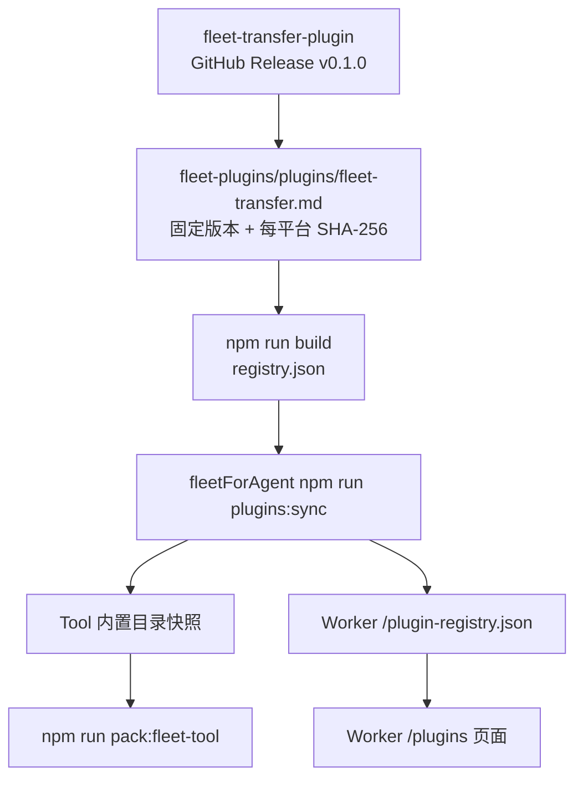

# Fleet 官方文件传输

状态：`v0.6.0` 发布候选。公开插件与官方目录已就绪，主仓仍须完成线上端到端验收。本文是 `fleet.transfer`、Fleet Agent、Fleet Tool 与 Worker 之间的协议约束，不是产品宣传。

## 目标与边界

首版只传输一个普通文件，支持同一 Fleet 账户内：

- 本地 Fleet Tool → 在线设备；
- 在线设备 → 本地 Fleet Tool；
- 在线设备 → 在线设备。

文件内容只走端到端 WebRTC DataChannel。Worker 负责鉴权、设备归属校验、短期票据和 SDP/ICE 信令，不读取、缓存或转发文件字节。直连失败时返回 `direct_unavailable`，不会偷偷降级到 WSS、Durable Object、R2 或第三方中继。

远程 Worker MCP 没有调用者本地磁盘，也不能充当 Tool 文件端点。Tool 端传输只在本地 stdio/CLI 进程中可用。

首版不支持目录、符号链接、FIFO、设备文件、覆盖已有文件或跨账户传输。没有 TURN 时，严格 NAT 环境可能无法直连；这是明确限制，不是需要隐藏的特殊情况。

## 组件职责



| 组件 | 负责 | 不负责 |
|---|---|---|
| Worker / TransferDO | 账户隔离、端点在线状态、状态机、信令、签票 | 文件字节、文件路径访问、传输中继 |
| Fleet Agent | 本机确认、验票、WebRTC、背压、会话取消 | 任意路径的直接读写 |
| Fleet Tool | 用户入口、Tool 端安全文件 I/O、编排与状态显示 | 远程 MCP 的本地文件访问 |
| `fleet.transfer` | 打开固定文件描述符、哈希、`.part`、续传校验、原子提交 | 身份、Hub Token、信令、网络连接 |

独立公开仓库为 `TITOCHAN2023/fleet-transfer-plugin`，插件 ID 为 `fleet.transfer`。主仓库不复制插件源码，只保留通用运行时、协议和经过版本/SHA-256 固定的目录快照。

## 核心数据

传输是两个端点之间的对象，不属于某个设备。它按 `transfer_id` 存在于独立 `TransferDO` 中。

```text
Transfer {
  transfer_id, user_id, operator_id,
  source { kind: "tool"|"device", id },
  target { kind: "tool"|"device", id },
  file { name, size, sha256 },
  resume { offset, prefix_sha256 },
  state, created_at, updated_at, expires_at
}
```

设备 ID 必须来自已认证的 WSS attachment 或当前账户的设备目录。请求正文不能冒充设备身份。Tool 身份是当前进程生成的 `X-Fleet-Operator` UUID。

### 状态机



终态是 `completed`、`direct_unavailable`、`source_changed`、`hash_mismatch`、`destination_exists`、`expired` 或 `cancelled`。`interrupted` 在 Worker 中最多保留 24 小时，可以续传；Tool 最多自动重试三轮且总协调窗口不超过 30 分钟。显式取消、失败或过期会删除目标端部分文件。

## 短期身份票据

文件传输使用新的固定 statement，不能给现有 shell RTC 票据堆可选字段：

```text
v, kind="file_transfer", sid, transfer_id, kid, operator_id,
source_kind, source_id, target_kind, target_id,
offerer_kind, offerer_id, answerer_kind, answerer_id,
name, size, sha256, resume_offset, prefix_sha256,
offer_fp, answer_fp, iat, exp
```

约束：

- 两端逐字段核对自己的身份、角色、`kid`、文件元数据、续传位置和 DTLS fingerprint；
- 票据最多有效 60 秒，只授权建立这一次连接；
- 每次恢复都使用新的 `sid`、PeerConnection 和票据；
- Hub Token 重置、控制 WSS 断开、本机切换 Off 或用户取消时立即关闭 DataChannel；
- 每台设备最多同时参与两个文件传输；普通 shell RTC 的 8 会话限额保持不变。

## DataChannel 协议

通道固定为可靠、有序的 `fleet-file-v1`，不复用承载 JSON Envelope 的 `fleet-v1`。

控制消息使用 v1 JSON Envelope：

- `file_ready`
- `file_ack`
- `file_eof`
- `file_complete`
- `file_complete_ack`
- `file_cancel`
- `file_error`

控制字段一律放在 `body`；`body.transfer_id` 必填。`file_ack` 使用 `body.committed`，禁止另造顶层 `offset` 变体。Agent 与 Tool 共用同一份 golden frame 测试，防止两套“各自单测都通过”的伪协议再次出现。

文件数据使用二进制帧：

```text
magic       4 bytes   "FLTF"
version     uint8     1
type        uint8     1 (DATA)
flags       uint16    reserved, must be zero
offset      uint64    big-endian
payload     0..32768 bytes
```

接收端要求 offset 严格连续。单帧 payload 最大 32 KiB；发送端 DataChannel 高水位为 4 MiB，超过后等待降到 1 MiB。Agent 与插件之间也只能使用约 4 MiB 的有界队列。ACK 每持久化 4 MiB或每秒发送一次，不逐块 ACK。Worker 最多每秒记录一次进度。

## 插件流式 ABI v1

现有“一次 JSON stdin → 一次 JSON stdout”插件 ABI 原样保留。官方文件插件另用 streaming ABI；不得将文件 base64 放入 JSON。

### Source

1. Agent 启动已安装且重新校验 SHA-256 的 `fleet.transfer`。
2. stdin 写一行 `prepare_source` JSON，插件拒绝 symlink/非普通文件，以只读方式打开并保持同一个 fd。
3. stdout 返回不超过 64 KiB 的 manifest 行：`name`、`size`、`sha256`。
4. Agent 发送 `prefix`，插件从同一 fd 计算指定 offset 的 `prefix_sha256`；只有它与 Target 的已验证前缀一致才允许续传。
5. Agent 按固定 32 KiB 发送 `read`。插件先输出一行包含 offset、length 与块 SHA-256 的 `chunk` JSON，紧随其后输出恰好 length 个原始字节。最后一块之外的块大小不能协商。

### Target

1. 本机确认必须显示来源、文件名、大小、绝对目标路径以及“不覆盖”规则；`permit=allow` 也不能跳过发送/接收确认。
2. stdin 写一行 `prepare_target` JSON。完整路径由本机目标目录与经过校验的 basename 组成，发送者不能指定目标绝对路径。
3. 插件在最终文件同目录创建权限 `0600` 的 `.part` 与 sidecar；最终文件已存在则失败。
4. 插件校验 sidecar 与 partial，返回 committed offset 和 partial 的 `prefix_sha256`。
5. Agent 每次先写一行包含 offset、length 与块 SHA-256 的 `chunk` JSON，再写恰好 length 个原始字节；插件持久化块与 sidecar 后返回 `ack`。
6. 收齐后 Agent 发送 `commit`。大小、最终 SHA-256 与 `fsync` 全部成功后，插件用同目录 hard-link + unlink 无覆盖发布；文件系统不支持 hard link 时安全失败并保留可续传状态。任何失败都不能让不完整文件以最终文件名出现。

Source 对同一 offset 计算出的 `prefix_sha256` 必须与 Target 一致，并写入短期票据。offset 越界或哈希不一致直接失败，不猜测、不截断。

## 本机确认与插件权限

- `install`、`uninstall`、`prepare_source`、`prepare_target` 始终需要设备本机确认；
- Agent 必须持久化并执行 registry 声明的 `actions` 白名单；未声明 action 一律拒绝；
- `approval_actions` 是可选的通用 manifest 字段，旧插件缺少它时行为不变；
- 插件不是 OS 沙箱。它以当前 Agent 用户运行，因此安装来源、版本、仓库和二进制 SHA-256 必须同时匹配；
- 官方 artifact URL 必须属于 manifest 的同一仓库和对应 Release tag，不能只校验 GitHub 组织名。

## 发布与目录链路



`fleet.transfer v0.1.0` 当前已在官方目录中设为 `installable: true`，用于 `v0.6.0` 线上验收；若端到端验收失败，必须先回滚为 catalog-only，再继续修复。页面按 registry 自动渲染，不为 `fleet.transfer` 写硬编码 UI 分支。

## 验收

- Tool→设备、设备→Tool、设备→设备的 0 字节、32 MiB以上文件 SHA-256 一致；
- 在 37% 处断线后从已持久化 offset 恢复；
- source 变化、partial 篡改、目标存在、symlink/FIFO、磁盘失败均安全失败；
- 交换端点、篡改 hash/offset、过期票据、旧 `kid`、跨账户/跨 operator 操作均被拒绝；
- 阻断 UDP/ICE 时固定超时返回 `direct_unavailable`，并断言 Worker/WSS 未出现文件帧；
- 内存占用不随文件大小线性增长；
- 老 Agent 缺少 `file_transfer_v1` 时明确返回 unsupported，现有 shell/plugin/desktop RTC 和 WSS 回退不变。
