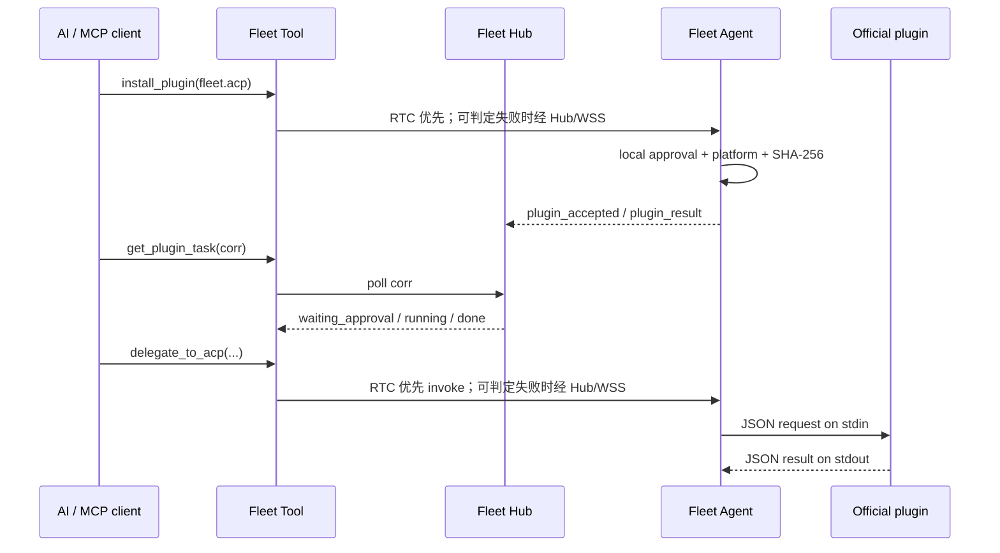

# Fleet 插件系统

Fleet 插件运行在设备上的 Fleet Agent 中，不运行在 Hub。公开的 [`fleet-plugins`](https://github.com/TITOCHAN2023/fleet-plugins) 仓库以“一插件一 Markdown”维护收录清单；Fleet 固定到该仓库的一个 commit，再把生成快照交给网站、Tool 和 Hub。Hub 只负责把官方插件 id 转成固定清单并转发任务；安装、校验、执行和授权都由设备完成。

## 数据流



## 安全边界

- Tool 不能提交下载 URL、文件路径或 SHA；它只能提交官方插件 id。
- Hub 从构建时固定的注册表快照注入清单，不在安装时读取 GitHub 的可变内容。
- 无公网设备可用经过账户鉴权的同源 `/v1/plugin-artifact/<id>/<version>/<os>/<arch>` 镜像。Hub 仍只按固定注册表解析上游 GitHub Release，拒绝客户端 URL 和非精确版本/平台，流式响应上限 100 MiB；`mirror_url` 只注入临时安装清单，不写入公开注册表。Agent 仍须校验固定 SHA-256。
- 收录不等于可安装；只有 `installable: true` 且包含官方 Release 和 SHA-256 的条目才会进入安装白名单。
- Agent 只接受 `Fleet Official`，artifact 必须来自清单声明的同一个 GitHub 仓库和 `v<version>` Release，并要求当前 OS/CPU 有精确产物。
- 下载上限 100 MiB，必须通过固定 SHA-256；安装使用同目录临时文件和原子替换。
- 安装和卸载即使设备设置为 `permit=allow` 也必须在设备端确认。
- Agent 持久化并执行清单的 `actions` 白名单；未声明 action 一律拒绝。`approval_actions` 中的敏感动作即使 `permit=allow` 也必须逐次在设备端确认。
- 普通插件动作遵循设备的 `off / ask / allow`；Hub 不能覆盖。
- 插件的程序、元数据和默认私有数据位于 `~/.fleet-agent/plugins/<id>/`，但这**不是 OS 沙箱**。插件继承 Fleet Agent 当前用户的文件权限；因此来源、版本、artifact URL、SHA-256 与执行前二进制哈希都必须匹配。

## 设备插件协议

Fleet Agent 每次动作启动一次插件进程。请求从 stdin 读取：

```json
{"action":"delegate","input":{"profile":"default","cwd":"/absolute/project","prompt":"Run tests"}}
```

插件只向 stdout 写一个结果：

```json
{"ok":true,"result":{"text":"..."}}
```

失败时返回 `{"ok":false,"error":"..."}`。stdout 上限 2 MiB，动作最长 1 小时。

上面是通用 **task runtime**。本地 Tool 当前已 RTC 优先，并在能力缺失、建连失败或同步 `send()` 失败等可判定情形回退 Hub/WSS；远程 Worker MCP 直接走 WSS。它尚未解决“DataChannel 接受请求但 Agent 未确认接收”的灰区，所以不能宣称完整自动回退或 exactly-once。下一阶段必须补齐 Agent 接收 ACK、跨传输稳定的同一 `corr`、claim 与有界幂等结果重放。需要两个端点持续交换数据的插件使用通用 **peer runtime**：Worker 只协调同账户身份、批准、SDP 与短期票据，Agent/Tool 只建立可靠有序的直连通道并透明转发有界 FLPP DATA；业务协议全部由插件拥有。

peer runtime 不是 `fleet.transfer` 的私有后门，也不是任意插件自动获得网络或文件权限。插件必须在固定官方目录中精确声明 action、role、protocol、ABI 和批准策略，设备还会复验安装版本与二进制 SHA-256。Core 中不得出现官方插件 ID、文件帧或 ACP method 分支。完整架构契约见 [Fleet 通用插件运行时](./PLUGIN_RUNTIME.md)，文件插件约束见 [Fleet 官方文件传输](./FILE_TRANSFER.md)。

## Fleet ACP

官方 `fleet.acp v0.1.2` 插件是通用 ACP v1 客户端桥，不包含模型或厂商 Agent。它当前继续使用 task runtime，在远端机器启动用户配置的 ACP stdio 命令，并依次调用：

1. `initialize`（protocolVersion 1）
2. `session/new`（绝对 `cwd`）
3. `session/prompt`
4. 收集 `session/update`

嵌套 `session/request_permission` 默认拒绝。只有调用者明确传入 `permission_mode=allow_once` 时，才会选择 Agent 提供的 `allow_once` 选项；永不选择 `allow_always`。

`configure_acp` 和 `delegate_to_acp` 只是 Fleet Tool 的兼容入口，最终映射到通用插件 install/invoke/status 操作。Fleet Core 不解释 profile、prompt、ACP JSON-RPC method、流式 update 或 permission；这些数据只属于 `fleet-acp-plugin`。
