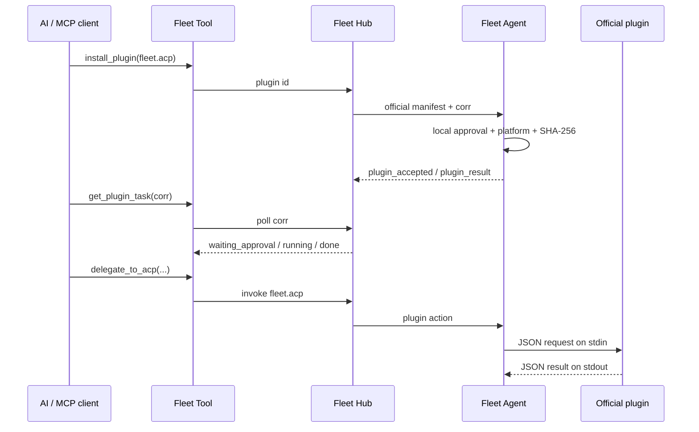

# Fleet 插件系统

Fleet 插件运行在设备上的 Fleet Agent 中，不运行在 Hub。公开的 [`fleet-plugins`](https://github.com/TITOCHAN2023/fleet-plugins) 仓库以“一插件一 Markdown”维护收录清单；Fleet 固定到该仓库的一个 commit，再把生成快照交给网站、Tool 和 Hub。Hub 只负责把官方插件 id 转成固定清单并转发任务；安装、校验、执行和授权都由设备完成。

## 数据流



## 安全边界

- Tool 不能提交下载 URL、文件路径或 SHA；它只能提交官方插件 id。
- Hub 从构建时固定的注册表快照注入清单，不在安装时读取 GitHub 的可变内容。
- 收录不等于可安装；只有 `installable: true` 且包含官方 Release 和 SHA-256 的条目才会进入安装白名单。
- Agent 只接受 `Fleet Official`、`https://github.com/TITOCHAN2023/*/releases/download/*`，并要求当前 OS/CPU 有精确 artifact。
- 下载上限 100 MiB，必须通过固定 SHA-256；安装使用同目录临时文件和原子替换。
- 安装和卸载即使设备设置为 `permit=allow` 也必须在设备端确认。
- 插件动作遵循设备的 `off / ask / allow`；Hub 不能覆盖。
- 每个插件只读写 `~/.fleet-agent/plugins/<id>/` 下的程序、元数据和私有数据。

## 设备插件协议

Fleet Agent 每次动作启动一次插件进程。请求从 stdin 读取：

```json
{"action":"delegate","input":{"profile":"default","cwd":"/absolute/project","prompt":"Run tests"}}
```

插件只向 stdout 写一个结果：

```json
{"ok":true,"result":{"text":"..."}}
```

失败时返回 `{"ok":false,"error":"..."}`。stdout 上限 2 MiB，动作最长 1 小时。

## Fleet ACP

官方 `fleet.acp` 插件是通用 ACP v1 客户端桥，不包含模型或厂商 Agent。它在远端机器启动用户配置的 ACP stdio 命令，并依次调用：

1. `initialize`（protocolVersion 1）
2. `session/new`（绝对 `cwd`）
3. `session/prompt`
4. 收集 `session/update`

嵌套 `session/request_permission` 默认拒绝。只有调用者明确传入 `permission_mode=allow_once` 时，才会选择 Agent 提供的 `allow_once` 选项；永不选择 `allow_always`。
