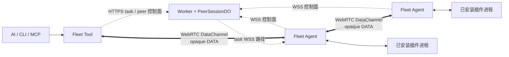
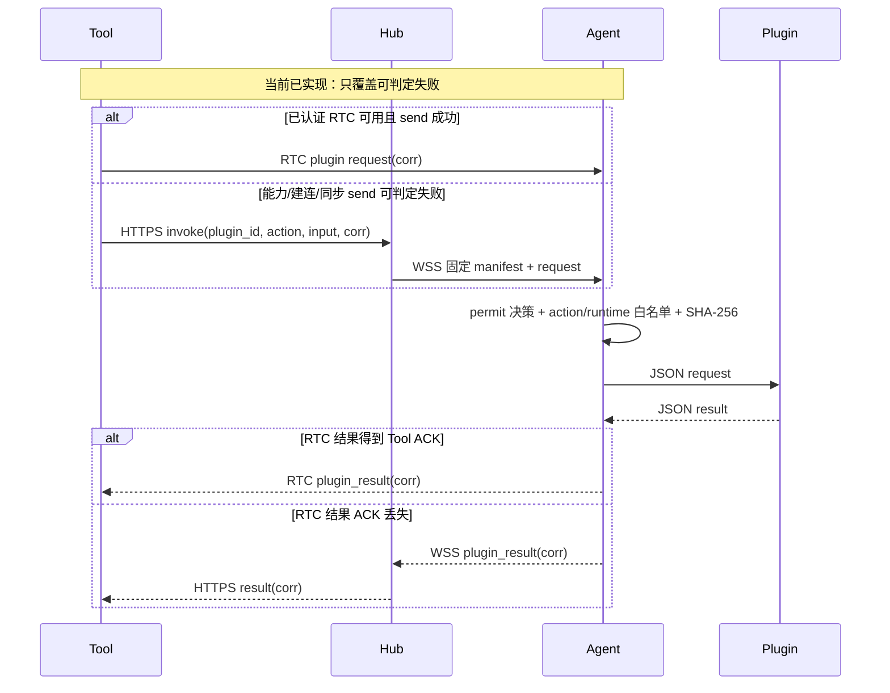
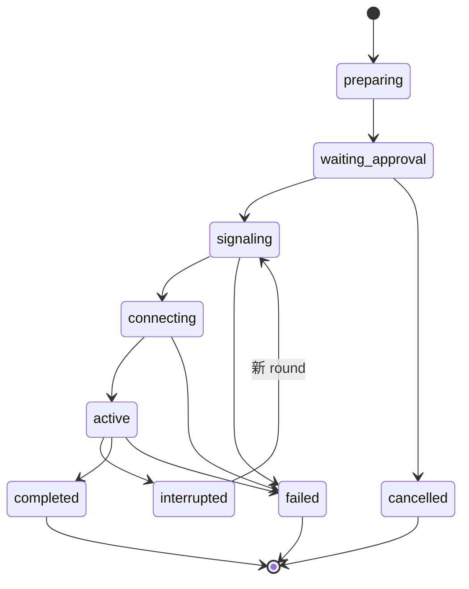
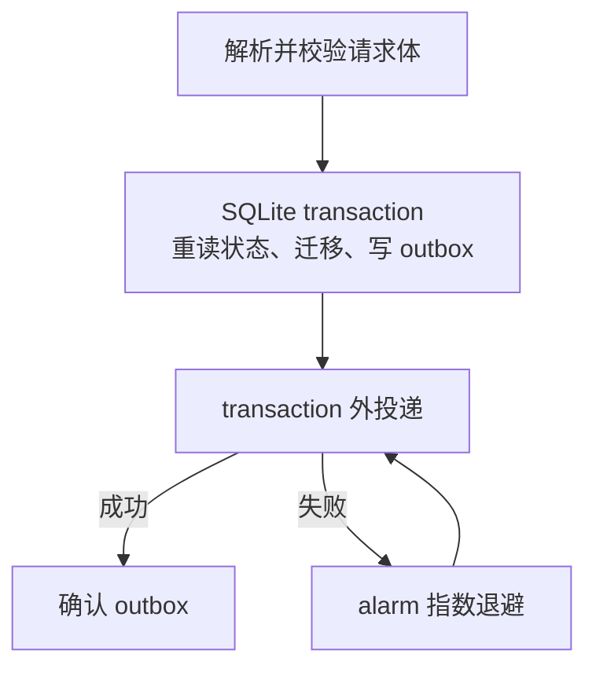
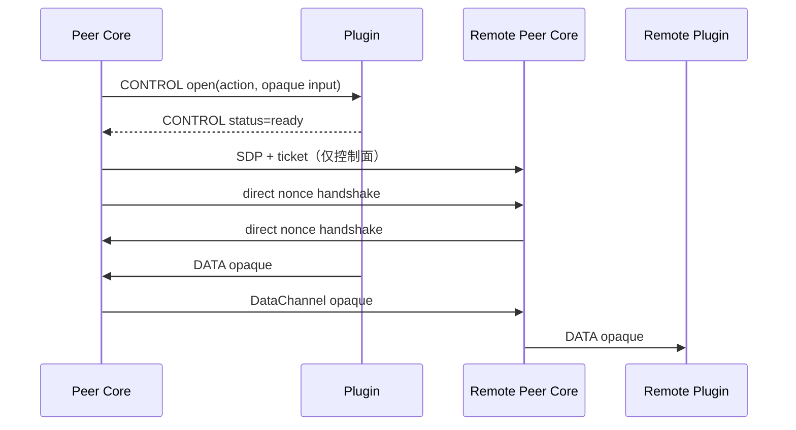

# Fleet 通用插件运行时

状态：`v0.6.1` 的设计与交接基线。后续 Agent 即使没有本次对话上下文，也必须先读本文，再修改插件链路。

## 核心判断

Fleet Core 只提供两种稳定运行形态：

1. **task**：一次有界 JSON 请求对应一次有界 JSON 结果；
2. **peer**：同一账户内两个已认证端点建立可靠、有序、直连的数据通道，业务字节对 Core 完全不透明。

`fleet.acp` 当前使用 task；`fleet.transfer` 使用 peer。以后增加插件，应优先复用这两种形态。不得在 Worker、Agent 或 Tool 的通用传输层新增插件 ID、文件字段、ACP method 或插件专用路由分支。



## 数据所有权

| 数据 | 唯一所有者 | Core 能否解释 |
|---|---|---|
| 账户、设备、operator、插件版本、协议声明 | Fleet Core | 能，只做身份和能力校验 |
| 会话 phase、round、SDP/ICE、DTLS fingerprint、短期票据 | `PeerSessionDO` / peer runtime | 能，只做控制面 |
| 本机 permit 决策、插件安装状态、插件二进制 SHA-256 | Fleet Agent | 能，只做执行授权 |
| 文件名、路径、manifest、offset、chunk、ACK、哈希、续传 | `fleet.transfer` | 不能 |
| ACP profile、prompt、method、permission、stream update | `fleet.acp` | 只能作为有界 task JSON 转发，不能解释 |
| peer DATA（包括文件字节） | 两端 peer 插件 | 不能读取、缓存或中继 |

若 Core 需要理解某个插件业务字段，数据结构已经错了。

## 目录声明

官方目录继续使用 `schema_version: 1`，避免破坏旧消费者。新增字段都是可选字段；缺少 `runtime` 时按旧版 task 插件处理。

```json
{
  "runtime": "task",
  "actions": ["run"],
  "approval_actions": ["run"],
  "action_specs": {
    "run": { "runtime": "task" }
  }
}
```

Peer 插件额外声明协议和角色。Core 只比较精确声明，不解释协议内容：

```json
{
  "runtime": "peer",
  "actions": ["prepare_source", "prepare_target"],
  "action_specs": {
    "prepare_source": { "runtime": "peer", "role": "source" },
    "prepare_target": { "runtime": "peer", "role": "target" }
  },
  "peer_protocols": [{
    "id": "fleet.transfer.v2",
    "abi": "fleet.plugin.peer.v1",
    "transport": "direct_ordered",
    "approval": "both_once",
    "roles": {
      "source": "prepare_source",
      "target": "prepare_target"
    }
  }]
}
```

`approval_actions` 保留为 schema v1 兼容元数据：旧 Agent、Tool 和 Worker 可以继续读取、转发和持久化它，但它不能覆盖设备 permit，也不能制造第二套批准规则。安装、卸载、task action 和 peer action 统一服从端点 Agent 的 `off / ask / allow`：`off` 拒绝，`ask` 等待本机点击，`allow` 自动授权且不再弹出插件确认。permit 只回答“本机是否授权执行”；官方来源、平台、action/runtime、下载上限、artifact 与执行时 SHA-256，以及适用的危险策略等硬校验始终生效。

peer 的 `approval: "both_once"` 也不表示“两端各点一次”。它表示每个端点在一个 session 内各完成一次本地授权决策：`ask` 需要点击，`allow` 自动通过，`off` 拒绝；后续新 round 复用该决定，不重复授权。

目录校验必须保证：

- `runtime` 只能是 `task|peer`，缺省为 task；
- `action_specs` 要么完全省略，要么覆盖全部 action，且不能声明不存在的 action；
- 顶层 `runtime=task` 不能夹带 peer action 或 `peer_protocols`；混合 task/peer action 必须显式使用顶层 `runtime=peer` 作为能力包络；
- `fleet.plugin.peer.v1` 固定使用两个逻辑 side/role：`source` 与 `target`；它们只是 Core 端点标签，不表示 Core 理解文件方向；
- peer action 的 role 只能是 `source|target`，且必须被某个 `peer_protocols.roles` 引用；每个协议必须恰好声明这两个 role；
- `abi`、`transport` 和 `approval` 只能使用固定枚举；
- role 对应值必须引用已声明 action；
- artifact 仍须固定仓库、Release 版本、平台和 SHA-256；
- 网站和 Tool 使用构建时固定 commit 的快照，安装时不得读取可变 GitHub 内容。

## task 运行时

task 保留现有 ABI：插件进程从 stdin 读取一个有界 JSON 请求，只向 stdout 返回一个有界 JSON 结果。`task` 是请求/结果语义，不等于某一种网络协议。

**当前实现**中，本地 Fleet Tool 的 task 插件请求已复用 `rtc_v1`，优先尝试已认证 DataChannel；RTC 能力缺失、建连失败或本地同步 `send()` 失败等可判定情形会走 HTTPS → Hub → Agent WSS。远程 Worker MCP 没有本地 RTC 端点，直接使用 Hub/WSS。结果已有 DataChannel ACK 和 WSS 重放，但请求侧仍有一个关键灰区：DataChannel 接受写入、Agent 尚未确认接收时若连接断开，Tool 不能判断该请求该重发还是已经执行。因此当前只能称为“RTC 优先并覆盖可判定失败的 WSS 回退”，不能称为完整安全回退或 exactly-once。

**下一阶段目标（未实现）**是补齐上述灰区，并把 RTC task fast path 收窄到 `invoke` 且目录最终声明为 task 的 action；插件 `list/install/uninstall` 固定走 WSS，peer action 永远不能进入这条路径。Tool 与 Agent 必须同时声明精确 feature gate，任一端不支持时保持 WSS-only，不能半协商。

重试身份不能由传输层临时生成。目标契约是：

```text
TaskKey = (device_id 隐含于目标连接, operator_id, corr)
RequestDigest = SHA-256(canonical({plugin_id, version, action, input, timeout}))
```

Tool 首次生成 `corr`，RTC 与 WSS 重试必须携带同一个 `corr` 和 canonical request。Agent 与 Worker 各自维护持久、有界、可过期的幂等 ledger：同一 TaskKey 与相同 digest 只能复用 accepted/running/result；同一 TaskKey 但 digest 不同必须 fail closed 为冲突，绝不能覆盖或执行第二份请求。

RTC 请求到达 Agent 后，Agent 必须先向 Worker claim 该 TaskKey；只有收到 Worker 对持久 claim 的 ACK 后才能启动插件，并向 Tool 返回 `plugin_accepted`。Tool 在收到 Agent 的 `plugin_accepted` 前可以继续同 corr 的 WSS fallback；收到后必须停止请求重发，只等待或查询同一任务。DataChannel 的本地 `send()` 成功不算接收证明。

结果走 RTC 时，Tool 必须回 ACK。Agent 未收到结果 ACK 时，可以把同 corr 的既有结果经 WSS 交给 Worker ledger；这是结果重放，不是重新执行。Agent/Worker ledger 只保存有硬上限的 task 状态和结果，不接收 peer DATA。

这套设计最多在进程存活和 ledger 状态完整时消除网络重试造成的重复执行。若 Agent 在 claim/accepted 之后、最终结果持久化之前崩溃，外部插件副作用可能已经发生而结果未知；系统只能报告 `unknown` / at-most-once，禁止自动重跑，也禁止把它宣传成 exactly-once。要获得真正 exactly-once，必须由具体业务提供事务或幂等键，Fleet Core 不能凭空制造。

| 情况 | 目标行为（未实现） |
|---|---|
| 两端 feature gate 不完整 | WSS-only |
| RTC 在 `plugin_accepted` 前失败 | 同 corr、同 digest 经 WSS claim/投递 |
| 同 TaskKey、同 digest 再到达 | replay accepted/running/result，不再执行 |
| 同 TaskKey、不同 digest | conflict，fail closed |
| RTC 结果 ACK 丢失 | 同 corr 结果经 WSS 重放 |
| Agent accepted 后崩溃、无最终结果 | `unknown` / at-most-once，不自动重跑 |
| list/install/uninstall 或 peer action | 不进入 RTC task fallback |

只有上述条件全部落地后，才可宣称“RTC 优先、失败自动回退且网络重试不重复执行”。这个回退只适用于有硬上限的 task，永远不能用于 peer DATA。



当前图没有解决“request send 成功但 Agent 未确认”的灰区。未来完整回退仍复用同一 task ABI、同一 `corr` 和同一 Agent 执行入口；它只强化投递确认，不能复制一套插件业务 handler。

`configure_acp` 和 `delegate_to_acp` 是 Tool 的兼容入口，不是 Core 协议。它们只能转换为通用 install/invoke/status 操作。ACP JSON-RPC、profile 和 permission 必须留在 `fleet-acp-plugin` 内部。

task 分发必须复核 action 的最终 runtime；声明为 peer 的 action 不能通过通用 `/v1/plugin invoke` 绕过双端授权和 peer 票据。Worker 做快速拒绝，Agent 以本机固定 metadata 再做最终拒绝。

## peer 运行时

### 控制面

Worker 暴露统一 `/v1/plugin-peer-session/*` API。创建请求包含 endpoint、plugin、version、protocol、role，以及每端不超过 8 KiB 的 opaque action input。Core 只做 JSON/字节上限和目录声明校验，不检查 input 内的文件或 ACP 字段。input 只进入首次 prepare outbox，投递成功即删除；持久 session record 和票据都不保存它。

设备本机授权必须由 Agent 的 permit 决定：`off` 拒绝，`ask` 才显示本机确认，`allow` 自动授权且不打开确认页面。`ask` 的提示必须从已安装且复验过 SHA-256 的 metadata 生成，显示 plugin id/version、action、对端以及 canonical bounded input（超长时安全截断）。Agent 不解释 input 的文件字段，也不得采用 Worker 或对端传来的“友好说明”；否则攻击者可以用无害文案遮蔽实际 action/input。



`waiting_approval` 是兼容的控制面状态，不等于“正在等人点击”。`allow` 可以自动完成端点授权并立即推进，只有 `ask` 才等待本机操作；`off` 必须拒绝会话。

每次重连都是新的、服务端生成的 `round_id`。旧 round 的 SDP、票据、回调和错误不得修改新 round。设备身份必须来自已认证 WSS attachment 或账户设备目录，不能信任请求正文冒充设备。

### Worker 持久状态与 outbox

`PeerSessionDO` 持久化账户、operator、kid、两端 endpoint/plugin/version/role、protocol、capability digest、端点授权状态、phase、round、签票 job 和过期时间。

状态变化和 `OutboxEntry` 必须在同一 SQLite transaction 中写入；向 DeviceDO/FleetDO 投递只能发生在 transaction 之外。失败重试复用稳定 `delivery_id`，不能因为一次网络失败把状态提交成“已投递”。端点 Core 为 session 和每个 round 生成 32-byte 随机 nonce；原文只留在端点内存，DO 只持久化 SHA-256。



Alarm 取过期、下一次 outbox retry 和 GC 中最早值。签票是持久 job，不得在状态提交后靠一次易失异步调用完成。

### 短期票据

票据只绑定一次直连所需身份和上下文：

```text
v=1, kind="plugin_peer",
session_id, round_id, kid, user_id, operator_id,
protocol, abi, transport, approval, capability_digest,
source_kind/id/plugin_id/plugin_version/action/role,
target_kind/id/plugin_id/plugin_version/action/role,
initiator_kind/id, responder_kind/id,
source_session_binding_hash, source_round_binding_hash,
target_session_binding_hash, target_round_binding_hash,
offer_fp, answer_fp, direct_only=true,
iat, exp
```

票据中的 `binding_hash` 是兼容字段名，实际绑定 Core 生成的 session/round nonce，不是插件业务数据。票据禁止放文件名、大小、路径、offset、业务 hash、prompt、ACP method 或 nonce 原文。两端逐字段核对身份、插件、协议、round、fingerprint、capability digest 和 nonce hash。过期、旧 kid、未知 round、跨账户或交换端点必须拒绝。

DataChannel 打开且票据验签后，双方 Core 先进行一次通用 nonce handshake：互发自己的 session/round nonce，对端复算并匹配票据里的 SHA-256。只有验证通过，Core 才开放 opaque DATA。插件不理解 nonce、session、round、SDP 或票据；Worker 也不保存、读取或回送 nonce 原文。

### 本地插件 ABI

Agent/Tool 与 peer 插件之间使用统一 FLPP 记录：

```text
magic    4 bytes  "FLPP"
version  uint8    1
kind     uint8    1=CONTROL, 2=DATA
flags    uint16   must be 0
length   uint32   big-endian
payload  length bytes
```

- CONTROL 最大 64 KiB；
- DATA 最大 32 KiB；
- Core 只解释 open/cancel/status 生命周期 CONTROL；
- Core 原样转发 DATA，不窥视、不修改、不重组业务协议；
- 插件自己定义 DATA 中的文件帧或 ACP 消息；
- 所有队列有硬上限，背压不能随文件大小线性增长内存；
- cancel/close 有硬超时，超时后终止整个插件进程组；但强制终止不算取消成功。



插件成功时返回 `status=complete`，显式取消使用 `CONTROL cancel`，失败使用 `status=error`。取消回执不是“进程已经没了”：Core 只有在本次 `cancel` 写入成功、收到合法的 FLPP v1 `status=canceled`，并确认插件自主以 0 退出后，才把 Worker 的 durable `cancelled` 投递 ACK。超时、强杀、信号退出、非零退出或缺少/伪造状态都保持未 ACK，等待恢复或人工处理。

普通网络中断使用 `Abort` 终止旧进程并保留插件自己的 checkpoint，同时留下一个有界的 cancellation recovery owner。之后若收到 durable `cancelled`，或本机进入 `permit=off`、认证撤销/Token 重置，Agent 会用原来的不可变插件身份和 bounded opaque input 重开插件，先发送 `open`，再发送 `cancel`；拿到上述真实回执后才清除恢复记录并 ACK。若 Hub 重放 `prepare`，这份清理义务会在 ACK 前原子转给新 session，不能被“新 session 还没启动”这个窗口吞掉。正常新 round 仍使用新的 nonce，业务插件通过自己的 DATA 握手决定如何恢复；插件作者不需要实现 Fleet 的 WebRTC round 状态机。

只有 `permit=ask` 才使用本机批准页面；`permit=allow` 必须直接完成授权决策，不能再调用或等待这个页面。页面虽然只监听 loopback，也必须按浏览器攻击面处理：只接受 loopback `Host`，拒绝跨站 `Origin` / `Sec-Fetch-Site`，所有变更接口固定为 `POST application/json`。CLI 可以省略浏览器来源头，但不能绕过方法和 Content-Type 门禁。禁止恢复 GET 批准或表单 POST，否则恶意网页和 DNS rebinding 可以代替用户点击批准。

### 不可变 round

Agent 和 Tool 的回调必须捕获不可变 round 对象，而不是读取 session 上会变化的 SID：

```text
PeerSession { current *PeerRound, used_rounds }
PeerRound   { generation, round_id, context, pc, dc, inbox }
```

任何异步回调修改状态前必须验证 `session.current == capturedRound`。不接受空 SID；有效但已使用的旧 round 消息直接丢弃；未知或伪造票据让当前 round 安全失败。旧 round 的 close/error/message 永远不能杀死新 round。

## 官方插件边界

### `fleet.transfer`

文件插件拥有全部业务语义：安全打开文件、basename、no-clobber、`.part`、sidecar、manifest、chunk、ACK、哈希、恢复和原子提交。Core 只看到自己生成的 nonce 摘要和 DATA 字节。

### `fleet.acp`

ACP 插件拥有 profile 配置、ACP stdio 子进程、`initialize`、`session/new`、`session/prompt`、stream update 和 permission 决策。当前保持 task runtime，避免为了展示抽象而强行改成 peer。若以后确有双端长连接需求，再通过目录声明增加 peer action，Core 仍不增加 ACP 分支。

## 兼容与发布顺序

- `origin/main` 已发布的 Hub Token、设备 WSS、shell RTC、桌面控制、普通 task ABI 和 ACP Tool 命令不得破坏；
- 运行时代码已删除旧 `TransferDO`、专用文件路由和文件票据；Cloudflare migration 历史仍永久保留 `v3 = TransferDO`，并通过新增 `v4` 删除旧类、创建通用 `PeerSessionDO`，禁止重写既有 tag；
- 任一端不支持精确 peer 能力时明确返回 `unsupported`，会话创建后禁止静默降级；
- peer 固定 `direct_only`，直连失败返回 `direct_unavailable`，不得把 DATA 降级到 Worker/WSS/R2；
- 新目录字段保持可选，旧消费者继续按 task 读取；
- `approval_actions` 和 `both_once` 的 wire/schema 取值保持不变；新 Agent 按统一 permit 语义解释，旧 Agent 仍可按旧逻辑运行；
- 发布顺序固定为：插件 Release → 目录固定 SHA/commit → 主仓同步快照 → Agent/Tool/Worker 发布。

## 已知后续项

以下问题已经在本次统一 CR 中确认并记录，但不与当前 peer/file-transfer 收尾混做：

- `create` 的稳定 intent 当前比较端点、协议、action 和 role，但不比较 opaque input；同一 `session_id` 的重试会保留第一次 input。下一阶段应只持久化 canonical input digest，并在 digest 变化时返回 conflict，不能保存业务明文；
- Worker 的信令类型仍允许 trickle ICE candidate，而 Agent/Tool 当前只使用完整 offer/answer。继续实现前必须二选一：三端一起补齐 candidate，或删除这段未闭包协议面；
- `FleetDO` 的账户 reservation 以 30 分钟 TTL 回收，terminal session 尚未主动释放。它现在既是并发上限也是短时速率上限；若要改成纯并发上限，必须设计幂等 terminal release，并保留 TTL 作为崩溃兜底；
- 完整 task RTC→WSS 安全回退仍按本文“下一阶段目标”实施，不得把它塞进 peer 状态机。

## 验证门禁

任何一项未通过都不得合并或发布：

1. Registry schema、固定 commit、artifact URL/version/SHA 测试；
2. Worker transaction/outbox、重试、alarm、过期、旧 round、跨账户测试；
3. Agent/Tool 旧 round callback、空 SID、伪造票据、硬帧上限、背压和进程组清理测试；
4. 通用 fake peer 插件证明 Core 能转发任意 opaque DATA，且 Core 无官方插件 ID 或业务帧分支；
5. `fleet.acp` configure/delegate、流式结果、permission、异常大帧和取消回归；
6. `fleet.transfer` Tool↔Client、Client↔Tool、Client↔Client 本地 VM 实测；
7. 文件 0 字节、至少 32 MiB、37% 断线恢复、取消、no-clobber、源变化、partial 篡改和最终 SHA-256；
8. 阻断直连后固定失败，并断言 Worker/WSS 从未出现 DATA；
9. 全仓 test、typecheck、lint、Go race、Worker dry-run和发布包校验。

## 禁止清单

- 禁止为某个插件新增 Core 专用 Durable Object、路由或 WSS payload；
- 禁止在 Core 中出现文件 chunk/ACK/resume 或 ACP method/profile/prompt；
- 禁止把文件 base64 塞进 JSON 或 Worker；
- 禁止客户端提供 artifact URL、执行路径或 SHA；
- 禁止把 peer action 从 task 路径启动；
- 禁止异步回调使用可变 session round；
- 禁止“直连失败就中继”的隐式降级；
- 禁止未经本地 VM 与旧功能回归直接发布。
