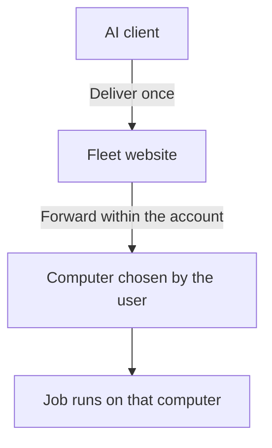

AI can already write code and run tests. The machine it can actually use, however, is often a temporary sandbox or the computer running the AI client. If the project and its development environment live somewhere else, the AI cannot reach them.

Fleet began with that mismatch. I already had Windows, Linux, and macOS computers. What I needed was a simple way for the AI client I was using to see which ones were online, select one, and send work to it.

## One place for many computers

After Fleet Agent is installed, each computer connects outward to the Fleet website. There is no inbound port to open on a home router and no public address required on the device. The operator connects to the same website and sees the computers that belong to the account.

Fleet exposes this through MCP, so people can keep using an AI client they already know. The AI gets a device directory with familiar names, operating systems, and online status. It neither receives nor needs the device IP.

A Windows PC at the office and a Mac at home can stay on their existing networks. A Linux server joins in the same way. If they can reach the internet, they can appear in one directory without joining a new private network or becoming visible to one another.

## Choose first, then act

The worst simple mistake in remote operation is picking the wrong computer. Fleet requires an explicit target before it will run anything. It does this even when only one device happens to be online.

That extra step matters because the list changes. An account with one computer today may have three tomorrow, and a convenient automatic choice can send the right command into the wrong environment.

The selected device belongs to the current AI tool session. A web console and another AI client can each keep their own target without silently changing the other. Once the AI has selected a computer, later actions can continue there until the user chooses a different one.

## Deliver a command once

AI clients usually limit how long a tool call may wait. A build or dependency installation can run beyond that limit, and a batch job may take much longer. When the result does not arrive in time, a model can easily send the same command again.

Fleet separates starting a job from waiting for its result. Once the device accepts the command, Fleet remembers that job. If the wait ends, the job is simply still running. The AI follows the original job instead of starting an identical process.

Cancelling a wait does not kill the remote job either. A brief network interruption or the end of one tool call leaves the target computer to finish its work. After reconnecting, the operator can continue reading the same job and collect its result.

## The job stays on the target device

Each job owns its process on the target computer. A stuck command does not block the next one from starting.

Output stays in a bounded buffer on the device. Fleet preserves useful early output and the most recent part, then makes the final result available when the job ends. The AI can inspect the current screen without pushing every byte that scrolled past into its conversation.

The hub only forwards messages. It does not keep a local process open for every connected computer, and the connection does not have to carry repeated versions of the same screen.

## The final decision stays beside the machine

Delivering a job to a device does not force that device to run it. Every computer keeps its own permission setting. A user can turn remote execution off or require approval at the machine. Commands run immediately only after the user has deliberately enabled automatic execution.

Desktop control follows the same local decision. Viewing the display and controlling the mouse or keyboard receive separate permission, so approval to look does not quietly grant input. The hub can report the setting chosen on the device, but it cannot remotely loosen it.
