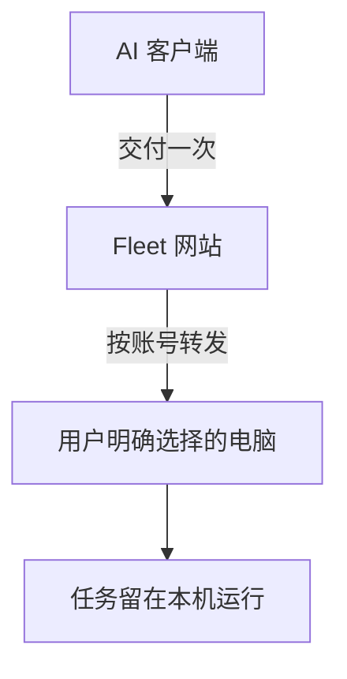
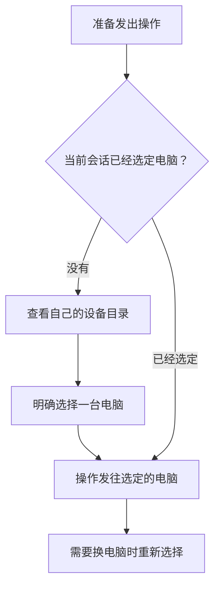
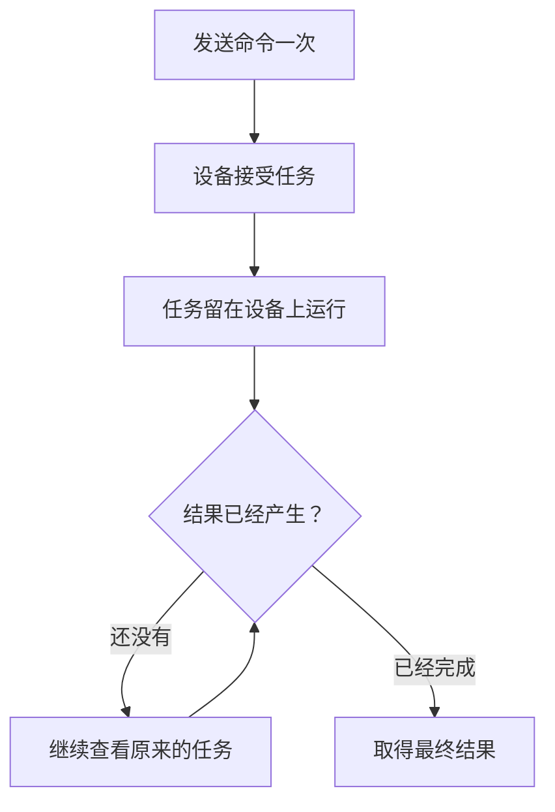
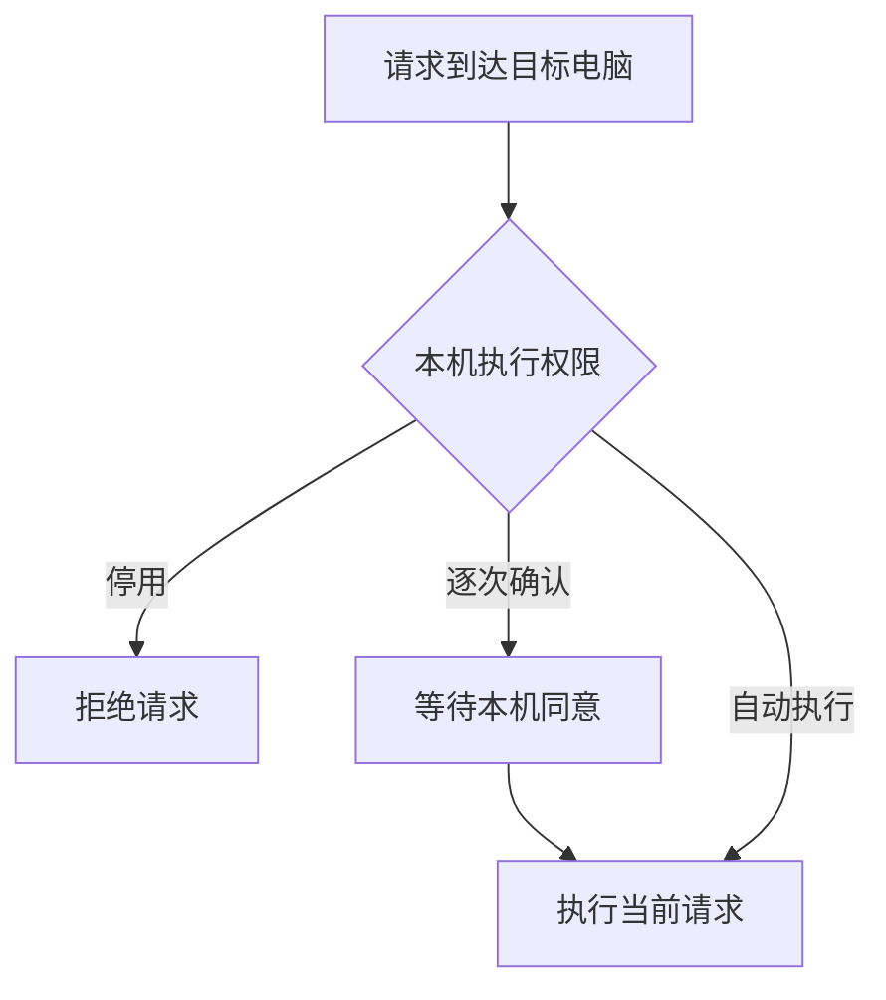

AI 已经可以写代码、跑测试，可它实际能够使用的机器，常常只有一台临时沙箱，或者正好运行客户端的那台电脑。项目和开发环境放在别处，它就够不到。

Fleet 就从这个缺口开始。我手边已经有 Windows、Linux 和 macOS 电脑，也不缺算力，缺的是一个简单的办法，让正在使用的 AI 客户端知道哪些电脑在线，选中其中一台，再把任务送过去。

## 多台电脑只留一个入口

每台电脑安装 Fleet Agent 后，会主动连接到 Fleet 网站。它不要求家里的路由器开放端口，也不要求设备拥有公网地址。操作端只需要连接同一个网站，就能看到当前账号下已经加入的电脑。

Fleet 把这项能力接进 MCP。用户可以继续使用自己熟悉的 AI 客户端，不必再换一个聊天界面。AI 看到的是一份设备目录，每台电脑都有用户熟悉的名称，也会显示系统和在线状态。设备在哪个网络，它无须知道。设备 IP 也不会交给它。

办公室里的 Windows 和家里的 Mac 可以继续使用各自原有的网络。Linux 服务器也按同样的方式接入。只要能够正常访问互联网，它们就能出现在同一份目录里，彼此不用建立新的局域网。

## 先选清楚，再动手

远程操作最怕选错机器。Fleet 要求 AI 在执行前明确目标，即使当前只有一台电脑在线，系统也不会擅自替它选择。这一步不能省。

这点看起来有些保守，却能挡住很麻烦的错误。在线状态随时会变，昨天只有一台电脑，今天可能已经有三台。自动选择省掉了一次确认，也让同一条命令更容易落到错误的环境里。

选中的设备只属于当前 AI 会话。网页控制台或另一个客户端可以各自操作自己的目标，谁也不会把别人的选择悄悄改掉。AI 记住了一台电脑以后，后续操作可以继续沿用；用户改为另一台时，新的选择才会生效。

## 同一条命令只交付一次

AI 客户端通常会限制一次工具调用能够等待多久，一次编译或依赖安装就可能超过这个时间，批量处理文件会更久。客户端没有及时拿到结果时，模型很容易把同一条命令再发一遍。

Fleet 把“开始任务”和“等待结果”分开处理。命令送到设备并开始运行后，系统会记住这次任务。等待时间用完了。结果还没回来，仅此而已。AI 接下来查看原来的任务，设备不会因此再启动一个相同进程。

取消等待也不会杀掉远端任务。网络短暂中断或 AI 客户端结束本次调用以后，任务仍由目标电脑继续完成。重新连上时，操作端可以沿着原来的任务读取状态和结果。

## 任务留在目标电脑上

每个任务都在目标设备上拥有自己的运行过程。某个命令卡住，不会堵住下一条，其他任务仍然可以开始。

命令产生的输出也留在设备上的有限缓冲区里。较快的输出会截住有用的开头，随后保留最近内容。任务结束后，最终结果仍能取回。AI 通常只需要知道任务现在走到哪里，没有必要把滚过屏幕的每个字节都塞进会话。

AI 可以随时查看当前状态，也能在任务结束后取得结果。连接不用搬运每一帧重复画面，中枢也只负责转交消息，无须替每台电脑长期托着一个本地进程。

## 最后的决定留在机器旁边

Fleet 能把任务送到设备，不代表设备必须执行。每台电脑都保留自己的权限设置。用户可以停用远程执行，也可以要求每次都在本机确认。自动执行才会直接运行。

桌面操作也遵守本机决定。查看屏幕和控制键鼠分别取得许可，一次查看不会顺带放开输入。中枢能够显示设备当前选择了哪种权限，却不能远程把它改成更宽松的档位。

