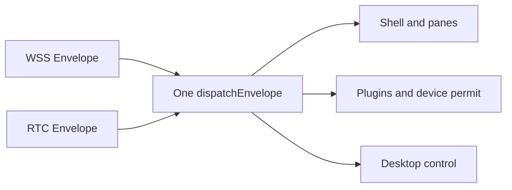

A central relay makes remote control pleasantly predictable. Both sides connect outward, home routers need no special treatment, and failures have one obvious place to inspect. The cost is just as clear. Every command, screen capture, and plugin call passes through the hub.

That cost barely registers with a few devices. As the number of devices and operators grows, the hub ends up carrying data between two machines that could often reach each other directly. WebRTC offers a tempting route around it. The peers attempt NAT traversal, move business traffic to a DataChannel when it works, and leave the hub to maintain presence and a fallback path.

The design fits on a small diagram. Most of the engineering sits inside the words “when it works.”

## Keep the business protocol unchanged

The first constraint was simple. RTC would not get its own remote execution protocol. Fleet already carries a fixed Envelope over WSS with a version, message type, request ID, correlation ID, timestamp, and body. The DataChannel carries the same Envelope.

The Agent keeps one business entry point as well. WSS messages go to `dispatchEnvelope`. DataChannel messages go there too. Commands, panes, desktop control, and plugins all reply through the same `EnvelopeSink`.

This decision is deliberately unexciting. Plugin installation still follows the device permit: Off refuses, Ask waits for someone beside the device, and Allow runs unattended without a second plugin prompt. Dangerous commands still meet the device policy. A second set of RTC handlers would eventually miss one of those checks.

The hub still does not interpret command text. The Agent process rejects disastrous input such as an attempt to delete the root filesystem. The Worker remains a mailbox that delivers an Envelope to the right device. Moving an operator from WSS to RTC does not create a path around device policy.

## Keep WSS after the direct path opens

WSS stays connected after the DataChannel opens. It continues to carry heartbeats and signaling, and it gains responsibility for revocation and fallback.

Keeping one idle connection costs a little. It also gives the direct path a useful security property. Every DataChannel depends on the control connection. When WSS disappears, the Agent closes all direct sessions before reconnecting.

NAT traversal fails for ordinary reasons. A company network may block UDP, a pair of NATs may refuse to cooperate, or a self-hosted STUN service may be unavailable for a while. Fleet does not treat those cases as an offline device. Traffic returns to HTTPS through the Worker and then follows the device's existing WSS connection.

STUN has a narrow job here. It helps each peer discover its public mapping. It does not relay commands or decide identity. The first release has no TURN service. TURN would become another central relay for business data, while Fleet already has a WSS fallback that has been exercised in production.

## A stolen Token makes revocation the hard part

An attacker with a valid Token has the permissions assigned to that Token until it is reset. Strong WebRTC encryption cannot identify a real stolen credential as fake.

Fleet makes the reset decisive. The hub first records the old kid as revoked and signs an `auth_revoked` statement with the old private key. When the Agent receives it, revocation takes priority over business work. The Agent clears pending approvals and reply paths, closes every direct session, and enters an authentication failure state. It will recover only after the user supplies a different Token.

The signed message cannot be the only safeguard. Networks are good at losing the message that matters most. DeviceDO closes WSS after sending the revocation notice. The Agent treats a lost control connection as a reason to close RTC immediately. If the signed notice never arrives, the next challenge still rejects the old kid and leaves the Agent in the same authentication failure state.

Revocation therefore does not depend on one message arriving just before a socket closes.

The reset operation also fails closed. Fleet does not mint the new Token until every online device confirms that it has been disconnected. The old kid is already marked as revoked, while its signing material remains long enough to retry the disconnect. A successful-looking settings page is not worth leaving an old direct session alive.

## The hub remains the trust root

The offer and answer each contain a DTLS fingerprint. The Worker puts both fingerprints, the device ID, the operator fingerprint, the current kid, and a short-lived session ID into a ticket signed with the account key. After verifying that ticket, the Agent sends `rtc_ready` through the direct channel. The Tool sends no business message before it receives that confirmation.

DTLS protects the data in transit. The signed ticket binds this encrypted connection to a Fleet session that has already passed authentication. A STUN address cannot provide that binding, and a random session ID cannot provide it either.

This release does not create another long-lived identity key for every device. The central Worker remains the trust root, which keeps the boundary understandable. If the cloud side is fully compromised, local Off and per-request approval still matter. Automatic execution deliberately gives the current Token its full operating authority.

## Older clients continue normally

Capability negotiation adds `rtc_v1` without changing the protocol version. A new Tool uses WSS when an older Agent does not advertise that capability. It also caches the result when an older Worker or standalone Node Hub has no RTC signaling endpoint, then continues along the existing path. An older Tool needs no knowledge of the new transport when it talks to a new Agent.

Transport integration tests that open an Agent shell run inside a disposable Docker container. The source tree is mounted read-only, the container has no Linux capabilities, and it cannot reach the host Docker socket. The Go test connects two Pion peers, runs an ordinary command through one DataChannel, then sends a harmless command marked by the test interceptor and checks that the Agent returns exit code 126. Node tests cover the unchanged Envelope, older-client fallback, and the `rtc_ready` gate. Destructive strings appear only in policy parser tests and never reach a shell.

The direct path is useful because most business traffic can take a shorter route. The brake remains part of the design. WSS stays connected, revocation can preempt business work, failed NAT traversal has a proven route home, and older clients do not have to share the risk of a new transport.
