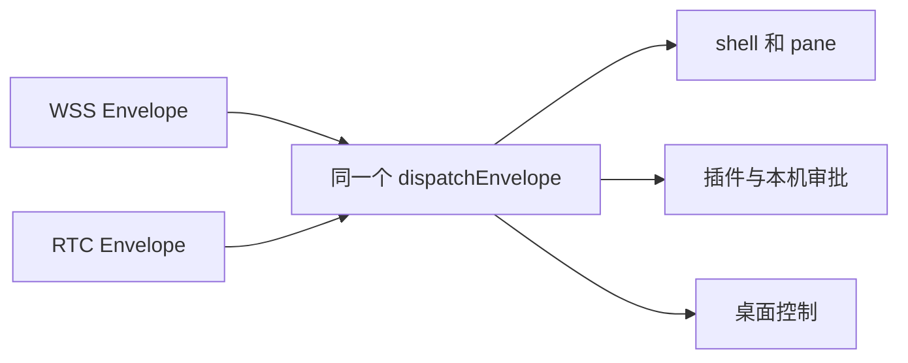

做远程控制时，中心中继很省心。两边都向外连，不用碰用户家的路由器，哪里断了也容易查。代价同样直白，每条命令、每张屏幕快照、每次插件调用都要经过中枢。

访问量小时，这点开销不显眼。设备和操作端多起来以后，中枢会替本来能够直接说话的两台机器搬很多东西。于是很自然会想到 WebRTC。双方先打洞，成功以后走 DataChannel，中枢只管在线状态和备用路径。

这个想法写在纸上只要几行。真正动手时，麻烦全在那句“成功以后”。

## 先不碰业务协议

我最先定下来的限制，是不准为 RTC 再写一套远程执行逻辑。Fleet 原来的 WSS 已经传一份固定 Envelope，里面有版本、类型、请求编号、关联编号、时间和正文。新通道继续传它。

Agent 里也只留一个业务入口。WSS 收到消息，交给 `dispatchEnvelope`。DataChannel 收到消息，还是交给它。命令执行、pane、桌面控制和插件最后都从同一个 `EnvelopeSink` 回信。

这件事看着不够新鲜，却最要紧。插件安装本来要求设备旁的人确认，换成 RTC 以后还得确认。危险命令本来由设备拦，换成 RTC 以后仍然在同一个位置拦。若为直连复制一遍 handler，迟早会有一个分支少掉检查。

中枢也没有开始研究命令内容。`rm -rf /` 这类灾难命令在 Agent 进程里拒绝，Worker 只负责把 Envelope 送到正确设备。操作端从 WSS 换到 RTC，设备 policy 没有旁路。

## WSS 不能因为直连成功就退场

DataChannel 打开以后，WSS 仍然保持连接。它现在多了一层职责，负责心跳、信令、撤销和兜底。

这么做会少省一条空闲连接，却换来一个很实在的安全性质。直连必须依附在控制连接上。WSS 一断，Agent 马上关掉所有 DataChannel。它不会让一条失去中心控制的业务通道继续活着。

打洞失败也很普通。公司网络可能封 UDP，两边的 NAT 组合可能谈不拢，自建 STUN 也可能临时没响应。Fleet 不把这些情况当成设备离线。直连失败以后，原来的 HTTPS 到 Worker，再到设备 WSS 的路线继续工作。

STUN 在这里很朴素。它帮双方看见各自的公网映射，不转发命令，也不参与身份判断。第一版没有加 TURN。TURN 会重新成为中心业务中继，而我们手里已经有一条经过生产验证的 WSS 兜底。

## 最难处理的是 Token 已经被偷

有效 Token 落到攻击者手里以后，他在重置前拥有账号给这把 Token 的权限。WebRTC 加密再好，也不能把一把真的钥匙辨认成假的。

能做的事情，是让重置足够硬。

Fleet 重置 Token 时，会先记下旧 kid 已经撤销，再用旧私钥签一份 `auth_revoked`。这份消息发到设备以后，Agent 先清待批准请求和回包出口，再关全部直连，最后进入认证失败状态。旧 Token 不会自动重连。用户贴入一把不同的新 Token，它才恢复。

签名消息也不能成为唯一保险。网络最会挑这种时候掉包。DeviceDO 发完撤销以后还会关闭 WSS。Agent 只要看见控制连接消失，就会先切断 RTC。若它没收到签名消息，下一次连接也过不了旧 kid 的 challenge，随后停在认证失败。

这个顺序让撤销不依赖一条消息恰好赶在 close 前送达。

重置本身也按失败关闭处理。只要有在线设备的断连没有得到确认，就不生成新 Token；旧 kid 已经被标成撤销，旧签名材料则暂时保留，供用户重试这次断连。不能为了让设置页看起来成功，就把仍可能存活的直连留在后面。

## 中心仍然是信任根

offer 和 answer 里各有一份 DTLS fingerprint。Worker 把两端 fingerprint、设备编号、操作端指纹、当前 kid 和短期 session 编号放进 ticket，再用账户私钥签名。Agent 验过 ticket 后会在直连里发一条 `rtc_ready`，Tool 等到它才允许业务消息出发。不能因为 Worker 已经生成 ticket，就猜 Agent 也恰好处理完了。

DTLS 保护正在传输的数据。签名 ticket 把当前这条加密连接和已经通过 Fleet 认证的会话绑在一起。STUN 地址不能替代这层认证，单独一个随机 session 编号也不行。

这版没有给每台设备另造长期身份钥匙。中心 Worker 仍是信任根，系统的边界也因此比较清楚。云端若被完全控制，本机的停用和逐次确认依然重要。选择自动执行，就等于把当前 Token 的操作权限完整交出去。

## 旧客户端照常用

能力协商只多了一个 `rtc_v1`，协议版本没有变。新 Tool 看见旧 Agent 没有这项能力，直接走 WSS。新 Tool 遇到旧 Worker 或独立 Node Hub，发现没有 RTC 配置接口，也会缓存这个结果，再走原路径。旧 Tool 和新 Agent 的组合不需要知道发生过这些改动。

会进入 Agent Shell 的传输集成测试放在一次性 Docker 容器里，源码只读挂载，容器没有 Linux capabilities，也拿不到宿主机的 Docker socket。测试让 Go 的 Pion 两端互通，在同一条 DataChannel 里跑普通命令，再送一条由测试拦截器标记的无害命令，设备返回 126。Tool 侧的 Node 单测检查原 Envelope、旧版回退和 `rtc_ready` 门禁。真实危险字符串只出现在纯 policy 解析单测里，不会送进 Shell。

直连值得做，因为它确实能让大部分业务数据少绕一段路。那脚刹车也得留着。WSS 还在，撤销能抢占业务，打洞失败能回家，旧客户端不用陪着新功能一起冒险。
