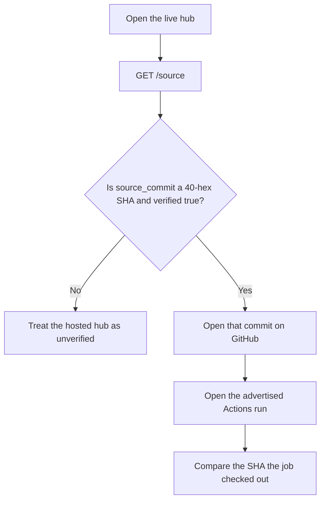
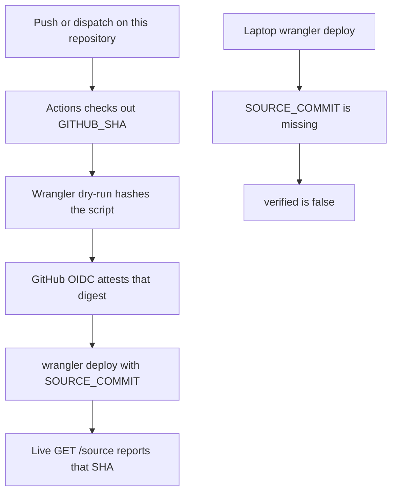

A reasonable doubt about any hosted remote-control service is that the public repository is one codebase and the live website is another. Fleet treats that as a check, not a slogan.

The hosted hub is [https://fleet.ginfo.cc](https://fleet.ginfo.cc). The public tree is [https://github.com/TITOCHAN2023/fleetForAgent](https://github.com/TITOCHAN2023/fleetForAgent). This note explains what you can verify, what the Agent installers already prove more strongly, and what a Cloudflare Worker still cannot prove by talking about itself.



## Ask the live process

The Worker answers without a login:

```bash
curl -sS https://fleet.ginfo.cc/source
```

The same document is at `/v1/source` and inside `/v1/health` as `source`. A page with no JavaScript is at [https://fleet.ginfo.cc/trust](https://fleet.ginfo.cc/trust).

`verified` is true only when `SOURCE_COMMIT` is a 40-character hexadecimal git object name. Anything else, including a missing value after a laptop `wrangler deploy`, is unverified.

The fields that matter:

- `source_repo` — the public remote, defaulting to this GitHub repository
- `source_commit` — the SHA baked at deploy time
- `source_workflow_run` — the Actions run that published this Worker
- `source_bundle_sha256` — SHA-256 of the Wrangler dry-run script from that same job

If those values are absent or `verified` is false, stop. The hosted hub is not presenting a checkable identity.

## How production is published

The intended publisher of `fleet.ginfo.cc` is `.github/workflows/deploy-hub.yml` in this repository. That job checks out the commit it will advertise, builds a Worker bundle without deploying it, hashes that script, attests the digest with GitHub OIDC, and only then runs `wrangler deploy` with `SOURCE_COMMIT` set to `$GITHUB_SHA`.

The Cloudflare API token belongs in GitHub Actions secrets. It does not belong on a laptop. The job does not keep dashboard variables from a previous publish, so a laptop deploy without those `--var` flags drops `SOURCE_COMMIT` and the live `/source` document becomes unverified.



## What a yes does not prove

Cloudflare does not let a stranger download the live Worker isolate and hash it. A process that reports its own commit can also lie about that commit. Anyone who holds the Cloudflare token can publish a different Worker while advertising a public SHA.

The counter is process, not a bytecode proof. Production is supposed to come from this repository's Actions job. The advertised SHA is `$GITHUB_SHA` from that job. The workflow URL is public. A laptop publish without the baked variables makes `verified` false.

That is enough to catch an accidental second tree. It is not a substitute for reading the git object yourself, and it is not as strong as verifying a file you already have on disk.

## Agent installers are a stronger case

Release binaries are files you can hold. The packaging script refuses a dirty checkout, requires the release tag to point at `HEAD`, and embeds `vcs.revision` with `go build -buildvcs=true`. GitHub Releases ship `checksums-*.txt` and OIDC attestations for those artifacts.

```bash
curl -fsSL https://github.com/TITOCHAN2023/fleetForAgent/releases/latest/download/checksums.txt
gh attestation verify --repo TITOCHAN2023/fleetForAgent FleetAgent-macos-arm64.dmg
go version -m ./fleet-agent | grep vcs.revision
```

The Agent on each computer is the component that can run commands. That is the binary whose digest you can check independently of anything the website says.

## Self-host when the hosted hub is not the authority you want

The Node hub and a Worker you deploy on your own account speak the same protocol. Set `SOURCE_COMMIT` to `git rev-parse HEAD` so `/source` describes the tree you built. Empty `SOURCE_COMMIT` stays unverified on purpose.

The hosted site is a convenience so Windows, Linux, and macOS can join one account without standing up a hub first. The source of truth for the code remains this GitHub repository. If you do not want to trust the hosted process, clone the tree, read it, and run it yourself.

The safety boundary on the device is a separate article: [Where the safety boundary belongs in remote computer control](/docs/why-fleet-is-safe).
