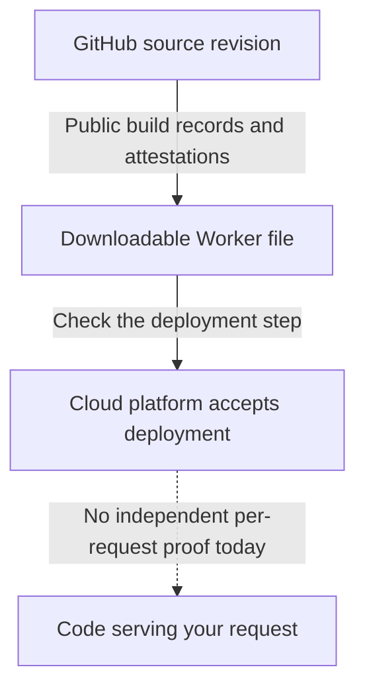
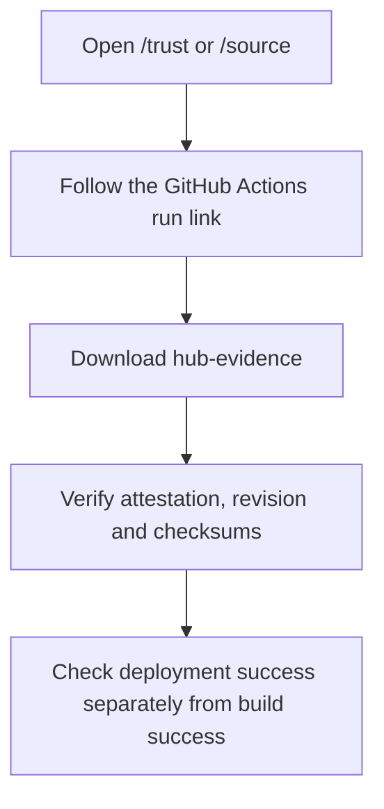
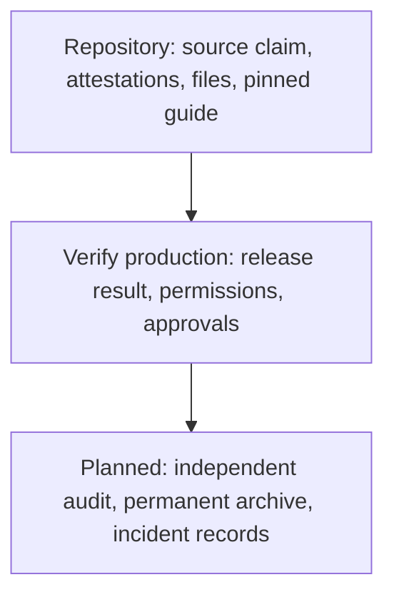

Public source code does not by itself establish what a hosted server runs. This pinned document maintains Fleet's release evidence, verification instructions, and unfinished work.

**Current status: this repository provides the workflow below. Evidence exists for a release only after the relevant workflow runs; check deployment success separately. This document does not certify that production has adopted it or that an independent audit has occurred.**

## What needs to match


```mermaid
flowchart TD
  A["GitHub source revision"] -->|"Public build records and attestations"| B["Downloadable Worker file"]
  B -->|"Check the deployment step"| C["Cloud platform accepts deployment"]
  C -.->|"No independent per-request proof today"| D["Code serving your request"]
```

The first steps supply inspectable release evidence. The last still depends on the operator and cloud platform. Provenance also does not establish that code is free of vulnerabilities.

## Inspect a release


```mermaid
flowchart TD
  A["Open /trust or /source"] --> B["Follow the GitHub Actions run link"]
  B --> C["Download hub-evidence"]
  C --> D["Verify attestation, revision and checksums"]
  D --> E["Check deployment success separately from build success"]
```

Start at the [Hub source declaration](https://fleet.ginfo.cc/trust). Its commit, bundle hash and Actions link are leads to inspect, not independent proof. The legacy `verified=true` field only checks commit format. `runtime_verified=false` explicitly reports that running code has not been verified.

Download `hub-evidence-COMMIT-ATTEMPT` from that run's Artifacts, then unpack GitHub's download ZIP to obtain `hub-evidence.tar.gz`. GitHub login is required. Artifacts expire after 90 days and can be deleted earlier; they are not a permanent append-only archive. Older releases without artifacts cannot be claimed as verified.

Verify the archive's origin before extracting:

```bash
gh attestation verify hub-evidence.tar.gz --repo TITOCHAN2023/fleetForAgent --signer-workflow TITOCHAN2023/fleetForAgent/.github/workflows/deploy-hub.yml
mkdir hub-evidence
tar -xzf hub-evidence.tar.gz -C hub-evidence
cd hub-evidence
sha256sum --check checksums.txt
cat receipt.json
```

Compare the attested source revision against `receipt.json`, its workflow link, and the Hub's claimed `source_bundle_sha256` against `worker.js`. Inspect that run's deployment step. A mismatch invalidates the matching-evidence claim.

The archive contains Worker JavaScript, the repository's `wrangler.toml`, a receipt and checksums. Attestations cover both the archive and original script. Deployment rechecks the script hash and uploads the same file without bundling again. **Static website assets, production secrets, databases and live memory are excluded; this is not evidence for all website behavior.**

## Progress and remaining work


```mermaid
flowchart TD
  A["Repository: source claim, attestations, files, pinned guide"] --> B["Verify production: release result, permissions, approvals"]
  B --> C["Planned: independent audit, permanent archive, incident records"]
```

An independent audit should inspect deployed versions, routes, configuration and release permissions, not just source code. Cloudflare exposes script and deployment APIs for authorized reviewers. This is still not a per-request runtime proof. No audit report means no claim of an audit.

Declaring `environment: production` in a workflow does not enable approval protection by itself. GitHub environment rules and Cloudflare administrators and other deployment credentials need separate inspection.

## Examples behind this approach

- [Bitwarden](https://bitwarden.com/help/is-bitwarden-audited/) publishes independent security audit reports.
- [Mullvad](https://mullvad.net/en/blog/fourth-infrastructure-audit-completed-by-cure53) publishes infrastructure audit scope, findings and fixes, explicitly identifying the staging environment used in that audit.
- [Apple PCC](https://security.apple.com/blog/private-cloud-compute/) uses specialized hardware attestation tied to public software records. Fleet does not implement that proof today.

## Maintaining this document

Update this document in the same PR as release-mechanism changes. Disclosed incidents should include affected revisions, the response and repair evidence. Future audit entries must identify the report, date, scope and unresolved findings. Move work from planned to completed only with evidence. English, Chinese and the site are generated from the same Markdown sources; the URL stays stable.

Users who do not accept these trust assumptions can deploy the public source themselves and manage their own release permissions.
