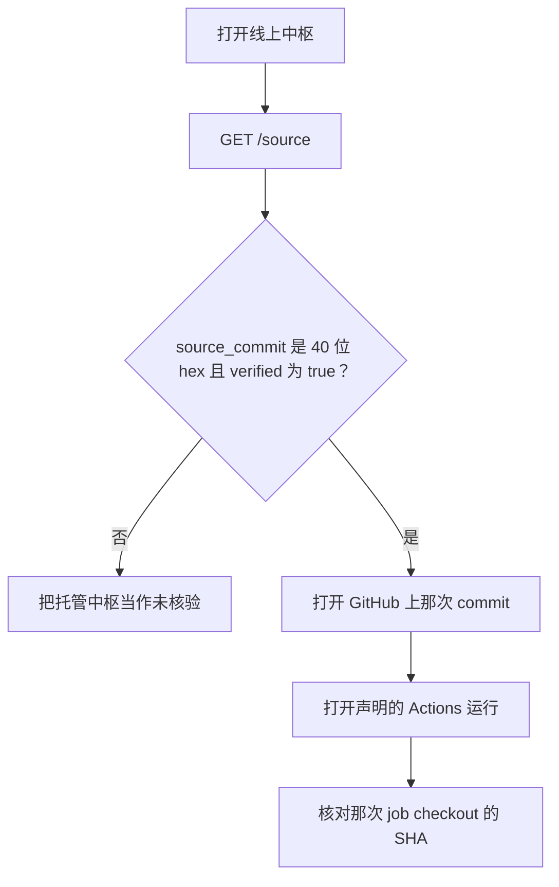
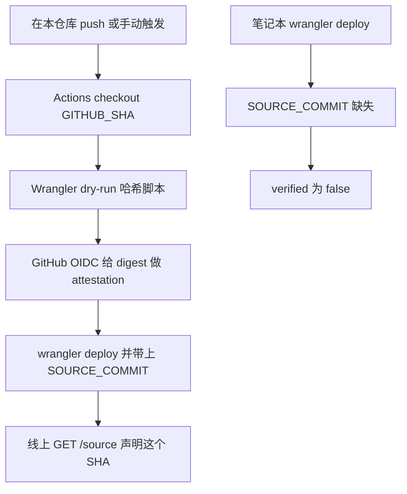

对任何托管的远程控制服务，一个合理怀疑是：公开仓库是一套代码，线上网站是另一套。Fleet 把这当成核验，而不是口号。

托管中枢是 [https://fleet.ginfo.cc](https://fleet.ginfo.cc)。公开的树是 [https://github.com/TITOCHAN2023/fleetForAgent](https://github.com/TITOCHAN2023/fleetForAgent)。这篇说明你可以核什么、Agent 安装包为什么更硬，以及 Cloudflare Worker 靠自报仍然证明不了什么。



## 问正在跑的那份进程

Worker 不需要登录就会回答：

```bash
curl -sS https://fleet.ginfo.cc/source
```

同一份文档也在 `/v1/source`，以及 `/v1/health` 的 `source` 字段。没有 JavaScript 的人读页在 [https://fleet.ginfo.cc/trust](https://fleet.ginfo.cc/trust)。

`verified` 为 true 的唯一条件：`SOURCE_COMMIT` 是 40 位十六进制的 git 对象名。缺这个值，包括笔记本上裸跑 `wrangler deploy` 之后，都是未核验。

值得看的字段：

- `source_repo` — 公开远程仓库，默认就是这个 GitHub 仓库
- `source_commit` — 部署时烘焙的 SHA
- `source_workflow_run` — 发布这次 Worker 的 Actions 运行
- `source_bundle_sha256` — 同一 job 里 Wrangler dry-run 脚本的 SHA-256

这些值缺失，或 `verified` 为 false，就停。托管中枢没有给出可核的身份。

## 生产怎么发

`fleet.ginfo.cc` 的预定发布路径是这个仓库里的 `.github/workflows/deploy-hub.yml`。那个 job 会 checkout 它将要声明的 commit，先 dry-run 打出 Worker 包并哈希脚本，用 GitHub OIDC 给这份 digest 做 attestation，然后才 `wrangler deploy`，并把 `SOURCE_COMMIT` 设成 `$GITHUB_SHA`。

Cloudflare API token 属于 GitHub Actions secrets，不属于笔记本。这次发布不会保留上次 dashboard 里的变量，所以笔记本上不带这些 `--var` 的 `wrangler deploy` 会清掉 `SOURCE_COMMIT`，线上 `/source` 变成未核验。



## 「对得上」证明不了什么

Cloudflare 不会让外人下载线上 Worker isolate 再哈希。一个进程可以报自己的 commit，也可以对这个 commit 撒谎。拿着 Cloudflare token 的人，仍可以部署另一份 Worker，同时广告一个公开 SHA。

对策是流程，不是字节码证明。生产应该来自本仓库的 Actions job。声明的 SHA 是那次 job 的 `$GITHUB_SHA`。workflow URL 公开。笔记本发布若不烘焙这些变量，`verified` 就是 false。

这够抓住「不小心发了另一棵树」。它代替不了你自己去读那个 git 对象，也不如核验已经在磁盘上的文件来得硬。

## Agent 安装包更硬

Release 二进制是你可以拿在手里的文件。打包脚本拒绝脏工作区，要求发布 tag 指向 `HEAD`，并用 `go build -buildvcs=true` 嵌入 `vcs.revision`。GitHub Releases 带 `checksums-*.txt`，以及这些产物的 OIDC attestation。

```bash
curl -fsSL https://github.com/TITOCHAN2023/fleetForAgent/releases/latest/download/checksums.txt
gh attestation verify --repo TITOCHAN2023/fleetForAgent FleetAgent-macos-arm64.dmg
go version -m ./fleet-agent | grep vcs.revision
```

每台电脑上的 Agent 才是能跑命令的那一层。它的 digest 可以独立于网站自报去核。

## 不想把托管中枢当权威时就自托管

Node 中枢和你自己账号上的 Worker 走同一套协议。把 `SOURCE_COMMIT` 设成 `git rev-parse HEAD`，`/source` 就会描述你编出来的那棵树。空的 `SOURCE_COMMIT` 故意保持未核验。

托管站点是为了让 Windows、Linux、macOS 先加入同一个账号，而不必先自己搭中枢。代码的权威仍是这个 GitHub 仓库。若你不想信任托管进程，就 clone 这棵树，读它，自己跑。

设备上的安全边界是另一篇：[远程操作电脑时，安全边界放在哪里](/docs/why-fleet-is-safe)。
