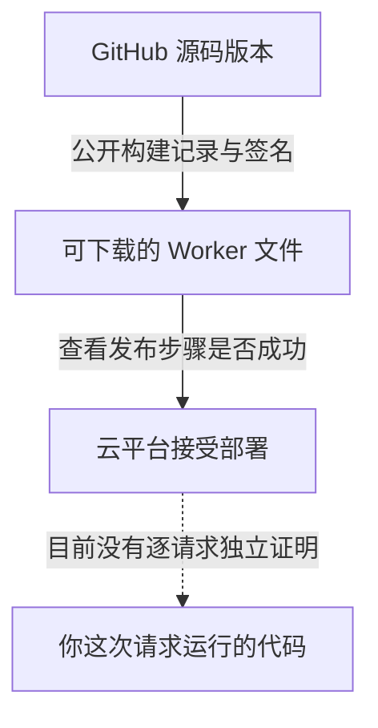
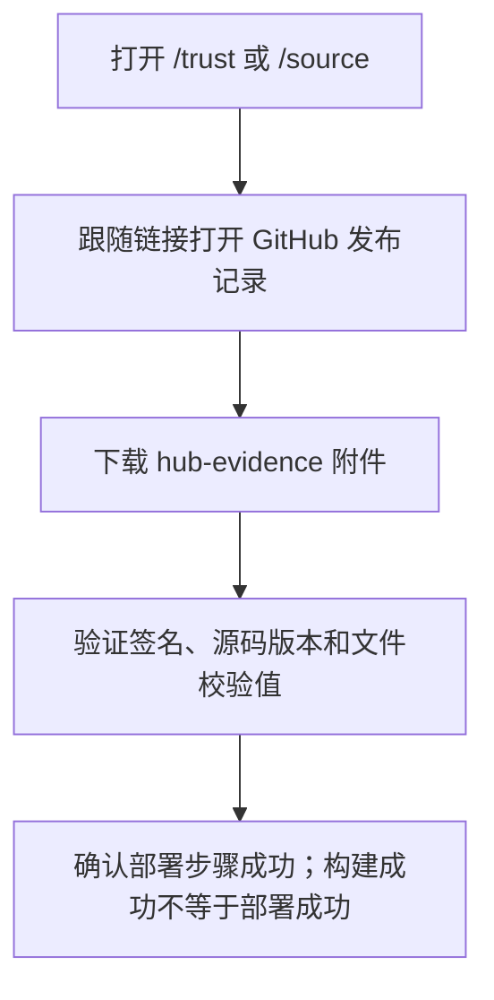
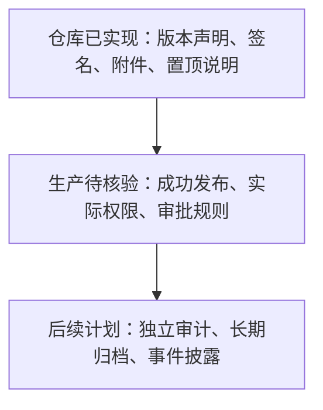

GitHub 上有源码，不代表你访问的服务器一定运行它。这篇置顶文档长期维护 Fleet 的发布证据、核验方法和未完成事项。

**当前状态：仓库提供下述发布流程。只有对应版本的生产发布成功后，才会产生该次发布的证据。这里不宣称线上已经启用，也不宣称已通过独立审计。**

## 一张图看清要核对什么


```mermaid
flowchart TD
  A["GitHub 源码版本"] -->|"公开构建记录与签名"| B["可下载的 Worker 文件"]
  B -->|"查看发布步骤是否成功"| C["云平台接受部署"]
  C -.->|"目前没有逐请求独立证明"| D["你这次请求运行的代码"]
```

前两段提供可检查的发布证据。最后一段仍需信任运营方和云平台。文件来源正确，也不代表代码没有漏洞。

## 你可以怎么检查


```mermaid
flowchart TD
  A["打开 /trust 或 /source"] --> B["跟随链接打开 GitHub 发布记录"]
  B --> C["下载 hub-evidence 附件"]
  C --> D["验证签名、源码版本和文件校验值"]
  D --> E["确认部署步骤成功；构建成功不等于部署成功"]
```

从 [Hub 的版本声明](https://fleet.ginfo.cc/trust) 开始。它自报的 commit、文件校验值和 Actions 链接，都是核对线索，不能单独当作证明。旧接口里的 `verified=true` 只表示 commit 格式正确；`runtime_verified=false` 明确表示没有核验运行中的代码。

在对应 Actions 运行的 Artifacts 中下载 `hub-evidence-源码版本-运行次数`，解开 GitHub 的下载 ZIP，得到 `hub-evidence.tar.gz`。需要 GitHub 登录；附件保留 90 天，可能被提前删除，不是永久不可删的档案。旧发布没有附件时，不能补称已经验证。

先验证归档的签名来源，再解包：

```bash
gh attestation verify hub-evidence.tar.gz --repo TITOCHAN2023/fleetForAgent --signer-workflow TITOCHAN2023/fleetForAgent/.github/workflows/deploy-hub.yml
mkdir hub-evidence
tar -xzf hub-evidence.tar.gz -C hub-evidence
cd hub-evidence
sha256sum --check checksums.txt
cat receipt.json
```

核对签名验证结果中的源码版本、`receipt.json` 的版本与运行链接，以及 `/source` 自报的 `source_bundle_sha256` 是否对应 `worker.js`。最后查看那次运行的部署步骤。任何不一致都应停止把它当作匹配证据。

附件包含 Worker JavaScript、仓库中的 `wrangler.toml`、收据和校验清单。签名覆盖归档和原始脚本；部署前重新检查脚本校验值，使用同一文件上传，不再重新打包。**附件不包含静态网站资源、生产 secrets、数据库和运行中的内存，也不证明整个网站的全部行为。**

## 哪些已经有，哪些还没有


```mermaid
flowchart TD
  A["仓库已实现：版本声明、签名、附件、置顶说明"] --> B["生产待核验：成功发布、实际权限、审批规则"]
  B --> C["后续计划：独立审计、长期归档、事件披露"]
```

独立审计应检查实际部署版本、路由、配置和发布权限，而不只看源码。Cloudflare 提供读取脚本和部署版本的接口，授权审计方可以核对；这仍然不能证明每次请求的运行环境。没有审计报告，就不标“已审计”。

仓库里的 `environment: production` 也不等于已经启用审批：保护规则需要在 GitHub 设置里落实，Cloudflare 的管理员和其他发布凭据也需要一并检查。

## 我们参考了谁

- [Bitwarden](https://bitwarden.com/help/is-bitwarden-audited/)：公开第三方审计报告，让用户检查独立评价。
- [Mullvad](https://mullvad.net/en/blog/fourth-infrastructure-audit-completed-by-cure53)：公布服务器与部署脚本审计的范围、问题和修复；该次审计使用测试环境，明确交代边界。
- [Apple PCC](https://security.apple.com/blog/private-cloud-compute/)：用专门硬件证明运行版本，并与公开软件记录对应。Fleet 当前未实现这类证明。

## 这篇文档怎么维护

每次变更发布机制，同一个 PR 更新本文；公开重大问题时补上影响版本、处理经过和修复证据。审计完成后加入报告、审计日期、检查范围与遗留问题。只有有证据的事项才能从“计划”移到“已完成”。中英文与网站由同一组 Markdown 生成，入口保持不变。

不接受这些信任前提的用户，可以从公开源码自行部署，并自己管理发布权限。
