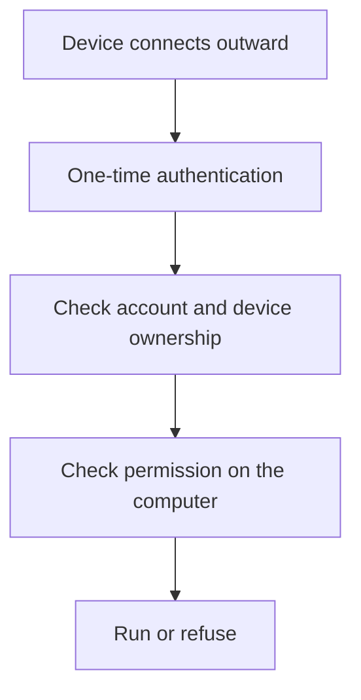
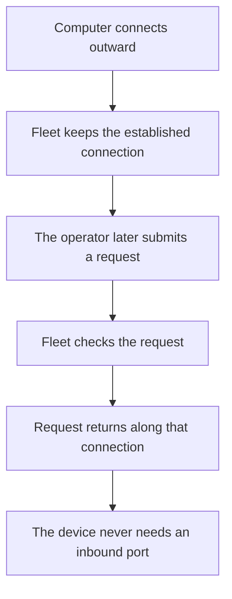
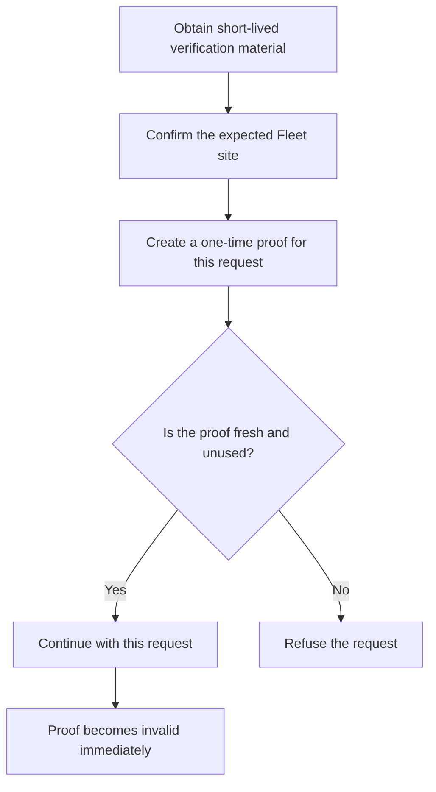
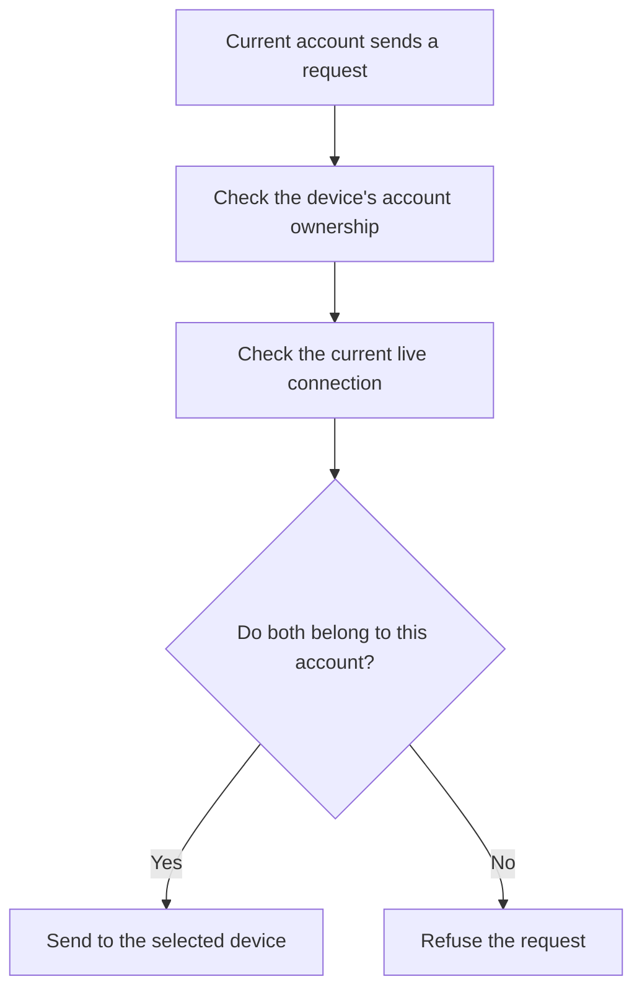
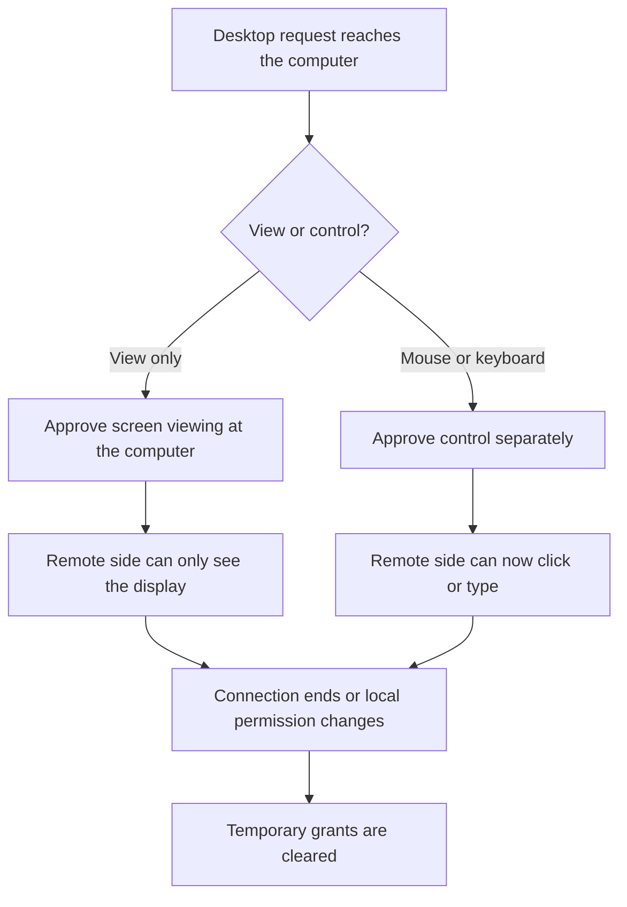

Installing an Agent that can run commands, view a display, and control the mouse or keyboard raises an obvious question. Who can make the computer act?

Fleet does not answer that with a broad claim of being secure end to end. Devices expose no new service to the internet, and authentication uses a one-time proof. The account relationship is checked again for every operation. Even a request that reaches the device must still obey the permission chosen there.

## The computer only connects outward

Fleet Agent initiates its connection to the hub. The computer needs no inbound port or router mapping, and a home connection without a public IP works normally. Fleet adds no device-side port for an internet scanner to find.

The computers do not join a shared virtual network. Each device maintains its own encrypted connection to the hub and remains invisible to the others. An operation reaches the hub first, then travels back along the connection the chosen device already opened.

Operating system maintenance remains necessary. Fleet simply avoids opening another path from the public internet just to gain remote control.

## The long-lived credential does not travel repeatedly

After signing in, a user generates a Hub token and gives it to their own Agents and MCP tools. The plaintext is shown once. The server keeps a hash of the important secret inside it and uses that hash when checking later proofs.

Before a connection or operation begins, the client obtains fresh, short-lived verification material. It checks that the response came from the expected Fleet hub, then sends an encrypted proof that can be used only once. The complete long-lived token is not copied unchanged into every request.

A proof captured from the network or a log cannot simply be replayed on the next request. It becomes invalid as soon as it is used and expires quickly if it is not. If the site address or the hub's identity does not match, the client stops before releasing authentication material.

The user can reset the Hub token at any time. Resetting replaces the old authentication material and disconnects the account's live device connections. The old token stops working immediately, and every Agent and MCP client needs the new token before it can reconnect.

## Each account reaches only its own devices

When a device first connects, Fleet assigns it to the account that presented a valid token. Once that ownership is established, another account cannot take the device over by presenting the same device identifier.

Fleet checks the account-to-device relationship again when listing devices or sending an operation. The stored device record is one check, and the current live connection is another. A missed check in one place does not give a message a path through the other.

The hosted Worker has no deployment-wide credential that bypasses this ownership check. Its optional ops allowlist changes only who may view the limited operations console; it adds no machine-control authority.

The device directory and control interface do not return device IPs. A user sees enough information to choose a computer, including its name, operating system, online status, and Agent version. Like any website, Fleet may still produce ordinary web access logs. That is separate from publishing controlled-computer IPs through the device interface.

## Permission ends on the device

Authentication and account isolation deal mainly with risks on the network. The computer being controlled decides whether an operation will actually run.

Fleet defaults to approval at the machine. A request continues only after someone beside that computer approves it. The user may also turn execution off, which rejects new commands and input. Automatic execution is intended for cases where the user understands the risk and is willing to give the current Hub token direct control.

The hub can receive the permission state reported by the device, but it cannot change Off to automatic execution. Turning the Agent off closes the connection as well. This gives the machine a refusal path that does not depend on trusting the hub.

## Viewing and input receive separate approval

Desktop control is more sensitive than reading command output. In approval mode, Fleet handles viewing the display separately from mouse and keyboard input. Permission to see the screen does not allow the remote side to click or type. Input needs its own approval.

Those desktop grants last only for the current connection. Disconnecting the device or changing its local permission clears them. A later desktop session must follow the permission currently set on the machine.

Fleet also blocks some common destructive commands to catch mistakes such as shutting down or formatting a disk. Overly broad deletion attempts are rejected as well. This is a guard against slips, not a substitute for local permission, and it does not make automatic execution low risk.

## The limits users should know

Automatic execution is full authorization. It hands the computer to the operator holding the current Hub token. Approval mode is a better fit when somebody can respond at the machine, while Off is appropriate when remote work is temporarily unnecessary.

Turning execution off rejects new commands and terminal input, and it stops desktop control. The Agent remains online, so the screen of an existing terminal job may still be readable. Turn the Agent itself off when all access must stop.

One account currently uses one Hub token across all of its devices. Separate accounts are required when different machines must be entrusted to different people. A cloud service that is fully compromised cannot preserve its normal cloud-side guarantees, which is why local Off and approval still matter. Choosing automatic execution deliberately opens that local restriction.
