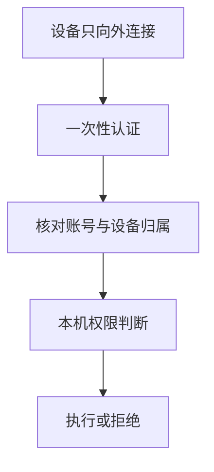
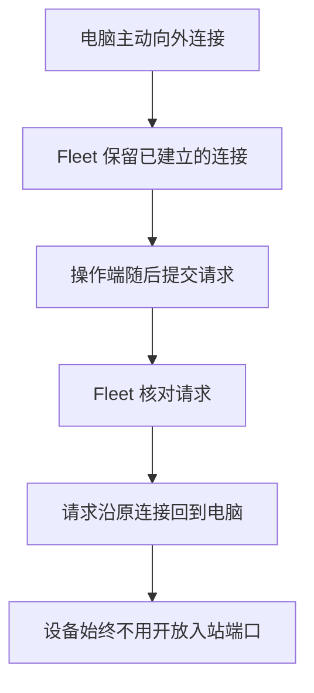
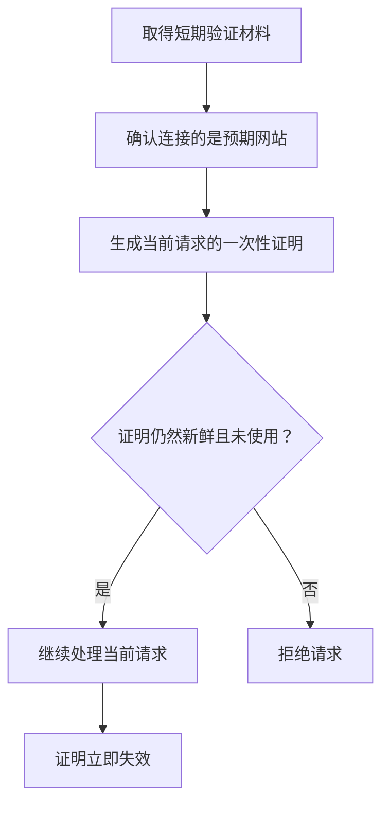
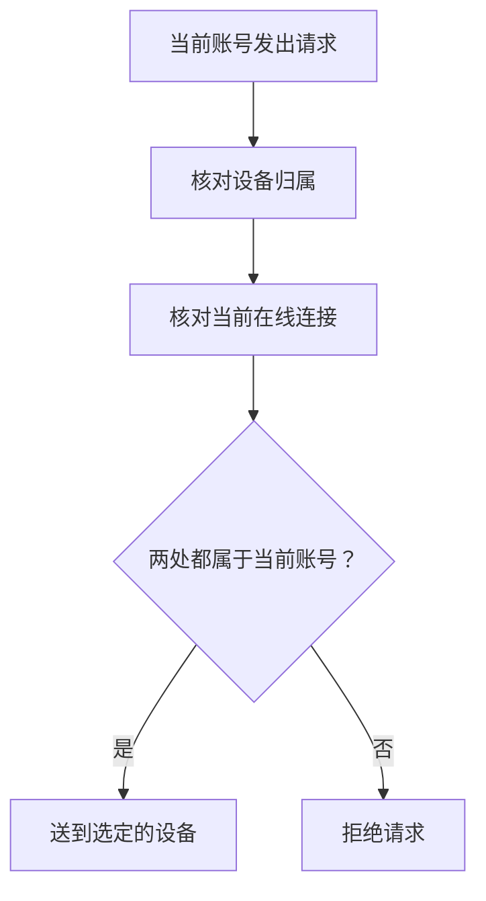
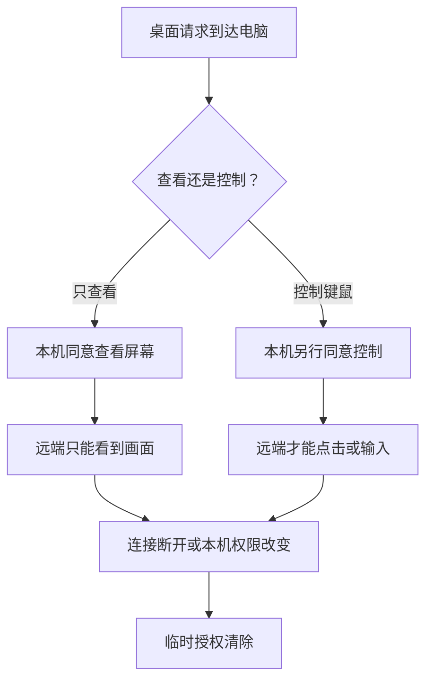

把一个能够运行命令、查看屏幕和控制键鼠的 Agent 装进自己的电脑，用户自然会问，谁能让它真的动起来。

Fleet 没有用一句“端到端安全”带过这个问题。设备不向互联网开放服务，认证依靠一次性证明，账号关系还会在每次操作时重新核对。请求即使到达设备，也要服从本机权限。

## 电脑只向外连接

Fleet Agent 启动后，会从设备主动连接到中枢。电脑不需要开放入站端口，也不用设置端口映射，家用宽带没有公网 IP 也能连接。设备端没有新增端口可扫。

这些电脑没有被接进一张互通的虚拟局域网。每台设备只维持自己到中枢的加密连接，彼此看不见。操作请求到达中枢后，再沿着设备已经建立的连接送回去。

这层处理减少了设备的暴露面。它不能替代操作系统自身的安全维护，却避免了为了远程控制再向公网开一道门。

## 长期凭据不在网络上反复出现

用户登录网站后生成一把 Hub token，把它分别交给自己的 Agent 和 MCP 工具。明文只显示一次。服务端保存其中关键秘密的哈希，用来核对以后收到的证明。

连接或操作开始前，客户端会先取得一份短期有效的新验证材料，确认回应确实来自预期的 Fleet 中枢，随后才发送只能使用一次的加密证明。完整的长期 token 不会原样放进每次请求里。

有人在网络或日志里截到这份证明，也不能在下一次请求中照搬。它使用后立即失效，没来得及使用也会很快过期。客户端发现网站地址或中枢身份对不上时，会在交出认证材料以前停止连接。

用户还可以随时重置 Hub token。重置会替换旧的认证信息，并断开这个账号下仍然在线的设备连接。旧 token 当场失效。所有 Agent 和 MCP 客户端都需要填入新 token 才能恢复操作。

## 每个账号只碰自己的设备

一台设备第一次连入后，会归到提供有效 token 的账号下。归属一旦确定，其他账号接不走。

后续查询设备目录或发送操作时，Fleet 都会再次核对账号和设备的关系。持久化的设备记录是一道检查，当前在线连接还有一道检查。前一处遗漏不会让消息直接穿过后一处。

线上 Worker 不存在能绕过这层归属检查的部署级万能凭据。可选的 Ops 白名单只决定谁能查看受限运维界面，不会增加机器控制权限。

设备目录和控制接口不会返回设备 IP。用户能看到设备名称、系统、在线状态和 Agent 版本，这些信息足以选择目标。网站作为普通互联网服务仍可能产生常规访问日志，这和把受控电脑的 IP 放进设备接口是两件事。

## 最后的权限在本机

账号隔离和认证主要处理网络上的风险。一次操作最终能否执行，由被操作的电脑决定。

默认是逐次确认。有人在设备旁同意以后，当前请求才会继续。用户也可以把权限设为停用，让新的命令和输入直接被拒绝。自动执行适合明确知道风险、并且愿意把控制权交给当前 Hub token 的场景。

中枢只能接收设备上报的权限状态，不能远程把停用改成自动执行。关闭 Agent 还会直接断开连接。即使账号凭据出了问题，本机仍有一条不依赖中枢的拒绝路径。

## 查看屏幕和控制输入分开同意

桌面控制比读取一段命令输出更敏感。Fleet 在逐次确认模式下分别处理屏幕查看和键鼠输入。看见屏幕不等于能够操作，用户同意查看以后，远端仍然不能点击或输入，键鼠控制需要再取得许可。

这些桌面授权只存在于当前连接。设备断开、重新连接，或者用户在本机修改权限以后，临时授权都会清除。重新开始桌面操作时，需要按当前权限再次处理。

Fleet 还会拦住一部分常见的高危命令，减少关机或格式化磁盘这类手滑，过于宽泛的删除也会被拒绝。它只是一层防误操作措施，不能代替本机权限，也不能把自动执行变成低风险选项。

## 用户需要知道的边界

自动执行就是完整授权，这台电脑会交给持有当前 Hub token 的操作端。只在有人能够及时确认时使用逐次确认，暂时不需要远程操作时选择停用，会更符合多数个人电脑的使用方式。

停用执行权限会拒绝新的命令和终端输入，桌面控制也会停止。Agent 仍然保持在线，已经存在的终端任务画面可能继续被读取。要完全停止访问，关闭 Agent。

同一个账号目前使用一把 Hub token 管理所有设备。需要把不同机器交给不同的人时，应使用不同账号。云端服务如果被完全控制，单靠云端认证也无法继续提供原有保证，本机的停用和逐次确认因此很重要。用户一旦选择自动执行，这条本机限制也会按用户的决定放开。
