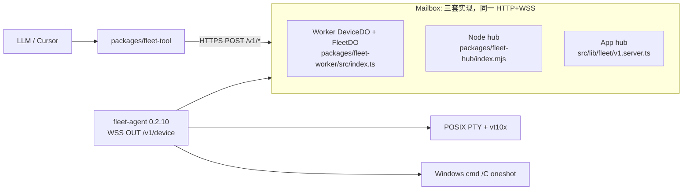
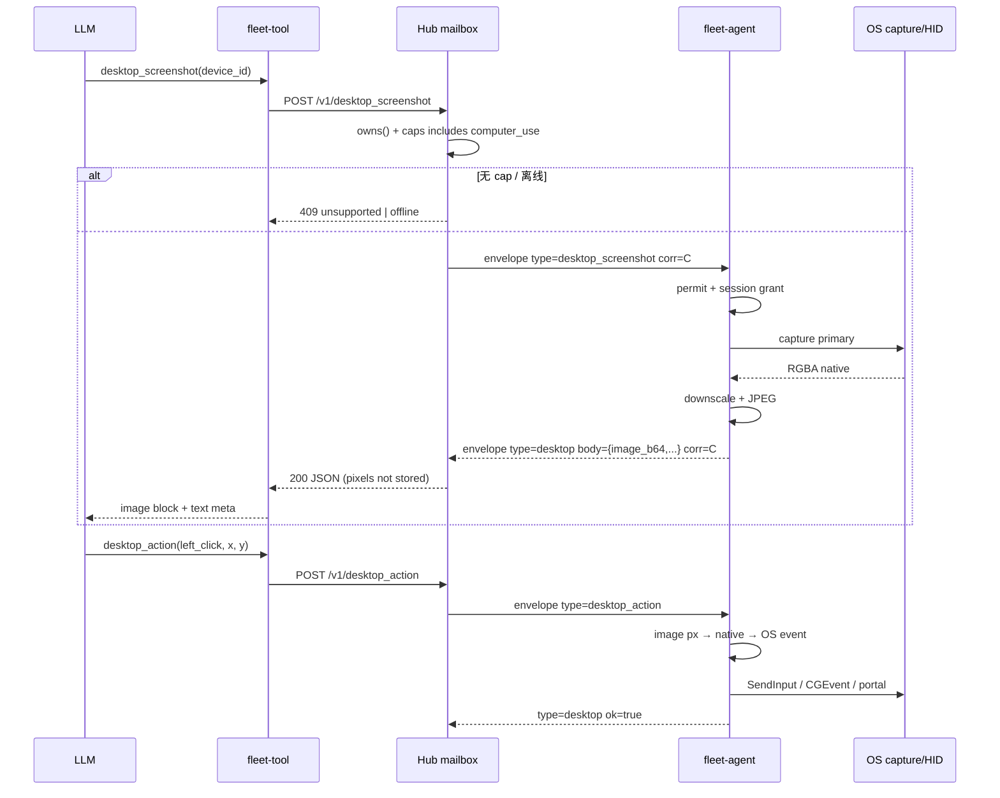
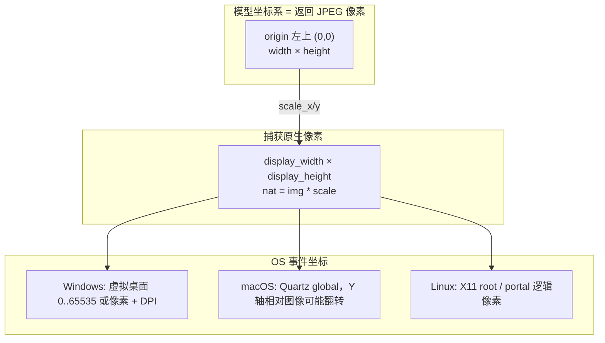
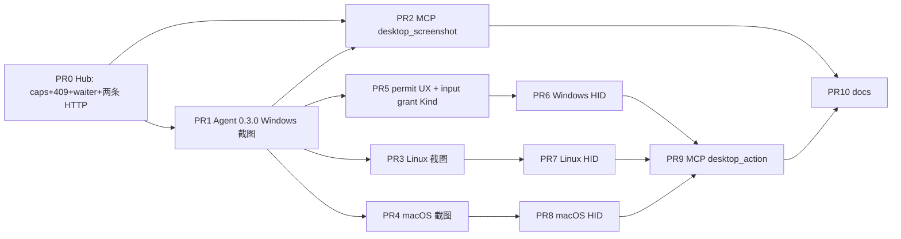

# Fleet Computer Use（GUI 截图 + 键鼠）设计文档

| 字段 | 值 |
| --- | --- |
| Title | Fleet Computer Use: 跨 Windows / macOS / Linux 的桌面截图与 HID 控制 |
| Author | TBD |
| Date | 2026-08-23 |
| Status | Draft（review revision 2） |
| Branch | `feat/computer-use`（worktree `G:\project\fleetForAgent-computer-use`，基于 `origin/main` `b022f52` “Bump Fleet Agent to 0.2.10”） |
| Agent 现状 | `packages/fleet-agent/main.go` `agentVersion = "0.2.10"` |
| 范围 | 设计 only；不改生产代码。本文同时落盘到 `docs/design-computer-use.md`。 |

---

## Overview

今天 Fleet 的 `read_screen` / `type` **不是**图形桌面。它们操作的是进程 pane：POSIX 上是 live PTY + `hinshun/vt10x` 网格（`packages/fleet-agent/pane.go`、`vt_screen.go`），Windows 上是 `cmd /C` oneshot 文本缓冲（`live_shell_start_windows.go`：「live shell is POSIX-only」）。Hub 信箱把 `type: "screen"` 的 `body.text` 存成最后一帧；MCP 描述写的是 “rendered grid on a live PTY”。模型看不见桌面像素，也不能点按钮。

本设计新增一条 **Computer Use** 表面：Agent 在本机捕获主显示器像素，经现有 WSS `/v1/device` 把 JPEG 交给 Hub，Hub **不落盘、不进 Durable Object storage**，MCP 以 image content block 交给视觉模型；模型返回结构化动作（click / type / key / scroll / drag / wait），Agent 在 OS 输入栈上执行。协议一套、三个 OS 实现藏在 Go build tags 后面。`read_screen` / `type` 保持 pane 工具不变。这是 Anthropic computer use / OpenAI computer tool 的 **harness** 角色：LLM 在 Cursor MCP 里循环，Fleet 不内嵌任何厂商 Computer Use API。

---

## Background & Motivation

### 当前数据面（已核对代码）



- Agent 主动拨出：`packages/fleet-agent/main.go` `connect()` → `websocket.Dial`，hello body 含 `os / arch / hostname / caps / agent_ver / permit / device_id`。
- `agentCaps()` 今天只返回 `["shell","pane"]`（Windows）或 `["shell","pane","live_shell"]`（POSIX）。**没有 GUI cap。**
- `readLoop` 只认识 `hello_ok | pong | ask_heartbeat | ping | run | type | read_screen | list_panes`。未知 `type` 被静默丢掉——旧 Agent 收到新信封 **不会报错，也不会回包**。
- Hub 侧 `DeviceDO.webSocketMessage` 对 `hello` 只 upsert `name/os/online/agentVer`，**丢掉 `caps`**。`computerPublic()`（`packages/fleet-worker/src/presence.mjs`）对外字段是 `id, name, os, online, lastSeen, agentVer`，同样没有 caps。App hub `upsertDevice()` 甚至把 `devices.caps` **写死成 `"shell,pane"`**（`src/lib/fleet/v1.server.ts`）。
- `read_screen` 路径：DeviceDO `/screen` 先 `send(read_screen)` 再立刻 `storage.get(screen:${corr})`——竞态返回上一帧文本。这对 250ms coalesce 的 VT 网格凑合；对 JPEG **不可用**。
- `DeviceDO` 把 `type: "screen"` 写入 `storage.put("screen:last")` 与 `screen:${corr}`。SQLite-backed DO 的 `storage.put` 单值大约 2 MiB。把桌面 JPEG/PNG 塞进这条路径会打爆存储，且把桌面密钥写进 Cloudflare。
- Permit：`off / ask / allow`，默认 `ask`（`Agent.load`）。`inputVerdict()` 门禁 `run` 与 `type`。Ask 时 `Pending.Kind` 只有 `pendingKindRun` / `pendingKindType`。GUI 控制比 shell 更危险，必须扩展这套门禁，禁止旁路。
- 打包约束（`scripts/package-agent.sh`）：**Windows `CGO_ENABLED=0`，Linux `CGO_ENABLED=0`，仅 Darwin CGO=1**。截图/键鼠实现必须遵守，否则无法从 Mac 交叉编译现有发布流水线。

### 痛点

1. 模型无法操作 GUI 应用、安装向导、浏览器、IDE 设置页。
2. Windows 上 `read_screen` 连 PTY 网格都没有，只有 oneshot 缓冲。
3. 直接把 `read_screen` 改成截图会破坏现有 pane 工作流，且 MCP `guide.test.ts` 把十个工具名钉死。
4. 截图像素远大于当前 JSON 文本帧；现有 “存 last screen” 模型在体积、隐私、DO 限制上都不成立。

---

## Goals & Non-Goals

### Goals

1. 一套 WSS 信封 + 一套 HTTP + 一套 MCP schema；Windows / macOS / Linux 只在 Agent 内用 build tags 分叉。Hub 永远看不到 DXGI / CGDisplay / X11 / Wayland。
2. 可独立合并的增量 PR：**先 Hub（caps + 409 + waiter，不依赖 Agent 二进制）**，再单 OS 截图，再 MCP，再 HID。每一 PR 对旧 Agent 安全（结构化错误，不挂死）。BitBlt 若延期，hang-prevention 仍可单独合入。
3. hello `caps` 增加 `computer_use`；Hub **仅在 hello 带数组时**写入现有 `DeviceRow`/`devices.caps`；heartbeat/offline **不得**把 caps 写成 `[]`。`list_computers` / `get_computer` 返回 caps。缺 cap → HTTP **409** `UNSUPPORTED_CAP`，**先于任何 WSS send**。
4. 坐标空间定义清楚：模型只看见返回图像的像素，原点左上；Agent 负责缩放到原生显示与 OS 事件坐标。v1 **仅主显示器**。
5. 截图默认 JPEG、长边 ≤ 1280、quality 70；Hub **不持久化像素**；日志禁止写 image bytes。
6. Permit 默认不静默 allow。截图与 HID 分两次会话授权（截图 PR 先授权看，键鼠 PR 再授权动手）。
7. 缺 OS 权限时返回可操作错误（macOS TCC、Wayland portal、Windows 会话 0）。

### Non-Goals

- 不修改 `read_screen` / `type` 语义，不把 pane 工具偷偷变成 GUI 工具。
- 不在 Agent 内调用 Anthropic / OpenAI Computer Use API；Fleet 是执行器。
- 不做多显示器选择、窗口级截图、OCR、无障碍树、浏览器专用 CDP（可后续）。
- 不新增 Durable Object binding / class（`wrangler.toml` 仍是 `DEVICE` + `FLEET`）。
- 不做 Hub 侧视觉循环（没有 `while model: screenshot → act`）；循环在 LLM 客户端。
- 不解决 UAC 安全桌面、锁屏密码输入、远程桌面嵌套捕获等对抗性场景。
- 不引入二进制 WebSocket 帧（三套 Hub 都按 JSON `Envelope` 工作）。

---

## Proposed Design

### 角色

| 层 | 职责 |
| --- | --- |
| LLM + MCP | 循环：看图 → 选动作 → 再看。`packages/fleet-tool` 新增工具，不在工具内循环。 |
| Hub 信箱 | 鉴权、设备所有权、cap 检查、把 HTTP 转成 WSS、**短等待 correlated `desktop` 回包**、原样返回。不解码图像、不解释坐标。 |
| Agent | 捕获、缩放、JPEG、HID、permit、OS 权限错误。 |

### 端到端



### 能力广告（旧 Agent 的生命线）

今天 hello 已经发 `caps`，但三套 Hub 都丢了。Computer Use **依赖**把它存下来，否则 Hub 只能盲发，旧 Agent 静默丢包，HTTP 一直等到超时——这就是用户说的 hang。

**Cap 名：** `computer_use`（该 OS 的 **真实 backend 已编进二进制** 就报；不是 “此刻有显示器”）。键鼠共用这一 cap。尚未实现的 `action` 由 Agent 回 `unsupported_action`（HTTP 200），Hub **不能**对 “有 cap 但无 HID” 发 409。拆成 `computer_screenshot` / `computer_input` 见 Alternatives G，v1 不采用。

`desktopSupported()` = 本 GOOS 编进了非 stub backend。无头启动、锁屏、未授权 TCC **不**影响 hello caps；那些是运行时 `no_session` / `os_permission`。

```go
func agentCaps() []string {
    caps := []string{"shell", "pane"}
    if runtime.GOOS != "windows" {
        caps = append(caps, "live_shell")
    }
    if desktopSupported() { // Windows: PR1 真 BitBlt 后 true；darwin/linux: 各自截图 PR 落地前 stub → false
        caps = append(caps, "computer_use")
    }
    return caps
}
```

- PR1：仅 Windows 报 `computer_use`。darwin/linux stub **不上 cap**。
- PR3/PR4 落地后，该 OS **只要编进真实 backend 就报 cap**，即使启动时没有 `DISPLAY`。装完桌面不用重编；运行时失败用 `no_session`。

Hub 持久化（**无新 DO**）。**不变量：只在 hello 提供 `caps` 数组时写入；ping / close / heartbeat 不得带 `caps: []`。**

- Worker `DeviceRow` 增加 `caps?: string[]`。`DeviceDO.webSocketMessage` 的 `hello` 分支把 `body.caps` 交给 `mark()`。`mark()` **仅当 `extra.caps` 是数组时**把该字段放进 POST `/upsert` 的 JSON；缺省 **省略 key**（`JSON.stringify` 丢掉 `undefined`）。FleetDO `{...prev, ...row}` 因此在 ping 时保留 `prev.caps`。
- hello 更新 WS attachment 必须是 **读-改-写整对象**。Cloudflare `serializeAttachment` **替换**而不合并。accept 时已有 `{ deviceId, name, os, userId }`（`packages/fleet-worker/src/index.ts`）。hello **禁止** `serializeAttachment({ caps })` 或只带 caps 的新对象——那会丢掉 `deviceId`，close/heartbeat 的 `mark()` 会打到 `"unknown"`。正确：

```ts
const att = (ws.deserializeAttachment() ?? {}) as {
  deviceId?: string; name?: string; os?: string; userId?: string; caps?: string[];
};
if (Array.isArray(parsed.body.caps)) att.caps = parsed.body.caps.map(String);
ws.serializeAttachment({
  deviceId: att.deviceId,
  name: String(parsed.body.hostname ?? att.name ?? att.deviceId ?? "device"),
  os: String(parsed.body.os ?? att.os ?? "linux"),
  userId: att.userId,
  caps: att.caps,
});
```

DeviceDO 发 `desktop_*` **之前**读 attachment.caps（hello 未到 → 无 `computer_use` → 409）。PR0 测试：hello 之后 attachment **仍有** `deviceId`，且 `caps` 含 `computer_use`。
- `FleetDO.list()` 今天投影为 `id,name,os,online,lastSeen,agentVer`，必须把 `caps` 加进 map（保持 **数组**）。旧行缺字段 → `caps: []`，**绝不**推断 `computer_use`。
- **App hub Postgres `devices.caps` 是 text**（`migrations/0002_fleet.sql` default `'shell'`）。**不要**把 SQL 字符串原样塞进 JSON 或 `computerPublic`：`Array.isArray("shell,pane,computer_use")` 为 false，会得到 `caps: []`，MCP 以为没 cap。约定：
  - 写入（仅 hello）：`helloCaps.join(",")`，与 `src/lib/fleet/actions.ts` `mapDevice` 对称。
  - 读出：`normalizeCaps(row.caps)`（见下）再放进 HTTP。`listComputers` / `get_computer` **必须** `SELECT caps` 且对外 `string[]`。
  - heartbeat/`online` **不得**再写死 `"shell,pane"`，也不得 `caps = ''`。
- Node in-memory 存数组。三套 Hub 的 `list_computers` JSON **形状必须一致**：`Array.isArray(caps) === true`。

测试（PR0 必过）：hello `caps: ["shell","pane","computer_use"]` → ping `{agent_ver}` → Worker / Node / **app hub** 的 `get_computer` 与 `list_computers` 均 `Array.isArray(caps)` 且含 `computer_use`。

`get_computer` / `list_computers` 返回示例：

```json
{
  "id": "…",
  "name": "MYPC",
  "os": "windows",
  "online": true,
  "lastSeen": 1770000000000,
  "agentVer": "0.3.0",
  "caps": ["shell", "pane", "computer_use"]
}
```

**缺 cap 的 HTTP 行为（必须在发 WSS 之前）：**

```
409 {
  "error": "unsupported",
  "code": "UNSUPPORTED_CAP",
  "missing": "computer_use",
  "agentVer": "0.2.10",
  "os": "darwin"
}
```

离线仍是现有 `409 { "error": "offline" }`（见 DeviceDO `/run`）。不要用 404：404 表示 `owns()` 失败（`not found`），避免泄露设备存在性。

这是旧 Agent 的 **主路径**，不是 8s 超时的后备。测试：设备 online、caps `["shell","pane"]` → 409 `UNSUPPORTED_CAP` 且该 WS **零** `desktop_screenshot` / `desktop_action` 帧。

旧 **Worker 前门**（`packages/fleet-worker/src/index.ts` 末尾 `return json({ error: "not found" }, 404)`）对未知 `/v1/*` 已经 404；Node / app hub 同样。DeviceDO 末尾 `return json({ ok: true })` 只在 **Worker 路由已加、DeviceDO handler 未加** 时踩到——同脚本同次部署，仍列为 PR0 检查项：两条 HTTP 路由必须同时接进 DeviceDO，禁止只加前门。挂死场景是 **新 Hub + 旧 Agent**（未知 WS type 被 `readLoop` 无 default 丢掉），不是旧 Hub。

### 线协议（Envelope.v 保持 1）

`src/lib/fleet/protocol.ts` 的 `PROTOCOL_VERSION = 1` 不变。新增 type，旧客户端忽略未知 type 的兼容策略已经存在；**Hub 侧不能依赖“忽略”**，必须用 caps。

#### 下行：截图

```json
{
  "v": 1,
  "type": "desktop_screenshot",
  "id": "<uuid>",
  "corr": "<uuid>",
  "t": 1770000000000,
  "body": {
    "max_width": 1280,
    "max_height": 1280,
    "quality": 70,
    "format": "jpeg"
  }
}
```

- `max_width` / `max_height`：对图像长边的上限，Agent clamp 到 `[320, 1920]`，默认 1280。
- `format`：`jpeg`（默认）| `png`。v1 实现 jpeg；png 可后补，未知 format → 当 jpeg。
- 无 pane / fingerprint。桌面是设备级，不走 `resolveSession` / `X-Fleet-Operator` 票。所有权仍是 `owns(fleet, actor, device_id)`。

#### 下行：动作

```json
{
  "v": 1,
  "type": "desktop_action",
  "id": "<uuid>",
  "corr": "<uuid>",
  "t": 1770000000000,
  "body": {
    "action": "left_click",
    "x": 412,
    "y": 880,
    "text": "",
    "key": "",
    "keys": [],
    "x2": 0,
    "y2": 0,
    "scroll_x": 0,
    "scroll_y": 3,
    "duration_ms": 0,
    "frame_id": "<optional, from last screenshot>"
  }
}
```

`action` 枚举（与 Anthropic/OpenAI 对齐，名字稳定）：

| action | 必填 | 说明 |
| --- | --- | --- |
| `screenshot` | — | **Hub 别名**：与 `POST /v1/desktop_screenshot` 走同一 waiter / 同一 WSS type `desktop_screenshot`（PR0 实现，不是后补） |
| `left_click` | x, y | 主键单击 |
| `right_click` | x, y | |
| `double_click` | x, y | |
| `middle_click` | x, y | |
| `mouse_move` | x, y | 移动，不点击 |
| `left_click_drag` | x, y, x2, y2 | 从 (x,y) 拖到 (x2,y2) |
| `scroll` | x, y, scroll_x/scroll_y | 在点上滚；单位 = “一次滚轮刻度”，正 y = 向下（与 OpenAI 一致） |
| `type` | text | Unicode 文本，走 OS 文本输入，**不是** PTY `type_keys.go` |
| `key` | key 或 keys | 命名键或组合，如 `enter`、`ctrl+c`；`keys: ["ctrl","c"]` 同义 |
| `wait` | duration_ms | Agent 睡眠，clamp `[0, 5000]` |

未知 action → `desktop` `{ ok:false, code:"unsupported_action" }`，HTTP 200（设备在线且有 cap，只是本 build 还没做）。这样键鼠 PR 之前，MCP 已经可以调用并得到明确错误。

#### 上行：统一 `desktop`（不要复用 `screen`）

```json
{
  "v": 1,
  "type": "desktop",
  "id": "<uuid>",
  "corr": "<uuid>",
  "t": 1770000000000,
  "body": {
    "ok": true,
    "status": "ok",
    "code": "",
    "error": "",
    "mime": "image/jpeg",
    "image_b64": "<...>",
    "width": 1280,
    "height": 720,
    "display_width": 1920,
    "display_height": 1080,
    "scale_x": 1.5,
    "scale_y": 1.5,
    "display_id": "primary",
    "origin": "top-left",
    "bytes": 91234,
    "frame_id": "<uuid, screenshot corr>"
  }
}
```

| 字段 | 含义 |
| --- | --- |
| `width`/`height` | **返回图像**像素。这是模型坐标系。 |
| `display_width`/`display_height` | 捕获用的原生像素（Retina 上是 backing pixels）。 |
| `scale_x`/`scale_y` | `display_* / image_*`。动作：`native = image * scale`。 |
| `origin` | 恒为 `top-left`。 |
| `image_b64` | 仅截图成功时出现。动作回包省略。consent/error 包不得带此字段。 |
| `bytes` | 原始 JPEG 大小（解码前），供观测；**日志只记这个数字**。 |
| `frame_id` | 成功截图时 = 该次 `corr`。HID 可选带回。 |
| `status` | `ok` \| `consent` \| `error` |
| `ok` | **始终存在。** 成功 `true`；consent / 一切设备失败 `false`。 |
| `code` | 成功为空字符串；失败见下表。 |
| `error` | 人类可读；consent 用稳定句（见下）。 |
| `permission` | 仅 `os_permission`：`screen_recording` \| `accessibility` \| `portal` 等 |

**禁止**把上述 body 写入 `screen:last` / `screen:${corr}` / `protocol_events.envelope` / `commands.stdout`。

#### 错误码目录（唯一权威）

分层：**Hub HTTP** = 没把活交给 Agent（或等不到回包）。**`desktop` body** = 设备在线、有 cap、Agent 已回；HTTP **一律 200**，由 `ok`/`code` 表达结果。MCP 据此区分 “机器不在/太旧” 与 “要去托盘点允许”。

| code | 层 | HTTP | `ok` | `status` | MCP `isError` | 何时 | 重试 |
| --- | --- | --- | --- | --- | --- | --- | --- |
| （空） | body | 200 | `true` | `ok` | false | 截图/动作成功 | — |
| `UNSUPPORTED_CAP` | HTTP | 409 | — | — | true | 无 `computer_use`（含旧行缺 caps、hello 未到） | 换已支持该 OS 的 Agent；**不要**盲升级到 “≥0.3.0” |
| `offline` | HTTP | 409 | — | — | true | 无 socket | 等上线 |
| `TIMEOUT` | HTTP | 409 | — | — | true | waiter 到期无 `desktop` | 重试；macOS/Linux 首次 OS 授权后必重试 |
| `not found` | HTTP | 404 | — | — | true | `owns()` 失败 | 换 `device_id` |
| `unauthorized` | HTTP | 401 | — | — | true | 鉴权 | 修 token |
| `consent` | body | 200 | **`false`** | `consent` | **true** | Ask 且本 WS 尚未授权该会话 | 人在托盘 Approve 后 **再调同一工具** |
| `denied` | body | 200 | `false` | `error` | true | 用户 Deny 之后的下一次 desktop 调用（一次性） | 不要死循环；改 permit 或再征得同意 |
| `permit_off` | body | 200 | `false` | `error` | true | `permit=off` 或 `enabled=false` | 本机打开开关 |
| `busy` | body | 200 | `false` | `error` | true | 已有 **desktop** pending（不影响 run/type） | 等 Approve/Deny |
| `unsupported_action` | body | 200 | `false` | `error` | true | 有 cap 但本 build 无该 HID | 等 HID PR；可继续截图 |
| `os_permission` | body | 200 | `false` | `error` | true | TCC / portal / UAC 安全桌面 | 按 `error`+`permission` 授权后重试 |
| `no_session` | body | 200 | `false` | `error` | true | 无交互桌面 / 会话 0 | 图形登录 |
| `capture_failed` | body | 200 | `false` | `error` | true | BitBlt==0、全黑保护窗口、编码器失败 | 退出全屏/换窗口后重试；不要把黑图当桌面 |
| `bad_coordinates` | body | 200 | `false` | `error` | true | 图像坐标越界（缩放前） | 用最新截图坐标 |
| `no_frame` | body | 200 | `false` | `error` | true | 本连接尚未成功截图就 HID | 先 `desktop_screenshot` |
| `stale_frame` | body | 200 | `false` | `error` | true | 带了 `frame_id` 且 ≠ `lastFrame` | 重新截图 |
| `rate_limited` | body | 200 | `false` | `error` | true | 超过 2 fps / 20 actions/s | 退避 |
| `bad_request` | body | 200 | `false` | `error` | true | 缺字段、text>4KiB、未知 format 已当 jpeg 的除外 | 改参数 |
| `no_input_backend` | body | 200 | `false` | `error` | true | Linux 无 uinput/xdotool/ydotool | 安装后重试 |

Ask **consent 包固定形状**（缺 `ok:false` 会被 MCP 当成成功、没有图）：

```json
{
  "ok": false,
  "status": "consent",
  "code": "consent",
  "error": "fleet: waiting for consent at the machine"
}
```

`deny()`：本 corr 的 waiter **已经**被 consent 解开，不再发旧 corr。清 `desktopPending`，置 `desktopDeniedOnce=true`，**不**设 session grant。下一次 desktop 调用消耗该标志，回 `code:"denied"` + `error:"fleet: denied at the machine"`；再下一次恢复为 `consent`。

MCP：`isError: true` 当 HTTP 4xx **或** body `ok === false`（含 consent）。JSON-RPC `throw` **只**用于传输失败（无 Hub、JSON 解析失败）。`hubRpc` 必须把 `code` / `missing` / `agentVer` / `os` 从 409 JSON 带出，不能只 `throw new Error(json.error)` 变成光秃 `"unsupported"`。

### Hub：相关等待，不存像素

对标 `DeviceDO.waitNextBeat` / `waitDeviceResult`，按 `corr` 挂 in-memory waiter：

```ts
// DeviceDO 内，不进 this.ctx.storage
private desktopWaiters = new Map<string, {
  resolve: (body: Record<string, unknown>) => void;
  timer: ReturnType<typeof setTimeout>;
}>();
```

Waiter 是 **请求期内的 isolate/进程内存**（`DeviceDO` 实例字段，对标 `beatWaiters`），**永远不要** `storage.put` `desktop` body，**不要**轮询 `res:` / `screen:`。

Durable Object 会在 `await` 上放开 input gate，所以 `webSocketMessage` 能 resolve 这个 Promise——heartbeat 已经依赖此语义。有人若 “改成 storage 轮询以免跨 handler 丢 waiter”，那会把 JPEG 写进 SQLite，**禁止**。`acceptWebSocket` 可休眠；in-memory map 休眠后消失，但 **in-flight HTTP fetch 会在 8s 等待内卡住 isolate**（与 heartbeat 3–10s 相同）。超时必须 `desktopWaiters.delete(corr)`。

流程：

1. 检查 socket；无 → 409 offline。
2. 读 caps（WS attachment，否则 FleetDO）。无 `computer_use` → 409 `UNSUPPORTED_CAP`（**先于 send**；这是旧 Agent 主路径，禁止靠超时兜底）。
3. `corr = randomUUID()`。**先** `desktopWaiters.set(corr, …)`，**再** `send`。默认等待 **8000ms**，上限 15s。Windows 保持 8s。Darwin/Linux 若 Agent 已能在阻塞 OS 对话框前返回 `os_permission` 则仍 8s；否则首次 TCC/portal 可能 409 `TIMEOUT`——文档写 “授权后再调一次”。
4. `action === "screenshot"` 的 `/v1/desktop_action` **内部转到** 与 `/v1/desktop_screenshot` 相同的 send+waiter（PR0）。
5. 收到 `type === "desktop" && corr` → `resolve` + `delete`，**不** `storage.put`。
6. HTTP 200 原样返回该 body（consent 也是 200）。超时 → 409 `{ error: "no desktop frame", code: "TIMEOUT" }` 并 delete map entry。

Node hub / app hub 同样：`src/lib/fleet/live.ts` 新增 `waitDesktop(deviceId, corr, ms)`，**不要**放进现有 `screens: Map`（pane 文本）。

PR0 测试：spy `storage.put`，desktop 往返中 **不得** 出现 `image_b64`。设备 caps=`["shell","pane"]` → 409 且 WS inbox 长度为 0。

Worker 入口：

```
POST /v1/desktop_screenshot  { device_id, max_width?, max_height?, quality?, format? }
POST /v1/desktop_action      { device_id, action, x?, y?, ... }
```

鉴权、CORS、`owns()` 与 `/v1/heartbeat` 相同。CORS allow-headers 不需要改。

Cloudflare 约束（量化）：

| 项 | 预算 | 结论 |
| --- | --- | --- |
| 1280×720 JPEG q70 | 典型 40–120 KiB，base64 ≈ 55–160 KiB | 远低于 WS 32 MiB、HTTP 响应上限 |
| 1920 边 PNG 桌面 | 常 > 2 MiB | v1 默认禁止；format=png 且预估超 1.5 MiB 时 Agent 改 jpeg |
| DO `storage.put` | ~2 MiB/value | **不把像素放进去** |
| 首张 DXGI/BitBlt | 冷启动可数百 ms | 8s 等待足够 |
| 目标 | 截图 p95 < 2s（本机已授权） | 超时当错误，MCP 可重试 |

`github.com/coder/websocket` 默认 **读**限制 32768，**不限制 Agent 发送**。v1 下行仍是小 JSON，Agent `SetReadLimit(1<<20)` 与 Node `maxPayload: 2_000_000` 可选，不挡 PR0。Cloudflare 单值 / WS 上限无法从本仓库核实；1280 JPEG q70 远小于公开的 32MiB WS / ~2MiB `storage.put`，**不存像素**仍是保守选择。

### Agent 内部结构（build tags）

```
packages/fleet-agent/
  desktop.go              # 类型、handleDesktop*、缩放、JPEG、permit、错误码；Agent.backend 可注入
  desktop_scale.go        # 纯函数：fitBox、imageToNative、nativeToOS（单测）
  desktop_keys.go         # 命名键 → 跨平台键名（与 type_keys.go 分离）
  desktop_windows.go      # //go:build windows  BitBlt/SendInput，无 CGO
  desktop_darwin.go       # //go:build darwin   CGO CoreGraphics / CGEvent
  desktop_linux.go        # //go:build linux    portal/DBus + X11 fallback，无 CGO
  desktop_test.go         # 注入 fake backend；每 OS 都能跑，不调用 BitBlt
  desktop_scale_test.go
```

**不要**加 `desktop_stub.go`。它若无 tag 会与 `desktop_windows.go` 的 `Supported()` 重复定义；若 `//go:build !windows` 则 Windows 开发机/CI 跑不到需要 fake 捕获的 permit/JPEG 测试。正确做法：`Agent` 持有 `desktopBackend`（默认 `newOSBackend()`），测试里赋 fake。`desktopSupported()` 问的是编译进来的真实 backend，不是测试注入。

公共接口（Hub 不可见）：

```go
type DisplayInfo struct {
    ID             string
    Width, Height  int // native pixels
    Scale          float64
}

type Frame struct {
    MIME     string
    JPEG     []byte
    Width    int
    Height   int
    Display  DisplayInfo
    ScaleX   float64
    ScaleY   float64
}

type lastDesktopFrame struct {
    FrameID              string
    Width, Height        int
    DisplayW, DisplayH   int
    ScaleX, ScaleY       float64
    DisplayID            string
}

type desktopBackend interface {
    Supported() bool
    Screenshot(maxW, maxH, quality int) (Frame, error)
    Pointer(action string, natX, natY, natX2, natY2 int) error
    Scroll(natX, natY, dx, dy int) error
    TypeText(text string) error
    Key(spec string) error
}
```

HID **必须**用模型看过的那一帧的变换，而不是 “当前显示器 / 默认 1280”。Agent 在每次 **成功** 截图后（mutex 下）写入 `a.lastFrame`。

**PR1 `handleDesktopAction`（截图-only Agent）：**

- 线协议里的 `action: "screenshot"` 由 **Hub** 转成 `desktop_screenshot`，Agent 不会收到这条 action。
- 其它一切 action（含 `wait`、`left_click`、`type`、`key`）立刻回 `ok:false, code:"unsupported_action"`，**不**走 `desktopVerdict`、**不**设 `desktopPending`、**不**要 input consent。否则 Ask + `left_click` 会弹出 PR5 才存在的 Kind，然后永远不点。
- `wait` **不在 PR1 实现**（既不是截图也不是 “无 grant 的睡眠”）。它随 HID PR（PR6）落地：不需要 `lastFrame`，也不需要 input grant（纯睡眠，clamp `[0, 5000]`）。

**PR6+ `handleDesktopAction`（有 HID 之后）：**

1. `wait`：不查 `lastFrame`、不查 `desktopInputGranted`，睡眠后 `ok:true`。
2. 指针类（click/move/drag/scroll）：无 `lastFrame` → `no_frame`；`frame_id` 不匹配 → `stale_frame`；否则 `natX = round(x * lastFrame.ScaleX)`，clamp 到 `[0, lastFrame.DisplayW-1]`。越界（缩放前）→ `bad_coordinates`。
3. `type` / `key`：不需要 `lastFrame`，但要 **input 会话授权**（PR5 的 `desktopInputGranted`；PR6 起强制）。
4. 指针类同样要 `desktopInputGranted`（PR6 起）。未授权 Ask → consent（`pendingKindDesktopInput`），不是 `unsupported_action`。

v1 **单操作者假设**：桌面是设备级，无 fingerprint。两个 MCP 用不同 `max_width` 连同一 Agent 时，后完成的截图覆盖 `lastFrame`。不在 v1 做 per-operator 帧表。文档 + `get_computer` 文案写明同一时刻一个 operator 打 GUI。

`handleDesktop*` 放在 `readLoop` 的新 `case`，**同步路径也要 go**，避免堵 heartbeat。**不要**复用 `handleRun` 的 “Ask 时不写 WS” 模式——Hub 的 8s waiter 会每次都 TIMEOUT。Ask 必须在返回前写出 `desktop`+`consent`。

**不要**把 desktop 门禁接到现有 `inputVerdict()` 上。该函数在 `a.pending != nil` 时对 **所有** 调用返回 refuse（`another command is waiting for consent`）。见下一节独立 `desktopPending`。

```go
case "desktop_screenshot":
    go a.handleDesktopScreenshot(ctx, c, env)
case "desktop_action":
    go a.handleDesktopAction(ctx, c, env)
```

JPEG：标准库 `image/jpeg`。缩放：`golang.org/x/image/draw`（需加依赖）或简单 `nearest` 先上、双线性后补。不引入 `kbinani/screenshot`：它在 Linux 上 CGO+X11，且 Wayland 差，和 `package-agent.sh` 冲突。

### 坐标系（硬约束）



规则：

1. 模型 **只**使用返回图的像素坐标，原点左上。
2. Agent 用 **`lastFrame`**，不是现场重测显示器：`natX = round(x * lastFrame.ScaleX)`，clamp 到 `[0, lastFrame.DisplayW-1]`。
3. 缩放前越界 → `bad_coordinates`。尚无成功截图 → `no_frame`。
4. 多显示器 v1 只捕获主屏。Windows `MOUSEEVENTF_ABSOLUTE` 公式见下，不能把图像坐标当成整桌面 0..65535。
5. macOS Retina：捕获 backing pixels；`CGEvent` 用全局点。`desktop_darwin.go` 显式转换，单测 `scale=2`。
6. Windows DPI awareness 在 **进程启动、托盘窗口创建之前**（`main` 最早处）调用 `SetProcessDpiAwarenessContext(DPI_AWARENESS_CONTEXT_PER_MONITOR_AWARE_V2)`。窗口已经创建后再设会扭曲托盘/设置页。捕获尺寸用 `GetSystemMetricsForDpi` / `GetDpiForMonitor`，不要用未感知的 `SM_CXSCREEN`。

### OS 实现要点

#### Windows（第一张真实 backend，无 CGO）

现有 Agent 已用 `syscall.NewLazyDLL`（`keepalive_windows.go`、`cli_windows.go`），`-H windowsgui`，`golang.org/x/sys v0.34.0` 已是 direct module。`GetDC` + `BitBlt` + `CreateDIBSection` 可交叉编译自 macOS。

- **DPI：** `main()`、`systray.Run` 之前 `SetProcessDpiAwarenessContext(PER_MONITOR_AWARE_V2)`。捕获宽高：`GetSystemMetricsForDpi(SM_CXSCREEN, dpi)` 或 per-monitor `GetDpiForMonitor`。
- **GDI 线程：** GDI 对象有线程亲和。所有 `GetDC` / `CreateCompatibleDC` / `BitBlt` / `DeleteObject` / `ReleaseDC` 必须在 **同一条** `runtime.LockOSThread()` goroutine 上串行（channel 排队），与 keepalive 的 OS-thread 模式相同。`go handleDesktopScreenshot` 只投递请求，禁止每个请求自己建/缓存跨 goroutine 的 HDC。
- **像素格式：** DIB 常为 BGRA；交给 `image.RGBA` 前做 BGRA→RGBA。
- **失败：** `BitBlt == 0` 或 `GetDC == 0` → `capture_failed`，**不要**返回全黑 JPEG。独占全屏 / `WDA_EXCLUDEFROMCAPTURE` 经常是黑帧；均值≈0 且方差≈0 时同样 `capture_failed`（暗色壁纸有纹理，方差不会是 0）。macOS 黑帧策略同样适用。
- **DXGI：** PR11，不挡 v1。
- **鼠标绝对坐标**（主屏点 `(natX, natY)` → `SendInput`）：

```
virtL = GetSystemMetrics(SM_XVIRTUALSCREEN)
virtT = GetSystemMetrics(SM_YVIRTUALSCREEN)
virtW = GetSystemMetrics(SM_CXVIRTUALSCREEN)
virtH = GetSystemMetrics(SM_CYVIRTUALSCREEN)
// 主屏左上在虚拟桌面里通常是 (0,0)；仍用 GetMonitorInfo(MONITOR_DEFAULTTOPRIMARY)
absX = round((natX + primary.left - virtL) * 65535 / (virtW - 1))
absY = round((natY + primary.top  - virtT) * 65535 / (virtH - 1))
```

flags：`MOUSEEVENTF_MOVE | MOUSEEVENTF_ABSOLUTE | MOUSEEVENTF_VIRTUALDESK`。单测用固定 virt/primary 矩形表，不依赖真屏。

- **键盘：** `KEYEVENTF_UNICODE` 打 `type` 文本，不要按 US 扫键码。
- 会话 0 → `no_session`。UAC 安全桌面 → `os_permission`（无法点 UAC）。

#### macOS（CGO 允许）

- 捕获：`CGDisplayCreateImage`（实现快）或 ScreenCaptureKit（macOS 14+ 更正确）。
- **先** `CGPreflightScreenCaptureAccess()`（若符号存在）。已拒绝 → 立刻 `os_permission` + `permission: "screen_recording"`，**不要**调用会弹出模态框并卡住 >8s 的 Capture。文案指向 System Settings → Privacy & Security → Screen Recording，并提示须退出重开 Agent。
- 未决授权：首次系统对话框仍可能挡住捕获；Hub 保持 8s，MCP 看到 `TIMEOUT` 后授权再试。不要为 Darwin 把全局 waiter 加到 30s。
- 输入：`CGEventPost`。缺 Accessibility → `permission: "accessibility"`。同样先 preflight。
- TCC 失败必须是 **actionable string**，不能是 `CGError 1002`。全黑帧 → `capture_failed`，不当成功桌面。

#### Linux（无 CGO）

- **cap：** PR3 起 Linux 二进制只要编了真实 backend 就报 `computer_use`（与启动时有无 `DISPLAY` 无关）。运行时无图形会话 → `no_session`。
- 检测：`DISPLAY` / `WAYLAND_DISPLAY` / `DBUS_SESSION_BUS_ADDRESS`（与 `linuxHasPanel()` 相同信号）。
- Wayland 截图：`org.freedesktop.portal.Screenshot`，`godbus/dbus/v5`（已 indirect）。PR3 **必须** `interactive: false`：未授权时尽快失败为 `os_permission`，而不是卡满 8s。GNOME 仍可能第一次弹框；文档写 `TIMEOUT` 后重试。**不要**在 persist 未证实前声称 GNOME 上能稳定 2 fps。
- X11：纯 Go `github.com/jezek/xgb` **或** exec `import -window root`。优先 portal，再 X11。
- 输入（PR7）：`/dev/uinput`（常需 `input` 组）→ `xdotool` → `ydotool` / `wtype`。都没有 → `no_input_backend`。Screenshot portal **不能**驱动指针；Linux HID 的正路 follow-up 是 xdg-desktop-portal **RemoteDesktop**（见 Alternatives H）。
- 错误信息带 `XDG_CURRENT_DESKTOP`。

### Permit 与会话授权

GUI 比 `run ls` 危险：一次 allow 等于远程桌面。

**不**新增第四档 permit。Desktop **不得**调用现有 `inputVerdict()`：它在 `a.pending != nil` 时拒绝一切（含截图），且 `handleRun` 在 Ask 时 **不写 WS**——复制该模式会让 8s waiter 次次 TIMEOUT。

独立槽位（方案 b）：

```go
pendingKindDesktopShot  = "desktop_shot"
pendingKindDesktopInput = "desktop_input"

type Agent struct {
    pending         *Pending // run/type，语义不变
    desktopPending  *Pending // 仅 GUI
    desktopShotGranted  bool // 本 WS，不落盘
    desktopInputGranted bool
    desktopDeniedOnce   bool
    lastFrame           *lastDesktopFrame
}
```

`desktopVerdict()` 只看 `enabled` / `permit` / `desktopPending` / 对应 `*Granted`。`inputVerdict()` **不读** `desktopPending`。TUI 同意等待不得挡住截图循环；截图同意不得挡住 `run`。

同一时刻只一个 `desktopPending`。第二个 desktop 请求 → 立即 `code:"busy"`（仍写 `desktop` 包，不挂 HTTP）。

策略：

| permit | 截图 | 键鼠 |
| --- | --- | --- |
| `off` 或 `enabled=false` | 立即 `ok:false, code:permit_off` | 同 |
| `allow` | 执行 | 执行（PR1 设置页必须写明：allow = 看屏幕 + 键鼠） |
| `ask` + 无对应会话授权 | 设 `desktopPending`，**立即**写 consent 包，再 `notify`/托盘 | 同，文案不同；**不得**因已有 shot grant 而放行 HID |
| `ask` + 已 shot grant | 截图执行 | 仍要 input grant（PR5 引入 Kind，PR6 起 HID 强制） |
| 改 permit / disconnect | 清 grant、pending、lastFrame | 同 |

Ask **立即**回 consent，模型重试。批准后 **不** 用旧 corr 补发 JPEG（waiter 已拆）。`approve()`/`deny()` 在 **PR1** 就必须分支 `pendingKindDesktopShot`（否则托盘 Approve 会把 GUI pending 当成 `run` 去 `spawnPane`）。`pendingKindDesktopInput` 在 **PR5** 与 shot UX 一起加，**不要**拖到 PR8 macOS HID。

Consent 文案：

- shot：`desktop screenshot (primary display)` / `允许查看主屏幕画面`
- input：`desktop mouse/keyboard` / `允许控制鼠标和键盘`

Windows 无 `notify-send`/`osascript` 分支（`notifyConsent` 只实现 darwin/linux）。**Windows UX = 托盘 Allow/Deny + 设置页**（PR1 最小可用，PR5 打磨）。托盘若同时有 shell pending 与 desktop pending：`Needs approval` 在任一非空时点亮；Approve **优先** `desktopPending`，否则 `pending`。设置页列出两项。

默认 permit 仍是 `ask`。`allow` 对该 Hub token 就是完整 GUI；此警告不得拖出 PR1。

### 速率与安全护栏

- 截图：每设备滑动窗口 **2 fps**（与 pane `screenInterval = 250ms` 同数量级），与捕获同一 mutex 计数。超限 `rate_limited`。GNOME portal 未 persist 前不保证 2 fps。
- 动作：20/s。`wait` 计入动作。
- `type` 文本上限 4 KiB；更长 → `bad_request`。
- 不把 `image_b64` 写入 `Agent.log`、托盘 tooltip、`protocol_events`、lab 事件。日志：`desktop screenshot 1280x720 jpeg 82KB ok`。
- 另写无像素审计行：`audit desktop shot device=… bytes=82KB action=screenshot`（无 b64、无 JPEG）。
- 不在 `destructive` 正则上拦截点击。HID 边界 = permit + `owns()`。Super `HUB_TOKEN`（`actor.super`）与 `run` 一样绕过用户 `owns()`——同一爆炸半径，不另开洞，设置/文档提一句。
- `publicSnapshot()` 继续不含帧。

### MCP（第三阶段，但 schema 现在定）

现有十工具钉在 `src/lib/fleet/guide.test.ts` 与 `guide-panel.tsx` `MCP_TOOLS`。Computer Use **追加两个**，不替换 pane 工具：

1. `desktop_screenshot`
2. `desktop_action`

不在 MCP 里做 while-loop。不先上 8 个细工具（click/type/scroll…），以免 Cursor 工具列表膨胀。

`packages/fleet-tool/index.mjs` 今天：

```js
const payload = { content: [{ type: "text", text: formatMcpText(...) }] };
```

mixed content **按结果分支**（consent/error 带空 image block 是非法 MCP，还会盖住 consent 文本）：

```js
function desktopMcpResult(row) {
  const ok = row && row.ok === true;
  const b64 = ok && typeof row.image_b64 === "string" && row.image_b64.length > 0 ? row.image_b64 : "";
  const text = formatMcpText("desktop_screenshot", /* strip image_b64 */ row);
  const content = [];
  if (b64) content.push({ type: "image", data: b64, mimeType: row.mime || "image/jpeg" });
  content.push({ type: "text", text });
  const out = { content };
  if (!ok) out.isError = true; // HTTP 4xx 与 ok===false（含 consent）
  return out;
}
```

成功 text meta 含 `width, height, display_width, display_height, scale_x, scale_y, origin, display_id, frame_id`（便于 MCP 之后 round-trip `stale_frame`；v1 单操作者可省略传入）。无图：只 text（`code`/`error`/支持矩阵）+ `isError: true`。不要把 409 变成 JSON-RPC throw（Cursor 会当成传输故障）。

`hubRpc` 今日 `throw new Error(json.error || res.statusText)` 会把 409 压成 `"unsupported"`。PR2 起 desktop 工具必须读取 `json.code` / `missing` / `agentVer` / `os`。文案用支持矩阵，**禁止** “install ≥ 0.3.0”：

```
unsupported: missing cap computer_use (agentVer=0.3.0, os=darwin).
Screenshot: Windows from Agent 0.3.0; macOS/Linux in later 0.3.x. HID follows each OS screenshot PR. Not read_screen.
```

`formatMcpText` 只序列化 meta，剥离 `image_b64`。

`device_id` 与其它十个工具相同：`set_computer` / 本进程上次显式 id 之后可省略（`resolveDevice`）。`quality` / `format` MCP 不暴露，走 HTTP 默认 jpeg/70/1280。MCP `desktop_action` 同时收 `key` 与 `keys`（与线协议一致）；两者都给时 `key` 优先。

`src/lib/fleet/protocol.ts` 的 `TOOLS` 已落后于真实十工具，且被 `fleet-console.tsx` 渲染。PR2 必须改 `TOOLS` **或**让控制台改读 `buildTools()`，否则产品页仍显示十个。`guide.test.ts` / `guide-panel.tsx` / i18n 同步。

CLI screenshot 非阻塞，可后补。

工具 description：**不要**写死 “Agent ≥ 0.3.0 即可”。写 cap `computer_use` + “check get_computer.caps；Windows 截图自 0.3.0，其它 OS 见该字段”。

### Agent 版本与发布

GUI **必须**新 Agent 构建。版本号分工：

- `packages/fleet-agent` `agentVersion` + `scripts/package-agent.sh` `VERSION=`：PR1 升到 **0.3.0**（Windows 截图）。
- `packages/fleet-tool` `FLEET_VERSION` 是 **MCP 包版本**，**不必**在 PR1 改成 0.3.0（PR1 不动工具列表）。PR2 加工具时再 bump fleet-tool。
- 0.3.x Agent：Linux/macOS 截图、各 OS HID。
- Hub 无产品版本；PR0 先上 409+caps 对旧 MCP 无影响。

Agent 先于 Hub：新信封打到旧 DeviceDO 末尾会 `ok: true`——靠 **同 PR 同时加 Worker 前门 + DeviceDO handler** 避免。旧 Hub 前门对未知 `/v1/desktop_*` 是 404，不是 hang。新 HTTP 必须三套 Hub 一起出现。

Rollout 顺序：**PR0 Hub → PR1 Agent 0.3.0 Windows → PR2 MCP 截图 → 其它 OS / HID**。

---

## API / Interface Changes

### HTTP（三套 Hub 对齐）

| 方法 | 路径 | 请求 | 成功 | 失败 |
| --- | --- | --- | --- | --- |
| POST | `/v1/desktop_screenshot` | `{ device_id, max_width?, max_height?, quality?, format? }` | 200 `desktop` body（含 `ok:false` consent） | 401 / 404 / 409 offline\|UNSUPPORTED_CAP\|TIMEOUT |
| POST | `/v1/desktop_action` | `{ device_id, action, x?, y?, x2?, y2?, text?, key?, keys?, scroll_x?, scroll_y?, duration_ms?, frame_id? }` | 200 `desktop` body（成功无 image；`action=screenshot` 同截图路径） | 同上。设备级失败（`unsupported_action` 等）是 **200 + ok:false**，不是 409 |

`/v1/read_screen`、`/v1/type`、`/v1/run` **零变化**。

### `computerPublic` 扩展

三套 Hub 对外都必须是 `caps: string[]`。Postgres 列是 text，所以规范化放在 **一个** helper 里，禁止 `Array.isArray` 把逗号串变成 `[]`：

```js
/** Worker/Node: string[]. App hub SQL: "shell,pane,computer_use". Missing → []. Never infer computer_use. */
export function normalizeCaps(caps) {
  if (Array.isArray(caps)) return caps.map(String).map((s) => s.trim()).filter(Boolean);
  if (typeof caps === "string") {
    return caps.split(",").map((s) => s.trim()).filter(Boolean);
  }
  return [];
}

export function computerPublic(row) {
  if (!row || typeof row !== "object" || !row.id) return null;
  return {
    id: row.id,
    name: row.name,
    os: row.os,
    online: Boolean(row.online),
    lastSeen: row.lastSeen,
    agentVer: row.agentVer,
    caps: normalizeCaps(row.caps),
  };
}
```

App `listComputers` / `get_computer`：`SELECT caps`，用 `normalizeCaps`（或先 split 再交给 `computerPublic`）。**不要** `caps: r.caps` 把 text 漏到 HTTP。写入 hello：`normalizeCaps(hello.body.caps).join(",")`，与 `mapDevice` 一致。

`presence.test.mjs`：数组进数组出；`"shell,pane,computer_use"` → 含 `computer_use` 的数组；缺字段 → `[]`；禁止 `userId`/`ip`。hello 后 ping 不丢 cap。PR0 再断言 Worker 与 app hub list JSON 同形：`Array.isArray(caps)`。

### MCP tools（追加）

```js
{
  name: "desktop_screenshot",
  description:
    "Capture the device primary display as a JPEG. Coordinates are pixels of this image, origin top-left. Requires get_computer.caps to include computer_use (Windows screenshot from Agent 0.3.0; macOS/Linux later). Not the pane tool read_screen. Optional device_id after set_computer.",
  inputSchema: {
    type: "object",
    properties: {
      device_id: { type: "string", description: "Optional after set_computer or a prior explicit device_id in this process." },
      max_width: { type: "number" },
      max_height: { type: "number" },
    },
  },
}
{
  name: "desktop_action",
  description:
    "HID on the primary display. x,y are pixels in the last screenshot image (top-left origin), not native display pixels. Actions: screenshot, left_click, right_click, double_click, middle_click, mouse_move, left_click_drag, scroll, type, key, wait. Optional frame_id from the screenshot. Requires computer_use. Not the pane tool type. Optional device_id after set_computer.",
  inputSchema: {
    type: "object",
    required: ["action"],
    properties: {
      device_id: { type: "string" },
      action: { type: "string" },
      x: { type: "number" },
      y: { type: "number" },
      x2: { type: "number" },
      y2: { type: "number" },
      text: { type: "string" },
      key: { type: "string", description: "Named key or combo, e.g. enter, ctrl+c. Wins if both key and keys are set." },
      keys: { type: "array", items: { type: "string" }, description: "Modifier sequence, e.g. [\"ctrl\",\"c\"]. Same as key." },
      scroll_x: { type: "number" },
      scroll_y: { type: "number" },
      duration_ms: { type: "number" },
      frame_id: { type: "string" },
    },
  },
}
```

`guide.test.ts` / `messages.ts` / `guide-panel.tsx` 必须同步，否则测试会红。文案 “Only these ten” 改为实际数量。

### Agent hello（已存在的字段，Hub 开始尊重）

```go
hello := Envelope{V: 1, Type: "hello", Body: map[string]any{
    "os": osKind(), "arch": runtime.GOARCH, "hostname": deviceName(),
    "caps": agentCaps(), "agent_ver": agentVersion,
    "permit": string(a.permit), "egress": "internet", "device_id": deviceID,
}}
```

heartbeat/`ping` body 今天只有 `agent_ver`（`presenceEnvelope()`）。**不必**每次 ping 重发 caps；hello 一次 + 重连即可。`get_computer` 在 Agent 升级后需重连（或用户调一次 `heartbeat` 也不带 caps——所以 hello 必须存）。文档写：升级 Agent 后看新 cap 需要重连；`heartbeat` 工具只刷新 `agentVer`/`lastSeen`。

可选后续：ping 带 caps。v1 不做，避免心跳变大。

---

## Data Model Changes

### Worker / Node（无迁移、无新 binding）

`DeviceRow` 多一个 `caps` 数组，写在现有 `d:${id}` JSON。旧行缺字段 → 视为无 `computer_use`。hello 写入；**heartbeat/close 的 mark 不得带空 caps**。`FleetDO.list` 投影、`computerPublic`、Node list、app `SELECT caps` 必须一起改，否则 upsert 了也看不见。

**不**把 `desktop` 帧写入 `res:` / `screen:` / SQLite。Waiter 纯内存；DO 休眠/重启丢失 in-flight 请求（与 heartbeat waiter 相同，可接受）。测试 spy `storage.put`。

### App hub Postgres

`migrations/0002_fleet.sql` 已有 `devices.caps text not null default 'shell'`。**不需要新 migration**。存储仍是逗号文本；HTTP 边界必须变成 `string[]`（`normalizeCaps` / `join(",")`）。`upsertDevice` 仅 hello 写真实 caps；list/get **SELECT + split**。把 text 直接 JSON 出去会让 `computer_use` 从 MCP 视角消失。

明确禁止：

- `insert into protocol_events … envelope` 含 `image_b64`（`protocol_events` 由 lab/console `src/lib/fleet/actions.ts` 使用，不是 `v1.server.ts` 邮箱；仍禁止把 `desktop` 信封整包塞进去）
- `commands.stdout` 含图像
- lab `dispatchHello` 可以带 `computer_use`，**不得**记录图像字节

### Agent 本地 cfg

`cfgPath` JSON 仍是 `enabled/permit/hubInput/hubToken/deviceId`。会话授权 **不落盘**（断开即失效）。这是有意的：重启必须重新同意 Ask。

---

## Alternatives Considered

### A. 把 `read_screen` 改成桌面截图

- 优点：MCP 工具数不变，模型已经会调 `read_screen`。
- 缺点：POSIX 用户靠它看 TUI/vim；Windows oneshot 语义也会被毁；`guide.test.ts`、MCP description、Hub `screen:last` 全被像素污染；无法同时保留 pane。
- **否决。** 新表面。

### B. Agent 内嵌 Anthropic/OpenAI Computer Use，Hub 只转发 “go”

- 优点：坐标缩放、动作循环厂商已调。
- 缺点：密钥进每台机器、锁定一家模型、离线/自建 Hub 失败、与 “Fleet 是 harness、LLM 在 Cursor” 相反。
- **否决。**

### C. 二进制 WS 帧 / 分块上传 / R2 存图

- 优点：省 33% base64；可存历史。
- 缺点：三套 Hub 都要改帧类型；Worker 无现成 R2 binding；历史截图是密钥堆。v1 JPEG+JSON 足够（<200 KiB）。
- **推迟。** 若以后 4K 无损再议。

### D. 每个动作一个 MCP 工具（desktop_click、desktop_type、…）

- 优点：schema 对模型更死板。
- 缺点：工具列表从 10 变 18；每次增量 PR 都改 `guide.test.ts`。
- **否决**为默认。用 `desktop_action` + enum。

### E. Ask 模式下每次截图都弹同意

- 优点：最安全。
- 缺点：Computer Use 循环 10–30 次，产品不可用。
- **折中：** 每 WS 连接一次截图授权 + 一次键鼠授权。`allow` 仍是全开。

### F. 新增 Durable Object `DisplayDO` 存 last frame

- 优点：HTTP 可立刻读 last，对齐今天 pane 的 racy read。
- 缺点：新 binding（用户明确不希望）、像素进 Cloudflare 持久层、体积与密钥。
- **否决。** in-memory waiter。不要用 `storage.put` 代替跨 handler 的 Promise（DO 在 await 上会放 input gate，`webSocketMessage` 能 resolve waiter，heartbeat 已证明）。

### G. 拆 cap：`computer_screenshot` vs `computer_input`

- 优点：Hub 可对无 HID 的 0.3.0 Windows 截图包直接 409 HID。
- 缺点：增量 Agent 要发两个 cap；hello/list 更吵；`unsupported_action` 已能表达 “能看不能点”。
- **否决（v1）。** 一个 `computer_use` + body `unsupported_action`。Hub 不把 HID 缺口当 409。

### H. Linux xdg-desktop-portal RemoteDesktop（screencast + 指针/键盘）代替 Screenshot + uinput

- 优点：一次授权同时覆盖采集与 HID；不依赖 `input` 组；Wayland 正道。
- 缺点：实现量大、合成器差异、与 “先截图后 HID” 的 PR 切分冲突。
- **v1 截图仍用 Screenshot portal（`interactive: false`）+ X11 fallback。** RemoteDesktop 列为 PR7 之后的 Linux HID follow-up，不挡 Windows。

---

## Security & Privacy Considerations

威胁模型：持有账户 Hub token 的 MCP 客户端 = 已能在该用户的机器上 `run`。Computer Use 把能力从 “shell” 升到 “坐在键盘前”。

| 威胁 | 严重度 | 缓解 |
| --- | --- | --- |
| 截图含密码管理器/OTP/邮件 | **高** | 不落盘；不打日志；Ask 默认；MCP 图只进当前模型上下文 |
| 键鼠用于破坏性 GUI 操作 | **高** | 与截图分开的 input 会话授权；permit=off 硬拒；不默认 allow |
| 旧 Agent hang 造成 Hub 排队 | 中 | caps 短路径 409；waiter 8s 超时 |
| 像素写入 DO / `protocol_events` | **高** | 新 type `desktop`；代码评审检查点；测试断言 `storage.put` 不被 spy 到 image |
| 越权看别人的桌面 | 高 | 现有 `owns()` / `canClaimDevice`；不走匿名 pane ticket |
| 日志/托盘泄漏 JPEG | 中 | 只记 bytes/尺寸；`publicSnapshot` 不含帧 |
| macOS/Windows 无权限却静默黑屏 | 中 | `BitBlt==0` / TCC 错误 / 全黑且方差≈0 → `capture_failed` 或 `os_permission`，不当成功图 |
| 模型点错 UAC / 锁屏 | 中 | 文档；`no_session` / `os_permission` |
| 截图洪水打爆流量 | 低 | 2 fps / 20 actions/s，与捕获同 mutex |
| `permit=allow` 被持久化后遗忘 | 中 | **PR1** 设置页写明 GUI；Ask 下 shot/input 分授权 |
| 无像素审计缺失 | 低 | `audit desktop …` 行（actor 不可用则 device+bytes+action） |

Auth：无新 token 类型。仍是 flt_1 OAEP wrap + 设备 WSS。Super `HUB_TOKEN`（`actor.super`）与现有 `run` 一样绕过 per-user `owns()`——能截图/HID 任何在线设备；不扩大也不缩小。

---

## Observability

结构化日志（Agent `log()` 已有 level + msg）：

```
info  desktop screenshot 1280x720 jpeg 82KB 14ms cap=12ms enc=2ms
info  audit desktop shot device=… bytes=91234 action=screenshot
warn  desktop denied code=permit_off
warn  desktop os_permission permission=screen_recording
info  desktop action left_click nat=618,1320 frame=…
```

禁止出现 `image_b64` 子串。单测扫 `LogLine.Msg`。lab `dispatchHello` 可含 `computer_use`，事件里无图。

Hub：现有 hop timing（`FLEET_DEV`）对 new path 照旧。建议字段：`code`、`bytes`、`width`、`height`、`wait_ms`。Worker 不打图像。

指标（若以后加，v1 可用日志凑）：

- `desktop_screenshot_ms` p50/p95
- `desktop_error{code}`
- `desktop_unsupported_total`（旧 Agent）
- `desktop_bytes`

告警：`TIMEOUT` 率突增（Agent 卡死/权限弹窗挡住捕获）。

---

## Rollout Plan

编号与下一节 PR Plan 一一对应（**PR0 不需要 Agent 二进制**）：



1. **PR0 先发 Hub**（Worker + Node + app）：存 caps、list 返回 caps、两条 HTTP、409-before-send、waiter。旧 MCP 不受影响。BitBlt 延期也不挡 hang-prevention。
2. **PR1 Agent 0.3.0** Windows 截图 + 最小 permit。未升级 → 409，文案含 `agentVer`+`os`+支持矩阵。
3. **PR2 fleet-tool** 截图工具。`FLEET_VERSION` 在这一 PR bump，不在 PR1。
4. Linux / macOS 截图独立。HID 在该 OS 截图之后。
5. **回滚：** MCP 回退即不可调用；Hub 回退则新 HTTP 404；Agent 回退掉 cap → 409。**不要**回滚 Hub 却留着会把像素打进旧 `screen:last` 的路径——所以 type 叫 `desktop`。

Feature flag：v1 用 caps + 工具是否发布，不另做远程 flag。Agent 侧无云开关。

---

## Open Questions

1. **Ask 会话授权时长：** v1 = 直到 disconnect 或改 permit。是否加 30 分钟墙钟仍开放。
2. **Linux cap vs `no_session`（已决）：** 真实 backend 编进二进制就报 `computer_use`（Windows 自 PR1；Linux/macOS 自其截图 PR）。运行时无图形会话 → `no_session`。Hub 409 = “这颗二进制不能”；`no_session` = “这次启动不能”。装完桌面不用重编。
3. **是否在 `get_computer` 暴露 `permit`：** hello 已有、Hub 丢掉。建议后续 PR。
4. **Cursor MCP image block：** PR2 用真 Cursor 点一次；host 丢 image 则 v1 不退化成临时文件协议。
5. **多屏 / 窗口截图：** follow-up（PR11）。
6. **键位语言（已决）：** 线协议与 MCP 同时收 `key`（`ctrl+c`）与 `keys`（`["ctrl","c"]`）；两者都给时 `key` 优先。

---

## Risks

| 风险 | 严重度 | 缓解 |
| --- | --- | --- |
| 坐标在 Retina/DPI 上点偏 | 高 | `lastFrame` + 纯函数单测；Windows 虚拟桌面公式；v1 只主屏 |
| 双 MCP 覆盖 `lastFrame` | 中 | v1 单操作者；可选 `frame_id` → `stale_frame` |
| Wayland 合成器分裂 | 高 | portal `interactive:false`；失败带桌面环境；不报假成功 |
| 交叉编译 CGO 回归 | 高 | Windows/Linux 禁止 CGO；CI `CGO_ENABLED=0 go build` |
| 误把像素写入 `screen:last` | 高 | 新 type；spy `storage.put`；PR 检查清单 |
| 旧 Agent 被盲发导致超时打满 | 中 | **409-before-send 为主路径**；未存 caps ≠ `computer_use`；8s 只防漏网 |
| ping 把 caps 写成 `[]` | 高 | mark 省略缺省 caps；hello-then-ping 测试 |
| `permit=allow` 用户不理解 GUI | 中 | **PR1** 设置页；Ask 下分授权 |
| JPEG 质量过低模型点错 | 中 | 默认 1280/q70；允许 max_width 提到 1920 |
| SendInput 与焦点 / 全屏黑帧 | 中 | 虚拟桌面公式；`capture_failed`；文档 |
| 首次 TCC/portal 烧尽 8s | 中 | preflight / `interactive:false`；TIMEOUT 后重试 |

---

## References

- 本仓库：`packages/fleet-agent/main.go`（`agentCaps`, `readLoop`, `handleScreen`, `inputVerdict`, `notifyConsent`）
- `packages/fleet-agent/type_keys.go`（pane 键，**不**复用到 HID）
- `packages/fleet-agent/live_shell_start_windows.go`（Windows 无 live PTY）
- `packages/fleet-worker/src/index.ts`（DeviceDO `/screen` racy get、`storage.put("screen:last")`、heartbeat waiter）
- `packages/fleet-worker/src/presence.mjs`（`computerPublic`）
- `packages/fleet-hub/index.mjs` + `index.test.mjs`
- `src/lib/fleet/v1.server.ts`、`live.ts`、`protocol.ts`
- `packages/fleet-tool/operator.mjs` `buildTools()`、`index.mjs` tools/call
- `src/lib/fleet/guide.test.ts`、`src/components/guide-panel.tsx`
- `scripts/package-agent.sh` CGO 矩阵
- Anthropic Computer Use（截图 + 像素坐标 + 客户端执行）
- OpenAI Responses computer tool（click/type/scroll/keypress/drag/move/wait/screenshot）
- MCP spec 2024-11-05 image content blocks

---

## Key Decisions

1. **新表面，不改 `read_screen`/`type`。** Pane 文本与 GUI 像素共存。MCP 加 `desktop_screenshot` + `desktop_action`，十工具变十二。
2. **`Envelope.v` 仍为 1。** 新 type：`desktop_screenshot`、`desktop_action`、上行 `desktop`。绝不复用 `screen`，以免像素进入 `screen:last`。
3. **一套线协议，OS 实现用 Go build tags。** Hub 三套实现只转发。Windows/Linux 无 CGO（服从 `package-agent.sh`）；Darwin 可用 CGO。
4. **Cap 名 `computer_use`，仅 hello 写入现有 `DeviceRow`/`devices.caps`。** ping 不得清空。无新 DO。缺 cap → **发 WSS 前** 409。旧行缺字段 ≠ 拥有 cap。编进真实 backend 才广告；无显示器是运行时 `no_session`。
5. **Hub 不持久化像素。** 请求期 in-memory corr waiter（对标 `beatWaiters`）：先注册再 send，超时 delete，禁止 `storage.put` / 轮询 `screen:`。DO await 会放 input gate，这是特性不是 bug。
6. **坐标系 = 模型看过的那一帧。** Agent 存 `lastFrame`；HID 用其 `scale_*`。无帧 → `no_frame`。v1 单操作者 + 主屏。原点左上。
7. **默认 JPEG，长边 1280，quality 70。** 目标 wire ~100 KiB。PNG 非默认。
8. **Permit 扩展而非旁路。** 独立 `desktopPending`，禁止复用 `inputVerdict()`。Ask 立即 `ok:false, status:consent, code:consent`。shot grant ≠ input grant。`allow` 的 GUI 含义写进 PR1。
9. **Ask 不阻塞 HTTP。** 批准后模型重试，不复用旧 corr。`deny` → 下一次 `code:denied` 一次。
10. **Fleet 是 harness。** 循环在 LLM；Agent 不含厂商 SDK。
11. **必须发新 Agent 构建才能截图（Windows 0.3.0）。** Hub（PR0）可先于 Agent。`FLEET_VERSION` 是 MCP 包版本，不与 0.3.0 绑死。
12. **第一张真实截图 OS = Windows**（无 CGO BitBlt：进程启动 DPI、LockOSThread GDI、BGRA→RGBA、虚拟桌面公式、黑帧=`capture_failed`）。Linux/macOS stub 不上 cap。
13. **MCP 仅在 `ok && image_b64` 时发 image block**；consent/error 纯 text + `isError`。409 文案含 os+矩阵，不是 “≥0.3.0”。对外 `caps` 恒为 `string[]`（app hub SQL text 必须 split）。
14. **桌面是设备级，不走 pane fingerprint。** 所有权 `owns()`；super token 与 `run` 同权。

---

## PR Plan

原则：每个 PR 可单独合并、有测试、不破坏 pane 工具。Hang-prevention（PR0）不绑 BitBlt。

### PR0 — `feat(computer-use): hub caps, 409, desktop waiter`

**依赖：** 无。 **无 Agent 发版。**  
**描述：** 三套 Hub 持久化 hello `caps`（ping 不擦除）；`computerPublic` / `FleetDO.list` / Node list / app `listComputers` SELECT 返回 `caps`；`POST /v1/desktop_screenshot` 与 `POST /v1/desktop_action`（含 `action=screenshot` 别名）走 in-memory waiter；缺 cap → **send 前** 409 `UNSUPPORTED_CAP`；超时 409 `TIMEOUT`；**不** `storage.put` 像素。DeviceDO 两条路由与 Worker 前门同一 PR 落地，避免内部 `ok: true`。

**文件：** `packages/fleet-worker/src/index.ts`、`presence.mjs`、`presence.d.ts`、`presence.test.mjs`；`packages/fleet-hub/index.mjs`、`index.test.mjs`；`src/lib/fleet/v1.server.ts`、`live.ts`、`live.test.ts`；可选 `lab.ts` hello caps（无图像）。

**测试：** hello 后 ping 仍有 `computer_use`；online + caps `["shell","pane"]` → 409 且 **零** WS 帧；fake Agent 回 `desktop` 则 200；spy `storage.put` 不见 `image_b64`；超时 delete waiter；hello 后 attachment 仍含 `deviceId` 且 `caps` 含 `computer_use`；app hub 与 Worker 的 list JSON 均为 `Array.isArray(caps)` 且 hello 后含 `computer_use`（SQL text 不得原样出现）。

### PR1 — `feat(computer-use): Windows screenshot Agent 0.3.0`

**依赖：** PR0。  
**Agent 版本：** 0.3.0（`main.go` + `package-agent.sh`）。**不** bump `FLEET_VERSION`。  
**描述：** Windows BitBlt JPEG；darwin/linux 编译进 stub backend 但 **不上** cap；`readLoop` 处理两 type。`desktop_screenshot` 走最小 permit（off 拒、allow 放行、ask **立即** consent + `desktopPending` shot）。**`handleDesktopAction`：除 Hub 已转走的 screenshot 外全部 `unsupported_action`，不弹 input consent、不实现 `wait`。** `approve`/`deny` 分支 `pendingKindDesktopShot`（否则会 `spawnPane`）；成功截图写 `lastFrame`；设置页一句 allow=GUI。测试用注入 fake `desktopBackend`，不加 `desktop_stub.go`。`curl` 打 PR0 Hub 可通。

**文件：** `main.go`、`desktop.go`、`desktop_scale.go`、`desktop_windows.go`、`desktop_darwin.go`、`desktop_linux.go`、`desktop_test.go`、`desktop_scale_test.go`、`permit_test.go`；设置页/托盘最小文案。

**测试：** `fitBox`；permit=off 不调 backend；consent 包 `ok:false`；`left_click`/`wait` → `unsupported_action` 且 `desktopPending` 仍空；`CGO_ENABLED=0 GOOS=windows go build`；日志无 `image_b64`。

### PR2 — `feat(computer-use): MCP desktop_screenshot + image blocks`

**依赖：** PR0（HTTP）。PR1 建议但非必须（无 cap 时工具应 409 且文案可读）。  
**描述：** `buildTools()` + **仅成功截图才带 image block**（consent/error 纯 text + `isError`）；`hubRpc`/desktop 路径暴露 `code/missing/agentVer/os`；支持矩阵文案；`device_id` 走 `resolveDevice`；更新 `protocol.ts` `TOOLS` 与 `fleet-console.tsx`、`guide.test.ts`、i18n。Bump `FLEET_VERSION`。

**文件：** `packages/fleet-tool/operator.mjs`、`index.mjs`、`operator.test.mjs`；`guide-panel.tsx`；`messages.ts`；`protocol.ts`。

### PR3 — `feat(computer-use): Linux screenshot (portal/X11, no CGO)`

**依赖：** PR1。  
**描述：** 真 `desktop_linux.go`；报 `computer_use`；portal `interactive: false`；无会话 `no_session`；不宣称 GNOME 2 fps。

**文件：** `desktop_linux.go`、`desktop_linux_test.go`、`go.mod`。

### PR4 — `feat(computer-use): macOS screenshot + TCC errors`

**依赖：** PR1。  
**描述：** CG 捕获；`CGPreflightScreenCaptureAccess`；Retina `scale=2`；全黑 `capture_failed`。

**文件：** `desktop_darwin.go`、`desktop_darwin_test.go`。

### PR5 — `feat(computer-use): permit session grant UX`

**依赖：** PR1。可与 PR2 并行。  
**描述：** 打磨托盘/设置页；**在此引入 `pendingKindDesktopInput` 与 `desktopInputGranted`**（OS 无关，供 PR6 起强制）。Windows consent = 托盘 + 设置页（无 toast）。Approve 优先 desktop pending。

**文件：** `main.go`、`permit_test.go`、`tray_host.go`、`ui/index.html`。

### PR6 — `feat(computer-use): Windows mouse/keyboard/scroll/drag`

**依赖：** PR0（action HTTP）、PR1（`lastFrame`）、PR5（input grant）。  
**描述：** SendInput + 虚拟桌面公式 + Unicode `type`。Hub action 路径已在 PR0。从此指针/`type`/`key` 走 `desktopInputGranted`（无 grant 则 Ask consent，不再 `unsupported_action`）。`wait` 在本 PR 实现：无 frame、无 input grant。

**文件：** `desktop_windows.go`、`desktop_keys.go`、`desktop_action_test.go`。

### PR7 — `feat(computer-use): Linux HID`

**依赖：** PR3、PR6 键名表、PR5 input grant。  
**描述：** uinput / xdotool / ydotool；`no_input_backend`。RemoteDesktop portal 不在本 PR（Alternatives H）。

### PR8 — `feat(computer-use): macOS HID + Accessibility TCC`

**依赖：** PR4、PR5（input grant 已存在，本 PR 只接 TCC）。  
**描述：** CGEvent；点 vs 像素；Accessibility 文案。

### PR9 — `feat(computer-use): MCP desktop_action`

**依赖：** PR6（至少 Windows HID）。其它 OS 可仍回 `unsupported_action` / `no_input_backend`。  
**描述：** schema（含 `keys`/`frame_id`）、operator 路由、guide。不在 MCP 内循环。

### PR10 — `docs(computer-use): help/guide + 安全说明`

**依赖：** PR2、PR9。  
**描述：** `docs/zh` `docs/en`；`read_screen` ≠ 桌面；permit；TCC；支持矩阵（不要写死 ≥0.3.0 万能）。

### PR11（follow-up）— 多显示器 / DXGI / ScreenCaptureKit / Linux RemoteDesktop portal

另开设计。

### PR 检查清单（每一张 Computer Use PR）

- [ ] 未改 `read_screen` / `type` 语义
- [ ] 无新 wrangler DO binding
- [ ] 无 `image_b64` 进入 storage / 日志 / protocol_events
- [ ] 旧 Agent：409 **且零 WS 帧**（不靠 8s）
- [ ] hello 后 ping 不丢 `computer_use`
- [ ] Windows/Linux `CGO_ENABLED=0` 仍能 build
- [ ] 缺权限返回 actionable `os_permission` / `capture_failed`（不交黑图）
- [ ] 坐标测试覆盖 scale ≠ 1 与 `lastFrame`/`no_frame`
- [ ] consent 包含 `ok:false`
- [ ] HTTP `caps` 恒为 `string[]`（app hub 从 text split）
- [ ] hello 后 WS attachment 仍含 `deviceId`
- [ ] MCP image block 仅出现在 `ok && image_b64`
- [ ] DeviceDO 新 HTTP 不是内部 `ok: true` 空壳
