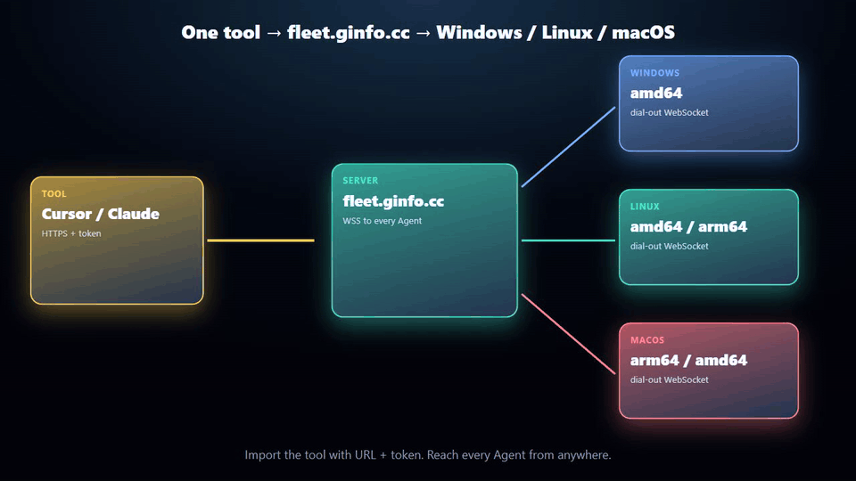
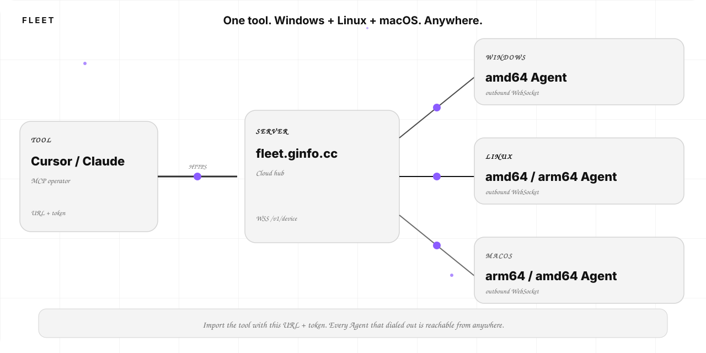

# Fleet

**One MCP tool. Windows, Linux, and macOS. From anywhere.**

Live hub: **[https://fleet.ginfo.cc](https://fleet.ginfo.cc)**



Install an Agent on each computer, then import the tool with **this URL + a hub token**. Cursor / Claude talks to the server; the server already has a WebSocket from every Windows, Linux, and Mac box that dialed out — any arch the Agent runs on.

[Try fleet.ginfo.cc](https://fleet.ginfo.cc) · [Docs](https://fleet.ginfo.cc/docs) · [Deploy](deploy.md) · [Auth](auth.md) · [Notes](notes.md)

中文：[../zh/README.md](../zh/README.md)

## How it works



1. **Tool** — Cursor, Claude, MCP. `FLEET_URL` + `FLEET_TOKEN`.
2. **Server** — [fleet.ginfo.cc](https://fleet.ginfo.cc) (or your own Worker). Relays jobs.
3. **Agents** — outbound `WSS /v1/device` on Windows amd64, Linux amd64/arm64, macOS arm64/amd64. No inbound ports.

Explainer video: [architecture.mp4](../media/architecture.mp4)

## Try the cloud first

1. Sign in at [https://fleet.ginfo.cc](https://fleet.ginfo.cc) (Google / X).
2. Settings → generate a Hub token.
3. [Install Agent](https://github.com/TITOCHAN2023/fleetForAgent/releases/latest) on each PC. Hub address = `https://fleet.ginfo.cc`.
4. Point the tool at the same pair:

```bash
FLEET_URL=https://fleet.ginfo.cc FLEET_TOKEN=flt_... node packages/fleet-tool/index.mjs list
```

The same Worker can serve `/ops` (usage, last-seen freshness, Ban) for emails in the `ADMIN_EMAILS` secret. Empty secret = no admins. Not a separate Worker. Ban cannot operate machines.

Details: [deploy.md](deploy.md) · [auth.md](auth.md)

## Local is a CLI

```bash
npm install
npm run dev
```

http://127.0.0.1:8080 is for hacking. A hub on loopback cannot join Windows / Linux / macOS that cannot see that address — local deploy never becomes a fleet. At most you get a command-line tool. Put the hub in the cloud (or start at **[https://fleet.ginfo.cc](https://fleet.ginfo.cc)**) if you want the product.
