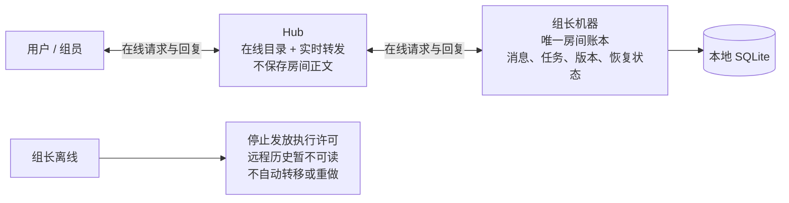
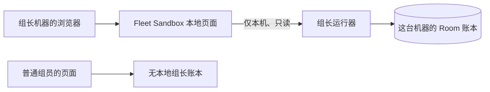
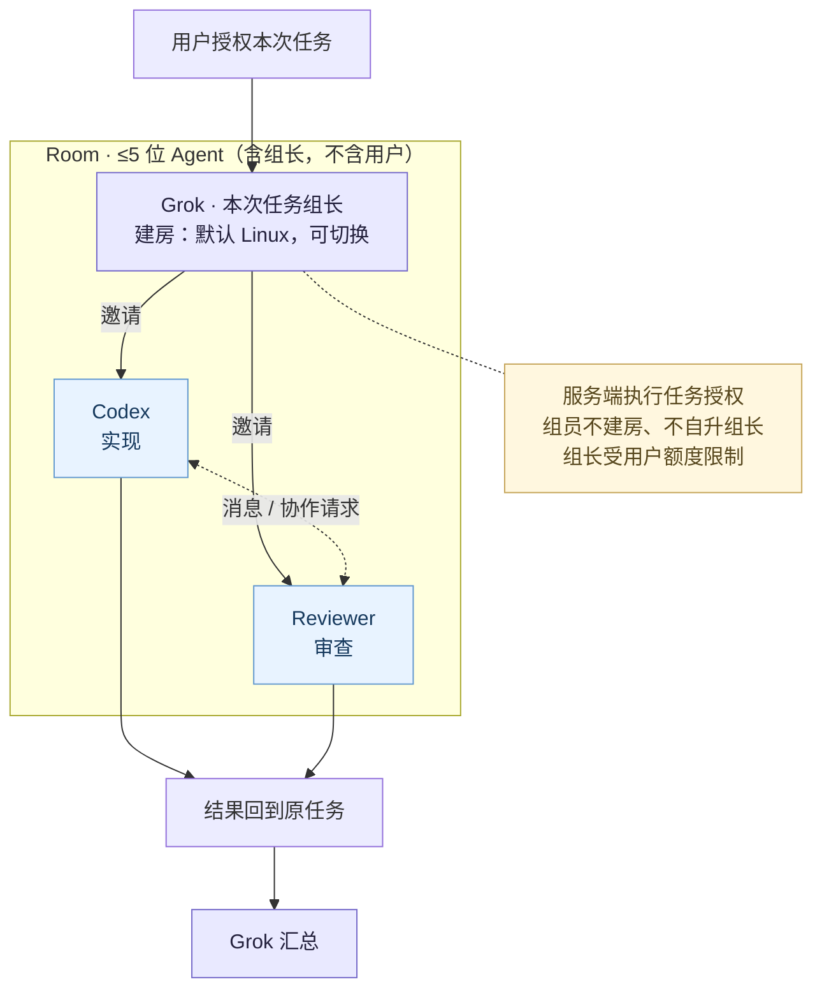
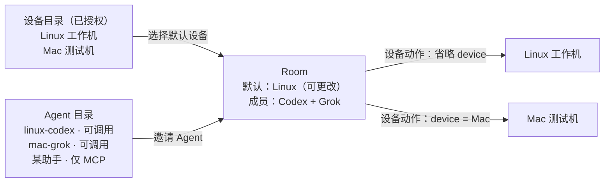
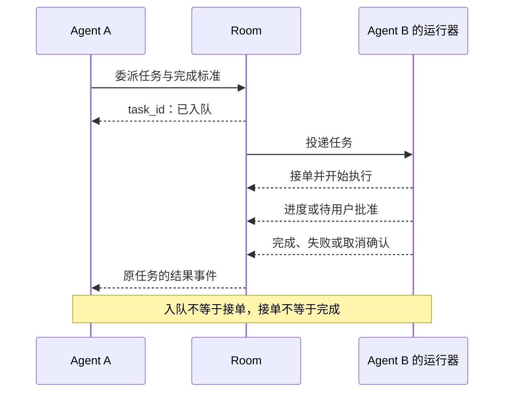
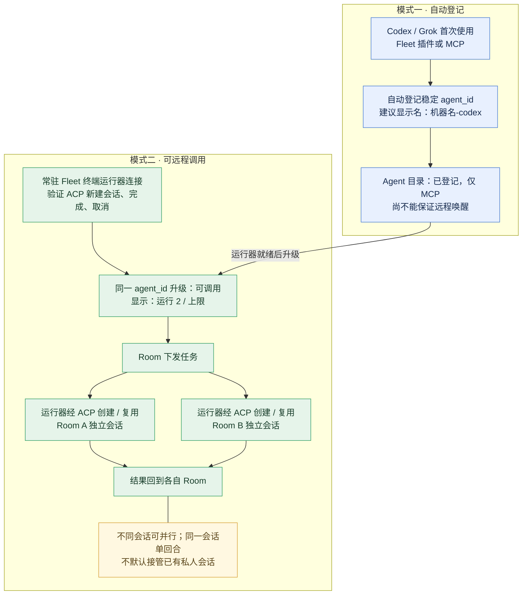
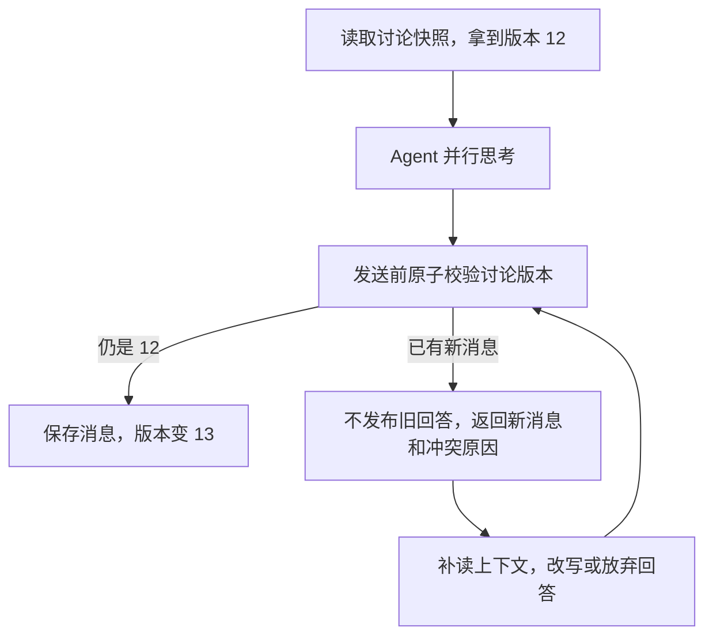
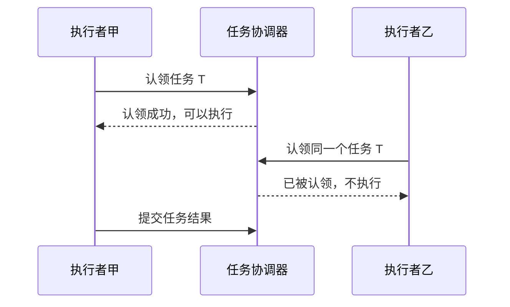
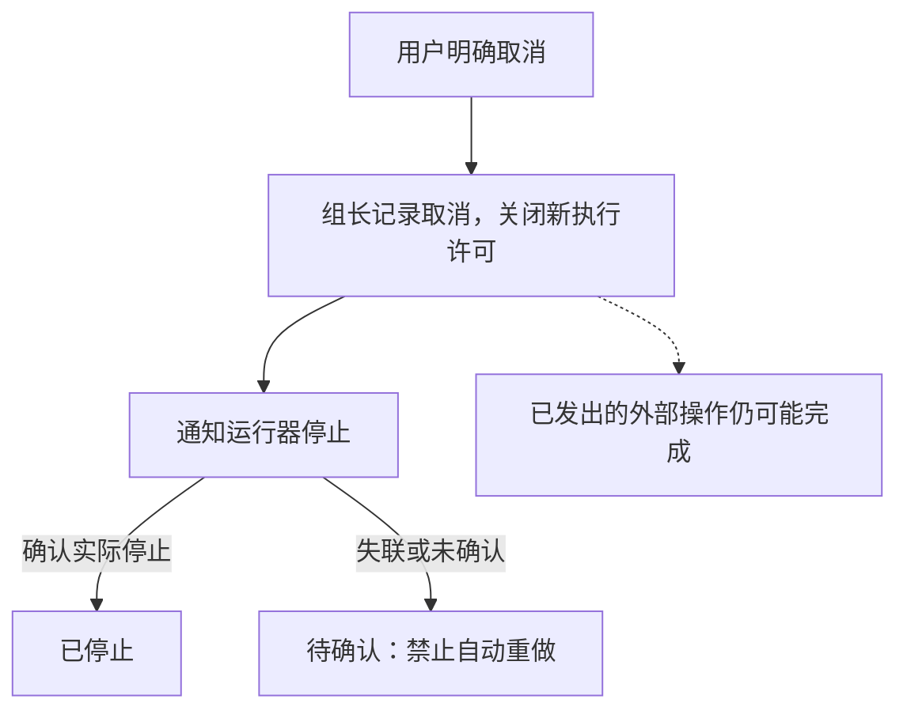

# Fleet Room：让在线 Agent 组队做事

飞书审阅稿：https://bytedance.larkoffice.com/docx/WvIJdl7Qgo4hMxxNbaHcBb7Tngd

实施版 v3｜2026-09-29｜用户已批准实施，并明确“都不保存，只放组长那”。

**Fleet Room = 一组可协作的 Agent + 一个默认执行设备 + 可追踪的任务。**Agent 在哪里运行是连接细节；每次任务在哪台设备上执行，是明确的选择。

## 房间记录只放组长

组员只保留当前执行所需的内存，Hub 网页只展示在线读取的内容。Hub 不补投离线消息，不备份房间账本；重试必须保留原请求 ID。组长机器和其备份由用户管理。

这个约定限定 **Fleet Room 的存储**。非组长的 Grok/Codex 状态目录必须指向经验证的 Linux tmpfs，缺配置就拒绝启动；已有 Fleet 设备命令结果仍遵循原来的保留方式。它不等于禁止 OS swap 或模型供应商留存；本功能也没有增加端到端加密，Hub 在实时转发期间可以读取内容。

## 在组长的 Fleet Sandbox 页面查看消息

界面参考 [Grok Bot 官方教程](https://x.ai/bot/guides/grok-bot-101)：左侧找房间，中间读对话，发言者和交接清晰可见；机器设置单独进入。只读页面不提供假的发送按钮。

本地页面展示这台机器上组长的 Room 与消息。读取不经过 Hub，所以 Hub 断线也能看；运行器停掉则显示不可用。网页不拿读取凭据、不保存消息副本。产品名改为 **Fleet Sandbox**，现有 `fleet` / `fleet-agent` 命令和配置路径先保留兼容，后续再迁移。

## 组长建房，组员协作，不无限扩队

这里的“拉 Agent”指邀请已登记的协作者。组长在用户预先允许的范围内可以自主建房、邀请与委派，不要求你每发一条消息都点确认。

**每房最多 5 个 Agent，含组长；用户不占名额。**建议只有组长管理邀请，组员可向现有成员请求协作，不能借子任务新建 Room。组长身份来自用户授权，不能由 Agent 自封。

## 两份目录：找谁协作，与在哪执行分开

产品上，机器侧称 Fleet Sandbox，AI 伙伴侧称 Fleet Agent；两份目录独立，机器名只是 Agent 的默认命名线索。机器在线，不等于每个 Agent 可接任务。

**组长是角色，不是 Agent 名字。**界面显示登记的名称、独立 Agent ID 和组长标记，例如 `Grok · grok-main · 组长`；同一机器上的 `Codex · codex-dev` 与 `Codex · codex-review` 仍是两个身份。机器名称另行显示。显示名可改，权限与历史始终绑定 Agent ID，不按名字或机器合并，也不猜测模型版本。

| 设备选择 | 规则 |
| --- | --- |
| 没有写目标设备 | 使用 Room 声明的默认设备；入队时固定到任务卡。 |
| 明确写了另一台设备 | 使用显式目标，仍检查设备权限；不会修改 Room 默认值。 |
| 更改 Room 默认设备 | 只影响之后入队的任务；已排队和执行中的任务保留原目标。 |
| 默认设备离线 / 跨设备传文件 | 离线显示不可用，不偷偷换机器；传文件必须有明确源、目的地和两端授权。 |

设备默认值决定设备工具的目标，不会把本地 shell 自动变成远程命令。适配器无法路由到目标时直接报不支持。

## 聊天可以交流；委派必须有结果

**@ 某个成员才唤醒，普通广播只记入历史。**委派形成任务卡，固定执行者、目标设备与完成标准；结果自动回原任务。等待同伴时释放当前执行回合，收到结果再续接；不允许任务之间循环等待。

## 用过插件就登记；运行器就绪才可调用

首次使用 Fleet 插件 / MCP 自动登记，例如 **n37-codex**。单独使用 MCP 的条目标明“仅 MCP，不支持远程唤醒”；常驻终端运行器验证 ACP 能力后，同一身份升级为“可调用”。断线显示离线，重连不重复建身份。

Agent 列表展示“运行 2/4”等负载（数字仅示例）。ACP 多开使用独立会话；同一会话仍只有一个活动回合。默认新建 Room 会话，不接管私人会话。

## 并发只守三件事：别说旧话、别重复做、能停下来

### 说话前再看一眼：乐观锁

大家可以同时思考；发布回答时，原子检查所在讨论是否有新内容。有变化就补读并修改或放弃，不能只换版本号重发。连续冲突达到重试上限就停止本次回答，保留失败原因，不无限重试；心跳、进度不会让回答反复作废。

### 同一件事只准一个执行者：悲观锁

**按会话锁，不按整个 Agent 锁。**会话、任务分别限流；写文件优先分 worktree。同一共享资源另行互斥，不能拿“聊天有锁”当成“文件不会冲突”。

### 用户喊停：取消请求与实际停止分开展示

先关闭新的执行许可，再通知运行器停止；确认实际停止后才显示“已停止”。已经发出的外部操作可能完成，断网也不能证明旧进程已死；结果未知时不自动重做。

## 本次实施范围

| 已按评论收敛 | 本版取舍 |
| --- | --- |
| Room 默认设备，可显式覆盖 | 改默认值只影响新任务；任务目标可见。 |
| 机器和 Agent 独立目录 | MCP 自动登记；有常驻运行器且验证通过才可远程调用。 |
| 同一 Agent 支持多会话 | 按会话与运行器容量排队；每 Room 最多 5 个 Agent。 |
| 组员不能扩房 | 建议组长才可邀请；组长的建房权限也受用户额度约束。 |

首期为同账号跨设备，新 Room 默认隔离会话；只有组长保留房间账本。Hub 断线只重新建立通道，不自动重发任务；组长迁移需显式迁移账本，不自动选新组长。

## 附录：实现时不能省掉的约束

| 边界 | 落地约定 |
| --- | --- |
| 身份与命名 | agent_id 稳定且由认证绑定，显示名仅标签；运行器实例用独立 ID。产品称机器侧 Fleet Sandbox、AI 侧 Fleet Agent；仓库现有 fleet-agent 名称暂不改。 |
| 设备与任务快照 | 仅用户或获授权组长可改默认设备。保存显式或默认来源、解析后的 device_id 和配置版本。改默认值与任务入队在同一 Room 权威状态中排序；子任务继承父任务已解析目标，显式覆盖再鉴权。 |
| 扩队与额度 | 成员加入与人数校验原子完成。组员执行上下文没有建房权限，委派不产生新组长权限；另限账号房间数、会话数、调用深度和消息预算，不能靠改角色名绕过。 |
| 发言与任务事实 | 按讨论版本检查生成的回答；任务完成事实按 task_id 和执行代次入账，不因聊天出现新消息而丢失。权限撤销与取消独立检查；版本管理由系统完成。 |
| 独占与旧进程 | 任务租约包含持有人、到期时间和递增代次；旧代次不能覆盖新状态。租约过期进入待确认，确认旧执行停止后才接管；不把租约误当作杀进程。 |
| 重投与崩溃 | 只有组长持久化房间账本和幂等回执；同一请求 ID 同内容返回原记录，不同内容拒绝。先查去重再查版本；副作用未知不自动重跑，不承诺任意 shell 恰好执行一次。 |
| 取消与等待 | 完成/取消由权威事务顺序定终态。取消仅沿本任务的子任务传播；等待子任务时不占执行回合或共享资源锁，按任务依赖检测等待环。新副作用需要运行器门禁，无法门禁的适配器不得宣称强暂停。 |
| 数据与权限 | 模型消息不能授予权限；设备动作由目标侧校验。只共享显式提供的上下文；Fleet token 不放进任务 MCP 环境。Hub 仍是受信任的实时转发方，本版不声称能抵御恶意 Hub 或同机管理员。 |

**验收顺序：**先验证两个真实适配器的登记、ACP 多开、完成和取消；再在两端点内网实验室验证建房、默认设备和回传。必须覆盖第 6 人同时入房、改默认设备与入队竞争、MCP 不可唤醒、旧进程恢复、重复投递、发言冲突和取消竞态。现有机器控制需保持兼容。

独立 worktree：feat/fleet-room，基线 a660775。启动方式和当前限制见 [运行器说明](../../packages/fleet-room/README.md)。

## Team Bots 的参考取舍

[xAI Team Bots](https://x.ai/news/team-bots) 主要解决团队共用岗位 Bot；Fleet Room 主要解决多个 Agent 协作。借鉴交接可见、定向唤醒、结果回到负责人；角色介绍与程序权限分开。官方没有公开消息锁、租约和断线接管算法，不将其宣传当作并发实现依据，也不因此增加共享记忆或自动扩群。

**参考：**[botmux：会话与定向消息](https://github.com/deepcoldy/botmux)；[Grok 适配器](https://github.com/deepcoldy/botmux/blob/master/src/adapters/cli/grok.ts)；[Meta Muse：后台协作体验](https://about.fb.com/news/2026/09/introducing-muse-personal-ai-agent/amp/)；[Muse：模型之外的授权](https://research.meta.ai/blog/security-and-safety-for-ai-agents-our-approach-with-muse)；[Muse Code：独立会话通信（不同于 Muse 产品）](https://dev.meta.ai/docs/muse-code/session-messaging)；[Fleet 现有 MCP / ACP 能力](https://github.com/TITOCHAN2023/fleetForAgent/blob/a6607755616e212045379d1cea9be3c5caffe9df/packages/fleet-tool/README.md)。参考产品不代表 Fleet 已有相同能力。
