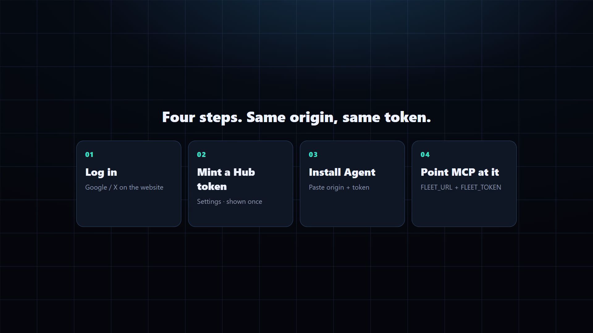

# Fleet

**让你的 Agent 跑在你自己的电脑上。**  
设备只出网。网站本身就是中枢。设备侧不用开入站端口，也不需要 VPS。


登录 → 生成 Hub token → 每台电脑装 Agent（填本站 origin + token）→ Cursor / Claude 的 MCP 填同一对。一台 Node 上可以有多个账号，SQL 按 `user_id` 隔离。

[最新安装包](https://github.com/TITOCHAN2023/fleetForAgent/releases/latest) · [部署](deploy.md) · [登录](auth.md) · [素材](../media/README.md)

English: [../en/README.md](../en/README.md)

## 怎么工作


1. **你** — Cursor、Claude，或任何 MCP 客户端。`FLEET_URL` + `FLEET_TOKEN`。
2. **中枢** — 这个网站。登录、发 token、在 `/v1/*` 上转发任务。
3. **Agent** — Mac / Windows / Linux 上的小进程。它主动连出 WebSocket（`/v1/device`），从不接受入站连接。

一次命令就是一个来回：MCP → 中枢 → Agent → stdout/结果回来。

24 秒无声讲解（后面配音用）：[architecture.mp4](../media/architecture.mp4)

## 新用户



1. 打开网站，用 **Google / X** 登录（不是邮箱）。生产域名见 [auth.md](auth.md)。
2. 设置页生成 Hub token（明文只显示一次；重置会使旧钥匙立刻作废）。
3. 从 [Releases](https://github.com/TITOCHAN2023/fleetForAgent/releases/latest) 装 Agent。填本站 origin + token。
4. 操作端 / MCP：

```bash
FLEET_URL=http://127.0.0.1:8080 FLEET_TOKEN=flt_... node packages/fleet-tool/index.mjs list
```

macOS 安装包必须是 `hdiutil` 打出来的真 dmg，不能把 zip 改后缀 — [packaging.md](packaging.md)。

完整步骤：[deploy.md](deploy.md)

## 本地控制台

```bash
npm install
npm run dev
```

http://127.0.0.1:8080 → 登录 → 设置 → 生成 token。Agent 和 tool 都用这个 origin + token。

可选的独立中枢（Cloudflare Worker / `packages/fleet-hub`）写在 [deploy.md](deploy.md)。新用户不用填那些地址。
