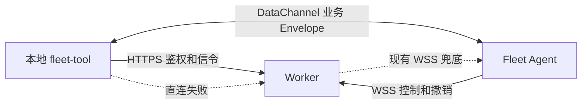

# 部署 FleetForAgent

先用线上版体验：**[https://fleet.ginfo.cc](https://fleet.ginfo.cc)**  
本地 `npm run dev` 只是环回地址上的命令行，管不了别的电脑。要真正用起来，得把中枢放到云上。

```
新用户 → https://fleet.ginfo.cc → 生成 Hub token
每台电脑装 Agent → 填 https://fleet.ginfo.cc + token
导入 Tool → FLEET_URL + FLEET_TOKEN
```

```
[fleet-tool / Cursor / Claude]
        HTTPS + Fleet-OAEP (flt_1)
            │
            ▼
   fleet.ginfo.cc  (云端中枢)
            ▲
            │  仅出站 WSS /v1/device
   ┌────────┼────────┐
Windows   Linux           macOS
amd64     amd64/arm64     arm64/amd64
```

安装包在 GitHub Release，不在仓库里：

https://github.com/TITOCHAN2023/fleetForAgent/releases/latest

---

## 0. 新用户（默认路径）

从 **[https://fleet.ginfo.cc](https://fleet.ginfo.cc)** 开始。不要先 `npm run dev`：中枢跑在 127.0.0.1 上最多算个命令行工具，别的电脑加不进来。

1. 打开 [https://fleet.ginfo.cc](https://fleet.ginfo.cc)，登录。
2. 设置页生成 Hub token（只显示一次明文；可随时重置，旧钥匙立刻作废）。
3. 每台电脑装 Agent，中枢地址填**这个网站的 origin**（`https://fleet.ginfo.cc`），再贴 token。
4. 操作端：

```bash
FLEET_URL=https://fleet.ginfo.cc FLEET_TOKEN=flt_... node packages/fleet-tool/index.mjs list
```

下面 A/B 是可选的独立中枢实现，不是新用户要填的地址。本地 `http://127.0.0.1:8080` 只适合改网站代码。

## 1. 可选：独立中枢（Worker 或单独 Node 进程）

协议一样。只有当你想把中枢和网站分开部署时才用。

### A. Cloudflare Worker

需要：Cloudflare 账号、Node 18+。

```bash
git clone https://github.com/TITOCHAN2023/fleetForAgent.git
cd fleetForAgent/packages/fleet-worker
npm install
npx wrangler login
npx wrangler deploy
```

`wrangler.toml` 里 `workers_dev = false`，不会再出 `*.workers.dev`。绑定自己的域名（Cloudflare Dashboard → Workers → Triggers → Custom Domain），Agent 填那个 origin。本仓库生产域是 `https://fleet.ginfo.cc`。本地预览可把 `workers_dev` 改回 `true`。

### 令牌（建议生产打开）

```bash
npx wrangler secret put HUB_TOKEN
npx wrangler secret put ADMIN_EMAILS
```

`ADMIN_EMAILS` 是 cookie 登录邮箱列表（逗号或空白分隔），只有这些邮箱能打开同一 Worker 上的 `/ops`。空 / 未设 = 没有管理员。不是 `HUB_TOKEN` / `Fleet-OAEP`。不要把邮箱写进 `[vars]`。

设了 `HUB_TOKEN` 之后，设备连接和控制面调用都要带：

```
Authorization: Bearer <HUB_TOKEN>
```

本机 Agent 设置页有「Hub token」栏。不设 secret 时 Worker 没有鉴权，只适合先自己跑通。

本地调试：

```bash
cp .dev.vars.example .dev.vars
npx wrangler dev --port 8787
```

Agent 填 `http://127.0.0.1:8787`（会转成 `ws://…/v1/device`）。

### 可选的点对点数据通道和自建 STUN

Agent 0.5.0 与本地 `fleet-tool` 0.5.0 会先保留原来的 WSS 控制连接，再尝试建立 WebRTC DataChannel。直连成功后，`run`、pane、桌面和插件仍传同一份 `{ v, type, id, corr, t, body }`；打洞失败、超时、旧客户端没有 `rtc_v1`，都会回到原来的 Worker → WSS 路径。远程 `/mcp` 和 `/mcp/sse` 运行在 Worker 内，没有 UDP socket，继续走中枢。



STUN 只告诉双方各自的公网映射，不转发命令内容。第一版不配 TURN，避免又造一条中心数据面。可以在有固定公网 IP 的小 VPS 上装 coturn，只开放 UDP 3478：

```bash
sudo apt-get update
sudo apt-get install -y coturn
sudo tee /etc/turnserver.conf >/dev/null <<'EOF'
stun-only
listening-port=3478
listening-ip=203.0.113.10
external-ip=203.0.113.10
no-cli
no-tls
no-dtls
EOF
sudo systemctl enable --now coturn
```

把示例 IP 换成服务器真实公网 IP，给它加一个只做 DNS 解析的域名，并在 Worker 的 `[vars]` 中加入：

```toml
RTC_STUN_URLS = "stun:stun.example.com:3478"
```

UDP 3478 必须在 VPS 防火墙和云安全组同时放行。STUN 宕机不会让 Fleet 失联，只会让这次直连失败并回到 WSS。不要在域名还没提供 STUN 服务时提前填写这个变量。

### B. 普通部署（VPS / 本机 Node）

不需要 Cloudflare。一台 Node 18+ 机器：

```bash
cd packages/fleet-hub
npm install
HUB_TOKEN=change-me PORT=8787 HOST=0.0.0.0 npm start
```

本机 Agent 填 `http://127.0.0.1:8787`。放到公网时前面加 Caddy / nginx 做 HTTPS，Agent 填 `hub.example.com`。

控制面路径和 Worker 完全一样：`/v1/health`、`/v1/list_computers`、`/v1/run`、`/v1/get_result`、`/v1/read_screen`、`/v1/type`。设备仍是 `WSS /v1/device`。

这是共享 `HUB_TOKEN` 的单用户中继，没有 `flt_1`、没有按账号隔离。空 `HUB_TOKEN` **只能绑 loopback**（`HOST=127.0.0.1`）；绑 `0.0.0.0` 或公网必须设 token。

systemd 示例：

```
[Service]
WorkingDirectory=/opt/fleet/packages/fleet-hub
Environment=PORT=8787
Environment=HUB_TOKEN=change-me
ExecStart=/usr/bin/node index.mjs
Restart=always
```

---

## 2. 每台电脑装 Agent

到 [Releases](https://github.com/TITOCHAN2023/fleetForAgent/releases/latest) 下载：

| 系统 | 文件 |
|---|---|
| Windows | `FleetAgent-windows-amd64.exe` |
| macOS Apple 芯片 | `FleetAgent-macos-arm64.dmg`（真磁盘映像；不要用 zip 改后缀） |
| macOS Intel | `FleetAgent-macos-amd64.dmg` |
| Linux amd64 | `fleet-agent-linux-amd64.tar.gz` |
| Linux ARM64 | `fleet-agent-linux-arm64.tar.gz` |

然后：

1. 打开安装包（Windows 双击 exe；Mac 拖到应用程序）。
2. **Mac / Windows：** 第一次会开 `http://127.0.0.1:17890` 设置页。关掉页面也没关系：Mac 在顶部时钟旁，Windows 在右下角托盘。再点一次图标会重新打开设置页；右键可开关本机、切换执行权限。
3. **Linux：没有设置页。** 解压后用环境变量启动，状态在面板托盘里（KDE / XFCE / Cinnamon 默认有；GNOME 需要 AppIndicator 扩展）。右键切换开关和执行权限。没有图形会话时，当后台进程跑。

```bash
export FLEET_URL=https://fleet.ginfo.cc
export FLEET_TOKEN=flt_…
./fleet-agent
```

配置也会写进 `~/.fleet-agent/config.json`。可选 `FLEET_ENABLED=1`。

三端都有命令行，和托盘/设置页共用本地 API（`127.0.0.1:17890`），不要两边各改一份配置：

```bash
fleet start --hub https://fleet.ginfo.cc --token flt_…
fleet status
fleet permit ask
fleet stop          # 关掉本机开关，进程还在
fleet quit          # 退出进程
fleet help
```

Mac 可执行：`"/Applications/Fleet Agent.app/Contents/MacOS/FleetAgent" status`  
或 `fleet install` 把 `fleet` 链到 PATH。Linux 包里同时有 `fleet` 和 `fleet-agent`（同一个文件）。Windows 用 `FleetAgent.exe status`；`fleet install` 拷到 `%LOCALAPPDATA%\Fleet\fleet.exe`。
5. Mac/Windows 填中枢地址（不要带路径）再点连接；Linux 用上面的 `FLEET_URL`。状态变成「已连接」时图标是 `F•`。
6. 开关打开时 Agent 挡住系统空闲休眠（屏幕仍可锁）。合盖不拦。Linux 用 `systemd-inhibit --what=idle:sleep`。
7. 选权限（Mac/Windows 设置页或各平台托盘右键）：
   - **停用**：拒绝 run 和 type（含已有 pane）
   - **需当面同意**：run 和后续按键都要本机点头
   - **自动执行**：直接跑。本机还有一条粗过滤，不当安全边界

设备只主动连中枢，**设备侧不用开端口、不用公网 IP、不用 VPN**。普通部署那台 Node 机器当然要能被连上（80/443 或你选的端口）。

自己重打安装包：

```bash
npm run release:agent
gh release create v0.x.0 public/dl/FleetAgent-* public/dl/fleet-agent-linux-amd64.tar.gz
```

---

## 3. 列机器、选一台、执行

Worker 和 Node 中枢走同一套路径。把 `$HUB` 换成 `https://fleet-hub.<account>.workers.dev` 或 `https://hub.example.com`。

健康检查：

```bash
curl $HUB/v1/health
```

列设备（不返回 IP）：

```bash
curl -X POST $HUB/v1/list_computers \
  -H "authorization: Bearer $HUB_TOKEN" \
  -H "content-type: application/json" \
  -d '{}'
```

跑一条命令：

```bash
curl -X POST $HUB/v1/run \
  -H "authorization: Bearer $HUB_TOKEN" \
  -H "content-type: application/json" \
  -d '{"device_id":"<id>","command":"uname -a"}'
```

返回 `{ "corr": "...", "status": "running" }`。再取结果：

```bash
curl -X POST $HUB/v1/get_result \
  -H "authorization: Bearer $HUB_TOKEN" \
  -H "content-type: application/json" \
  -d '{"device_id":"<id>","corr":"<corr>"}'
```

协议封装：`{ v:1, type, id, corr, t, body }`。设备路径只有 `WSS /v1/device`。

### 别让异步任务卡住中枢（tmux 式）

任务活在**设备本地的 pane**里，不活在中枢请求上。

| 不要 | 要 |
|---|---|
| 把 stdout 字节流接到中枢 | 本机 ring buffer，像 tmux 的 pane 历史 |
| `pipe-pane` 一直推 | `capture-pane` 式快照 |
| HTTP 等到 `sleep 30` 结束 | 立刻 `accepted`，之后 `read_screen` / `get_result` |
| 每行输出都发一条 WS | 4Hz 只发最新，中间帧直接丢 |

```bash
# 立刻返回 { corr, status: running }
curl -X POST $HUB/v1/run -H "authorization: Bearer $HUB_TOKEN" \
  -H "content-type: application/json" \
  -d '{"device_id":"<id>","command":"yes"}'

# 抓一张屏幕快照，不接管会话
curl -X POST $HUB/v1/read_screen -d '{"device_id":"<id>"}' ...

# 往 stdin 打字，不等进程
curl -X POST $HUB/v1/type -d '{"device_id":"<id>","keys":"q\n"}' ...
```

控制面（ping / type / read_screen）不进 `Wait()`。编译刷一万行也卡不住中枢。


---

## 4. 可选：部署控制台网站

仓库根目录是 TanStack Start 控制台（登录、实验室、下载页）。预览用进程内 PGLite；正式库用 Postgres。

```bash
# 根目录
cp .env.example .env.local
# DATABASE_URL=postgres://...
# BETTER_AUTH_SECRET=长随机串
# BETTER_AUTH_URL=https://你的网站
npm install
npm run build
```

可以放到任意 Node 主机，或接 Neon + 你常用的前端托管。控制台和中枢是分开的：中枢（Worker 或 `packages/fleet-hub`）管设备中转，网站管登录和 UI。

---

## 5. 安全要点

- 设备只出站。家用路由不用做端口映射。
- Token 走 `Authorization` 头，不要写进 URL。
- 本机三级权限在设备上执行，中枢改不了。`off` / `ask` 同时管 run 和 type。
- 危险命令拦截只在设备 Agent 执行。Worker、RTC 和 WSS 都只是传递同一份 Envelope，插件审批也不会被另一条传输绕开。
- 重置 Token 会先写撤销墓碑并下发签名的 `auth_revoked`，随后断开 WSS。Agent 把它当最高优先级事件，立即关闭全部 DataChannel，旧 Token 不再自动重连。
- Worker 的 `HUB_TOKEN` 是可选超级操作员。Node 中枢绑公网时必须设 `HUB_TOKEN`（空 token 只能 loopback）。
- 机器之间互相 ping 不通是正常的：没有内网 overlay。

---

## 常见问题

**连不上中枢**  
域名不带 `https://` 也行，Agent 会自己补上。先在本机 `curl /v1/health` 试试。Worker 确认 `npx wrangler deploy` 成功；普通部署确认 Node 进程在监听，反代正确转发了 WebSocket Upgrade。

**Mac 提示未签名 / 无法打开**  
先确认下载的是**真 dmg**（`file` 的输出不能是 `Zip archive`）。假 dmg 是打包脚本的历史坑，见 [packaging.md](packaging.md)。

真映像仍可能被 Gatekeeper 拦（未公证）：系统设置 → 隐私与安全性 → 仍要打开；或右键 `.app` → 打开；或 `xattr -cr "/Applications/Fleet Agent.app"`。zip 备用：解压出 `.app` 再拖进应用程序，不要把 zip 改成 `.dmg`。

**Windows SmartScreen**  
更多信息 → 仍要运行。这是未签名 exe 的正常提示。

**list_computers 是空的**  
Agent 要先显示已连接。等几秒再 POST。

**Windows 任务 vs Mac/Linux live shell**
Mac/Linux 共用一个登录 PTY（工作目录和环境会留到下一条命令）。Windows 用 `cmd /C` 一次性任务，不靠 ConPTY 也能编译、能跑。中枢协议两边一样。

**托盘显示已连接，列表却是 offline**  
中枢会下发 `heartbeat_s`，但旧版 Agent 从不发心跳。Windows 休眠或 NAT 空闲后容易半开：本机还显示在线，中枢已经判定掉线。新版每 25 秒 ping 一次，失败就重连。装上新 Agent 后重启一次即可。

**想换域名**  
Worker：绑 Custom Domain 后所有 Agent 改填新域名再点连接。普通部署：改反代域名，Agent 同样改填。
