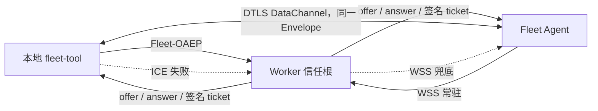
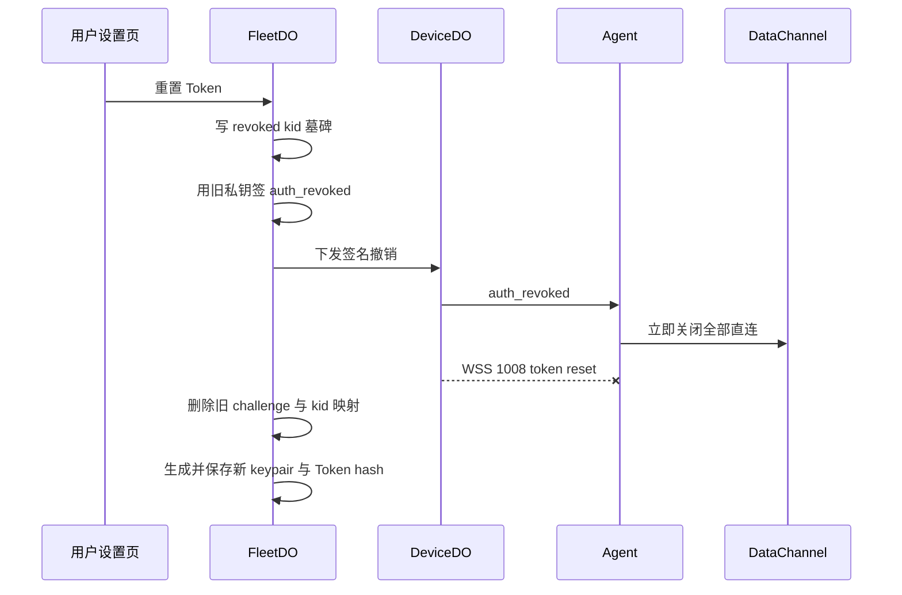

# Fleet 直连与撤销安全模型

这份文档描述 Agent 0.6.5 和本地 fleet-tool 0.6.3 的实现边界。它不是另一套远程执行协议。Worker 仍是身份与会话的信任根，WSS 仍是控制通道，WebRTC DataChannel 只是可选的数据通道。RTC 信令和已建立会话使用不同生命周期；新版双方会在 `rtc_ready` 后协商终态结果 ACK，只有未确认的结果才通过 WSS 补投，旧版不协商该扩展。

## 不变量

1. WSS 先连，而且直连期间不退出。它承载心跳、信令、Token 撤销和兜底。
2. WSS 与 RTC 都传 `{ v, type, id, corr, t, body }`。Agent 只有一个 `dispatchEnvelope` 和一个 `EnvelopeSink`。
3. shell、pane、桌面、插件安装、插件调用和本机审批全部在 Agent 处理。Worker 不解析命令，也不拥有插件的第二套审批逻辑。
4. 危险命令只在设备端 policy 拦截。换传输不能绕过 policy。
5. RTC 失败不会让设备失联。操作端回到现有 HTTPS → DeviceDO → WSS 路径。
6. 本地和远程 MCP 都在设备型结果的 `_meta.fleet_transport` 中报告实际返回路径。本地 Tool 为 `rtc` 或 `ws`，Worker 内的远程 MCP 固定为 `ws`。该值按单次调用记录，不进入默认文本和 v1 Envelope；心跳、保活仍固定走 WSS。



## 直连怎样被认证

Tool 生成 offer，Agent 生成 answer。Worker 从两份 SDP 取出 SHA-256 DTLS fingerprint，然后用当前账户在 Worker 内保存的 RSA 私钥签一个短期 ticket。ticket 固定这些字段：

```text
v, kind, sid, kid, device_id, operator_id,
offer_fp, answer_fp, iat, exp
```

Tool 和 Agent 都拿 Token 里的公钥验签，再分别核对 sid、当前 kid、设备、操作端指纹、两端 SDP fingerprint 和过期时间。Agent 验证完成后会在 DataChannel 上发 `rtc_ready`，Tool 必须等到这条确认才允许发送业务 Envelope。这样不会把“ticket 已经由 Worker 发出”误当成“Agent 已经处理完成”。

DTLS 负责加密通道并证明当前连接持有对应 fingerprint 的临时密钥。Worker ticket 负责证明这两个 fingerprint 是本次已认证 Fleet 会话选中的两端。只校验 DTLS 不够，只签一个没有 fingerprint 的 session id 也不够。

这套实现没有另造设备长期私钥。中心 Worker 是信任根。拿到 Hub Token 的人，在 Token 被重置前仍然拥有这个账户授予的权限。这一点不能靠 WebRTC 消失，解决办法是可验证、能抢占一切业务的撤销链路。

## Token 重置为什么能打断正在使用的直连

重置按下面的顺序执行：



`auth_revoked` 在 Agent 控制消息中优先级最高。验签和 kid 匹配后，Agent 会清掉待批准请求、直连 session 和旧回包 sink，进入 `auth_failed`。旧 Token 不会自动重连。用户贴入不同的新 Token 后，这个终态才解除。

如果撤销消息还没送到，WSS 被切断也会关闭全部 DataChannel。Agent 不允许业务直连脱离控制 WSS 单独存活。随后旧 Agent 或没收到签名消息的新 Agent 会尝试一次 WSS 重连，challenge 因撤销墓碑失败，再进入认证失败。这样不依赖“发送一条消息后马上 close 一定能送达”的侥幸。

重置是 fail-closed 的：任一在线设备的 DeviceDO 没确认断连，FleetDO 就保留旧签名材料供重试，不会越过失败点生成新 Token；旧 kid 已经有撤销墓碑，也不能再建立新连接。

## 向后兼容

| 组合 | 行为 |
|---|---|
| 新 Tool + 新 Agent + 新 Worker | 尝试 RTC，失败走 WSS |
| 新 Tool + 旧 Agent | `rtc_v1` 不存在，直接走 WSS |
| 新 Tool + 旧 Worker或独立 Node Hub | `/v1/rtc/config` 不存在，缓存失败并走原路径 |
| 旧 Tool + 新 Agent | 旧 HTTPS/WSS 路径不变 |
| 旧 Agent + 新 Worker | 不认识新控制消息，但重置时仍收到 WSS 1008 并被断开 |
| 远程 `/mcp`、`/mcp/sse` | Worker 内运行，继续使用中心 WSS 数据面 |

协议版本仍是 v1。能力协商只增加 `rtc_v1`，没有改旧 Envelope，也没有要求旧客户端理解新的业务字段。

## STUN 和可用性

STUN 只参与 ICE 地址发现，不看 Fleet Token，不转发命令。STUN 不可用、双方 NAT 不能打洞、公司网络封 UDP，结果都一样，直连超时并回到 WSS。第一版没有 TURN，因为 TURN 本质上又是中心业务中继，现有 WSS 已经承担这项职责。

自建 coturn 的部署方式见 [部署文档](deploy.md)。

## 还防不了什么

- Token 重置以前，已经偷到有效 Token 的攻击者具有账户授权。这是 Token 泄露，不是中间人攻击。
- 已经在设备上取得本地管理员权限的人，可以改 Agent 二进制或本机配置。设备端 policy 不是用来对抗本机 root 的。
- STUN 不是身份系统，也不提供额外加密。身份来自 Fleet-OAEP、Worker 私钥签名和 DTLS fingerprint 绑定。
- WSS 与 RTC 都无法替用户判断一条业务命令是否合理。`permit=ask`、官方插件清单和设备端灾难命令拦截仍然要保留。
- 设备端命令拦截是最后一道灾难保护，不是任意 Shell 的完整沙箱。需要强隔离时用 `permit=ask`，或让 Agent 本身运行在受限账户、容器或虚拟机里；`permit=allow` 就是在授予远程执行权。
