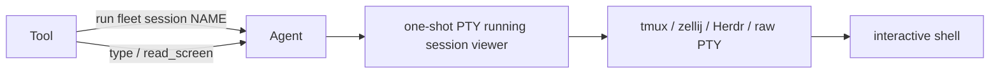

# Fleet Agent

Go process that sits on each machine. Composition root is `package main`. Domain code lives in `internal/` so a contributor can open one folder instead of a flat dump of 50 files.

```
packages/fleet-agent/
  main.go            Agent, hub WebSocket, settings HTTP, CLI glue
  rtc.go             optional Pion DataChannel; WSS remains control/fallback
  desktop.go         desktop permit / consent / rate-limit (calls internal/desktop)
  tray_adapt.go      *Agent implements tray.Controller
  autoupdate.go, update*.go, restart.go, heartbeat.go, tokenv1.go, cli.go, …
  internal/
    desktop/         capture, HID, pointer motion, JPEG viewport
    pane/            session backends (tmux/zellij/herdr/pty), oneshot shells, vt screen, type keys
    pane/backend/    multiplexer selector copied from botmux (default tmux)
    tray/            systray menu; takes a Controller, not Agent
    keepalive/       idle-sleep assertion (caffeinate / inhibit / ES_SYSTEM_REQUIRED)
    policy/          always-blocked destructive commands
```

`internal/` cannot be imported from outside this module. That is the point: these are agent internals, not a public SDK.

Where to change what:

| You want to… | Open |
|---|---|
| Hub protocol, permit, settings page | `main.go` |
| Screenshot / mouse / keyboard OS bits | `internal/desktop/` |
| Shell panes and live PTY | `internal/pane/` |
| Live session backend (tmux / zellij / herdr / pty) | `internal/pane/backend/` |
| Menu-bar / tray UI | `internal/tray/` |
| Keep the machine awake while enabled | `internal/keepalive/` |
| `rm -rf /` and friends | `internal/policy/` |

Agent 0.6.6 advertises `rtc_v1`. WSS and RTC both feed the same `dispatchEnvelope`; handlers reply through `EnvelopeSink`, so changing transport cannot bypass the local permit decision, desktop consent, panes, or device policy. A direct session is accepted only after the hub-signed ticket binds both DTLS fingerprints to the current token kid, device, and operator; the Tool waits for the Agent's post-verification `rtc_ready` before sending business data. Signaling has a short-lived context, while established commands use a session context tied to WSS authentication and revocation. New peers negotiate terminal-result ACKs: an unacknowledged `result`, `plugin_result`, or `desktop` reply is replayed once through the authenticated WSS control path and the unhealthy DataChannel is closed. Old peers do not negotiate this extension and keep their existing behavior. Token revocation or any WSS loss closes every DataChannel before reconnect logic runs.

All plugin installation, removal, task execution, and peer sessions follow that same Agent permit: `off` refuses, `ask` queues a local approval, and `allow` authorizes automatically without a second plugin click. `approval_actions` is retained only as schema-v1 compatibility metadata. Permit never relaxes official-source, platform, action/runtime, artifact and executable SHA-256, ticket/nonce, or applicable dangerous-operation checks. Peer `both_once` means each endpoint makes one local authorization decision for the session; it does not require a human click under `allow` or another decision for each resumed round.

A durable peer cancellation is acknowledged only after the current FLPP process accepts this invocation's `cancel`, emits a valid v1 `status=canceled`, and exits cleanly with code 0. Timeout, forced termination, signal/non-zero exit, or a missing/invalid status is not a cancellation receipt. WSS loss uses Abort and retains a bounded recovery owner; a later Hub cancellation, permit-off, auth revocation, or token reset reopens the immutable plugin session, sends `open` then `cancel`, and clears the owner only after the same receipt. Replayed prepare atomically inherits that cleanup debt before it is acknowledged.

Explicit persistent shells use `fleet session NAME` (or `fleet-agent session NAME` before installing the CLI). Run that command through the existing Fleet `run` tool, then use `type` and `read_screen` with its correlation ID. `Ctrl+]` detaches; running the same command with the same operator fingerprint reattaches without sending a new command to the surviving program. `fleet session close NAME` explicitly destroys it. Names are hashed with Fleet home and operator fingerprint, so unrelated operators and Fleet installations do not accidentally share terminals. A new MCP process normally has a new fingerprint; reconnect with a stable operator identity when persistence across Tool restarts is needed.

`FLEET_BACKEND_TYPE` selects **tmux** (default), **zellij**, **herdr**, or **pty**. This entrypoint uses `internal/pane/backend` directly; the old PS1-parsing live-job helpers remain unused. Ordinary `run` commands still get their own isolated PTY and report the child process exit code. A session command reports the viewer's exit status, not the exit code of commands typed inside it.

Herdr support is optional and currently POSIX-only. Install [Herdr](https://herdr.dev/docs/cli-reference/) yourself and put `herdr` on the Agent's PATH; the adapter was tested against **0.9.0**. For example, run `FLEET_BACKEND_TYPE=herdr fleet session work`. Fleet creates a private headless Herdr server per session, with a single terminal and private configuration beneath the OS temporary directory (`fleet-herdr-<uid>`). It never attaches to the default user Herdr instance and never requests controller takeover. Creation is locked, and unknown server state fails closed instead of replacing a possibly live session. Explicit close stops that server and removes its saved layout. A missing backend fails with an error; there is no automatic install or silent fallback.

Persistence means the backing server survives viewer/Agent disconnection. It does not promise process recovery after a host reboot, a Herdr server crash, or temporary-directory cleanup. PTY has no independent backing server and cannot survive viewer exit.




Build from this directory:

```bash
go test ./...
go build .
```

`go test` is local only. Fleet behavior that crosses Agent / Hub / Tool / live shell / RTC / plugins is unverified until the two-pod intranet lab at the repo root has passed. See [`TESTING.md`](../../TESTING.md) and `scripts/plugin-peer-vm/`.

```bash
npm run test:intranet
```

Envelope→shell tests that must not touch the host go in the disposable single container (not an intranet lab):

```bash
npm run test:agent:sandbox
```

The source tree is mounted read-only and the container has a read-only root filesystem, no Linux capabilities, and no access to the host Docker socket. Destructive command strings belong only in pure `internal/policy` parser tests; transport tests inject a harmless test-only block rule.
