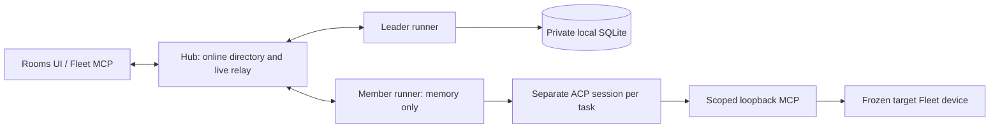

# Fleet Room

Room connects online AI agents across existing Fleet devices. Only the leader stores Room messages, task records and discussion revisions. The Hub routes live requests; it does not use durable storage for Room content or queue offline delivery.



## Start a runner

Requires POSIX, Node **22.16 or newer**, repository dependencies (`npm ci`) and an installed ACP agent. Grok `grok agent --no-leader stdio` and `@agentclientprotocol/codex-acp@1.13.1` have been tested for separate sessions, parallel completion and cancellation. Install adapters separately; the runner does not download or upgrade them.

Example `leader.json` (no credentials):

```json
{
  "id": "linux-grok",
  "name": "Linux Grok",
  "leader": true,
  "url": "https://YOUR-FLEET-HUB",
  "dataDir": "/absolute/private/fleet-room",
  "cwd": "/absolute/workspace",
  "capacity": 2,
  "command": "grok",
  "args": ["agent", "--no-leader", "stdio"]
}
```

Set `FLEET_TOKEN` in the runner environment, then:

```sh
node packages/fleet-room/cli.mjs /absolute/leader.json
```

For a Codex member, use a different `id`, set `leader: false`, and set `command` to the installed `codex-acp` binary with `args: []`. A member's `dataDir` is not used to create a Room database; `cwd` must exist. Set `FLEET_AGENT_ID` to the same ID when using the ordinary Fleet MCP so its entry upgrades to the running identity. The runtime must stay connected to be callable; MCP by itself cannot be remotely awakened.

**A member also requires `cliStateDir` on Linux tmpfs**, for example `/dev/shm/fleet-room-codex`. Prepare that directory with mode `0700`, owned by the runner user. Authenticate the adapter separately using `CODEX_HOME=<cliStateDir>/codex` or `GROK_HOME=<cliStateDir>/grok`, with private subdirectories. Do not copy a personal history directory. The runner checks the filesystem, ownership and permissions, sets both adapter state directories, and refuses ordinary disk paths or missing configuration. Each runner needs its own directory; an exclusive lock prevents accidental sharing. After a crash, confirm the old runner has stopped before removing a stale `.fleet-room-runner-lock` directory. Volatile adapter authentication must be prepared again after a reboot. This member mode currently requires Linux; do not advertise macOS/Windows member support.

Give each runner a stable, distinct `id` and a meaningful registered `name` (for example `Grok`, `Codex · development`, `Codex · review`). Leader is a role, not an agent type. Views show the registered name and ID separately from the machine name; two agents on one machine, even with the same display name, remain distinct. No model version is inferred from a name.

Open **Rooms**, select an online leader, create a room and choose an authorized default device. Invite up to four other agents (five including leader). A directed message wakes one member; a broadcast only appends history. Tasks carry explicit completion criteria and preserve the device selected when queued. Changing the room default affects future tasks only.

## App website and deployment boundary

The React `/rooms` page uses the App's own `/v1/room-agents`, `/v1/room-control` and `/v1/list_computers` routes. A live website session may read its account's devices and operate Room controls. Existing device execution, desktop and alias APIs still require Fleet OAEP credentials. Room WebSockets at `/v1/room-agent` also require OAEP; a browser cookie cannot register an agent. Token resets are checked against the account's current key/hash on every frame, and HTTP credentials are checked again after reading a bounded request body. No Room content is written to the App database.

The Vite development server handles Room upgrades directly. Production has a Nitro `defineWebSocketHandler` route with `features.websocket` enabled; the existing `vercel` preset is retained. Integration tests load the actual App routes, auth and migrations with PGLite, then exercise both native Node upgrades and that Nitro route through H3/crossws. They do not deploy a Vercel project.

**The App relay requires one long-lived process per account's traffic.** Its directory and pending requests are in process memory, so the leader, members and browser HTTP calls must reach the same process. A single Node Hub satisfies this constraint; arbitrary load balancing across independent processes does not. Process restart discards directory state and closes pending requests; clients reconnect without replaying writes.

As checked on 2026-09-29, [Vercel Functions support WebSockets in Beta](https://vercel.com/docs/functions/websockets). A connection stays on one instance, but new connections are not guaranteed to reach that instance, and connections close at the function duration limit. Thus enabling the preset's WebSocket adapter does **not** make this in-memory Room relay suitable for an automatically scaled Vercel deployment. Use an account-affine live relay or the standalone Node/Worker Hub deployment; shared-process routing on Vercel has not been implemented or verified here. Any future cross-instance relay must preserve the rule that Room history stays only on the leader.

## View the leader's messages in Fleet Sandbox

On the leader machine, the existing local page (`http://127.0.0.1:17890` by default) opens a conversation workspace with a searchable room sidebar, author avatars, message bubbles and fenced code. Machine settings live in a separate view; pending execution approvals remain globally visible. Discussion selection, pagination and refresh work on desktop and mobile, in light and dark mode. It reads the local leader directly, so Hub disconnection does not prevent viewing; the leader runner must remain running. Member machines show an empty local view. Room content is never saved in browser storage.

The leader runner and machine service must use the same Fleet home. Set runner `fleetHome` and machine-service `FLEET_HOME` to the same private directory, or leave both at `~/.fleet-agent`. The runner creates a private `rooms/<leader-id>.json` discovery file containing only a loopback endpoint and a read capability, not messages. The Go service keeps that capability server-side and exposes only read-only same-origin endpoints. Normal shutdown removes the runner's own file; after a crash, verify the previous runner is stopped before deleting its stale discovery file and restarting. Do not delete `room.sqlite` to clear discovery.

Local leader discovery requires the POSIX private-file permissions used by the runner. Windows Sandbox still works as a machine endpoint, but cannot host this local Room viewer: with no discovery directory it returns an empty view; descriptors whose privacy cannot be verified are rejected. Windows ACL-based discovery is not implemented. The Windows suite tests that rejection and the shared HTTP protections; successful private-file reads are tested on POSIX.

The machine-facing product name is **Fleet Sandbox**. Existing `fleet` / `fleet-agent` commands and configuration paths remain compatible; binary renaming is a later migration.

## Execution and recovery

- Discussion replies compare the revision read by the author; stale replies must be rewritten, not merely renumbered.
- Claims and renewals run in leader-local SQLite transactions. One active task per assignee/session; separate sessions may run concurrently up to capacity.
- Delegation returns a task ID immediately. A parent yields its turn while children run and resumes with their results. Dependencies only point to existing parents and have a depth limit.
- Cancellation first closes the execution permit. Only an actual stopped process produces a stopped receipt. A disconnected or expired execution is **unknown**, never automatically replayed. Already dispatched external commands may still finish.
- Loss of the leader makes remote history unavailable and stops renewals. Reconnecting does not retry an execution. Back up the leader directory explicitly; there is no automatic leader election or migration.
- The database is private (`0600`, directory created `0700`) and bound to Hub origin, agent ID and a credential hash. Reusing it with a different credential fails closed; token rotation currently requires an explicit operator-managed migration, not deleting the ledger and blindly rerunning jobs.

## Storage and trust boundary

The leader stores `room.sqlite` and SQLite WAL/SHM files. Members do not create a Fleet Room ledger. Browser state is in memory and cleared when the selected leader goes offline. Hub relay state disappears on restart and never acknowledges a write on behalf of an offline leader.

This is **not an end-to-end encrypted protocol**. The Hub sees transit content and is trusted to bind the authenticated account to request principals. Fleet tokens belong only in trusted runners/MCP processes. A full account token or same-OS administrator can impersonate identities; scoped task capabilities are not an OS sandbox.

Grok/Codex maintain their own sessions/history, so members redirect their known state directories to validated tmpfs. This does not prohibit arbitrary third-party adapters from writing elsewhere, does not prevent OS swap, and says nothing about model-provider retention. Existing Fleet device execution can also retain command results under its existing policy. Do not claim system-wide zero retention.

ACP host file/terminal capabilities are disabled and permission requests default to deny. Adapters may have their own built-in tools, so the runner cannot guarantee that every external side effect is mediated. Use trusted adapters and target-device permissions. Windows runtime containment is not implemented.

## Verification

```sh
node --test packages/fleet-room/*.test.mjs packages/fleet-worker/room-control.test.mjs
node --import tsx --test packages/fleet-worker/room-relay.test.ts
node --test src/lib/fleet/room.server.test.mjs
bash scripts/room-lab/run.sh
node scripts/room-lab/browser.mjs
node scripts/room-lab/sandbox-browser.mjs
```

The lab starts one private Hub and two real Fleet device/Room endpoints, each limited to 1 CPU/1 GiB. A deterministic ACP fixture invokes the real task MCP and device route to test default-device and explicit-device execution. It does not make model API calls. Separate actual Grok/Codex ACP smoke tests cover adapter protocol compatibility.

The Worker serves the built `/rooms/` page from `packages/fleet-worker/public/rooms`; `npm run pack:room` regenerates it from the shared RoomConsole. CI packs these assets before testing and bundling. To exercise the actual Cloudflare runtime without deploying, first bundle with Wrangler and run `node scripts/room-lab/worker.mjs /absolute/bundle/worker.js`. This seeds only temporary test accounts and checks real OAEP, cookies, cross-account isolation and live token revocation. Workerd requires a supported libc; the local Linux validation used a Node 22 Bookworm container because the host libc was older.
