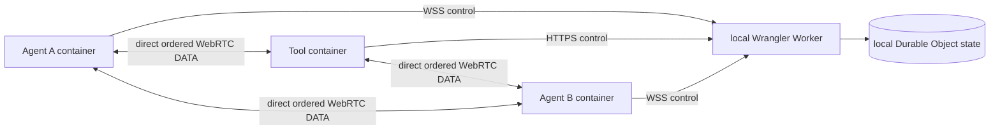

# Plugin peer VM verification

This directory is a disposable, local-only integration lab for the generic
`fleet.plugin.peer.v1` runtime and the official `fleet.transfer` v0.2.1 plugin.
It never deploys a Worker, publishes an artifact, changes DNS, or contacts a
production Fleet account.

The lab deliberately imports the real Worker and Durable Object classes. The
only additions are three routes in `worker.ts`, protected by a random per-run
secret:

- `POST /__fleet_vm__/seed` creates one throwaway local account/token;
- `POST /__fleet_vm__/interrupt` verifies that a real endpoint-side network
  interruption advanced the session to a fresh round; it never fabricates an
  endpoint event or mutates the session;
- `POST /__fleet_vm__/session` reads terminal state as a named test endpoint;
  it is used only to prove explicit cancellation reached `cancelled`.

Those routes exist only in this wrapper. They are not reachable from the
production Worker entrypoint.

The random seed key is injected only into local Wrangler with `--var`.
Wrangler's `--env-file` loads its own process environment but does not create a
Worker binding, so using it here would make every protected test route return 404. The key has no production value and is retained only in the mode-0600 run
evidence.



## Preconditions

- macOS host with a running Colima/Docker daemon whose server architecture is
  `arm64`/`aarch64`;
- local `node`, `go`, `curl`, and Docker CLI;
- `packages/fleet-worker/node_modules/.bin/wrangler` already installed;
- sibling repositories at `../fleet-transfer-plugin` and `../fleet-plugins`;
- the final `fleet.transfer` v0.2.1 artifacts already built;
- `packages/fleet-tool/official-plugins.generated.mjs` synced to the final
  private registry commit.

The runner is intentionally fail-fast. Before it starts Docker it requires all
three of these SHA-256 values to be identical:

1. the generated official catalog's `linux/arm64` hash;
2. `../fleet-transfer-plugin/dist/fleet-transfer-plugin-linux-arm64`;
3. a fresh `go build -trimpath -buildvcs=false -ldflags "-s -w"` from the
   current plugin source (the exact release-script flags).

It also requires catalog version `0.2.1`, peer ABI
`fleet.plugin.peer.v1`, protocol `fleet.transfer.v2`, transport
`direct_ordered`, and approval policy `both_once`. A stale v0.1 catalog cannot
silently test the wrong binary.

The filesystem assertion code has a Docker-free deterministic self-test. The
runner executes it before creating a run directory; it can also be run alone:

```bash
node scripts/plugin-peer-vm/helper.mjs self-test
```

The self-test proves that a valid published receipt and receiving checkpoint
pass, while `receiving`/`publishing` state presented as a completed receipt,
a tampered verified prefix, stray `.part`, and temporary/quarantine residue
fail.

## Run

```bash
./scripts/plugin-peer-vm/run.sh
```

Optional explicit cancellation cleanup:

```bash
./scripts/plugin-peer-vm/run.sh --extended
```

The base run verifies:

1. Tool → Client with a zero-byte file;
2. Client → Tool;
3. Client → Client with a file larger than 32 MiB;
4. Client → Client interruption after the target's verified partial reaches
   at least 37%, allocation of a new protocol round, resume, and completion;
5. destination no-clobber behavior.

Every successful transfer is verified on the host by exact byte count and full
SHA-256. Success must leave no `.part`, state temp, or quarantine entry, but it
must retain exactly one private v2 JSON receipt with `phase=published`. The
harness does not merely ignore JSON: it derives the sidecar name from the
runtime destination, reconstructs the opaque source binding from the completed
session, and checks every receipt field against the transfer ID, source,
manifest, final destination path, byte count, and SHA-256. The receipt must be
a regular non-symlink mode-0600 file.

The 37% interruption must retain a valid `receiving` partial and sidecar while
the endpoint is disconnected, including a re-hash of the declared verified
prefix, and finish with only the valid published receipt. Explicit cancellation
before publication has the opposite contract: after the session reaches
`cancelled`, the partial,
sidecar, state temp, and cancel/link quarantine must all be gone and no
destination may have been published. No-clobber likewise permits no transfer
artifact. Its CLI must exit non-zero, the Durable Object must finish in
`failed`, and the pre-existing sentinel is compared byte-for-byte.

For the 37% case the runner removes the target container from the dedicated
Docker network after reading `verified_offset` from its atomically replaced
sidecar. This breaks RTC and WSS without killing the Agent process or touching
its persistent partial. The still-connected endpoint reports the real RTC
failure, the VM-only route verifies that the Durable Object allocated a new
round, and the target rejoins the same network. The test therefore exercises
the real Agent interruption state and queued WSS delivery before completing
from the checkpoint. It does not inject a fake Hub event or add a relay.

The two Agents receive normal installed-plugin directories:

```text
<run>/agent-{a,b}/home/plugins/fleet.transfer/
  fleet-transfer-plugin
  metadata.json
```

The metadata contains the same catalog declaration and artifact hash that the
real Agent validates. There is no Agent-only development override. Only the
Tool uses its supported `FLEET_PLUGIN_DIR` override, pointing at the same
hash-pinned binary.

## Isolation and evidence

Each invocation creates a private, gitignored directory under the repository
so Colima can bind-mount it (macOS `$TMPDIR` under `/var/folders` is not shared
by default):

```text
scripts/plugin-peer-vm/.runs/fleet-plugin-peer-vm.XXXXXX/
  artifacts/          freshly built Agent and transfer plugin
  agent-a/, agent-b/  persistent config, plugin metadata, source and output
  tool/               Tool plugin and source/output files
  wrangler-state/     local Durable Object persistence
  logs/               Worker, Agent, Tool, progress, terminal status, SHA proof
  seed.json           local-only token; mode 0600
  tool.env             local-only Tool environment; mode 0600
```

`FLEET_VM_RUN_ROOT` may select an explicit directory, but the runner first
proves Docker can read the workspace mount and execute the freshly built Agent
from that directory. This catches an unshared/no-exec mount before Wrangler or
the long-lived containers start.

Containers, the Docker network, and Wrangler are stopped by the exit trap.
The run directory is always retained, especially on failure. It may contain a
throwaway local token and therefore remains mode `0700`; remove it manually
after review. No cleanup command in the script deletes user or repository data.
An interrupted run exits non-zero (`130` for `SIGINT`, `143` for `SIGTERM`)
and must never be treated as passing evidence.

Containers use a dedicated bridge network, drop all Linux capabilities, enable
`no-new-privileges`, and have read-only root filesystems. Writable mounts are
limited to each endpoint's test data/state. `fleet-hub.test` resolves only to
Docker's host gateway, keeping the token audience identical for Tool and Agent.
The Agent runs with no arguments so it remains container PID 1; `--daemon`
would deliberately double-fork and let the container exit before the child can
connect.

## Failure triage

- Catalog/hash rejection before Docker: finish the plugin build and registry
  sync; do not weaken the check.
- Agent never appears in `logs/list.json`: inspect `logs/agent-*.log` and
  `logs/wrangler.log`.
- Approval timeout: inspect `logs/*-fleet-peer-*.json`; the harness refuses to
  approve any prompt that is not exactly a `fleet.transfer 0.2.1` peer action.
- Direct connection failure: inspect both Agent logs and the session progress
  NDJSON. The test has no TURN, WebSocket-byte, Worker-byte, or R2 fallback.
- Resume failure: keep the run directory. A failed/interrupted target may retain
  a `receiving` `.part` and sidecar as evidence; a completed target must instead
  retain only its validated `published` JSON receipt. Do not rerun into the same
  directory.

The lab's purpose is evidence, not release automation. A green run does not
authorize a push, tag, GitHub Release, deployment, DNS change, or production
migration.
